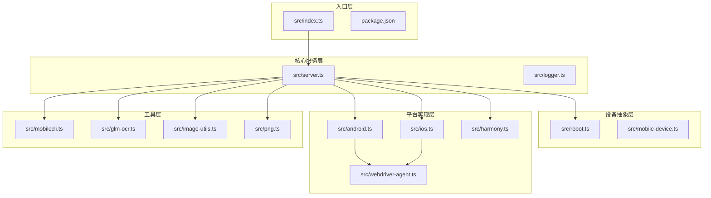
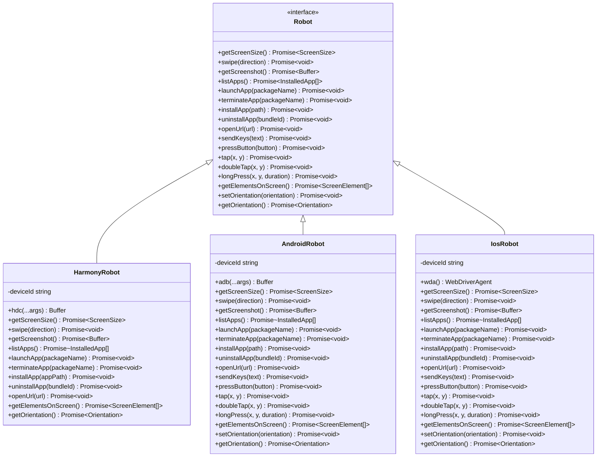
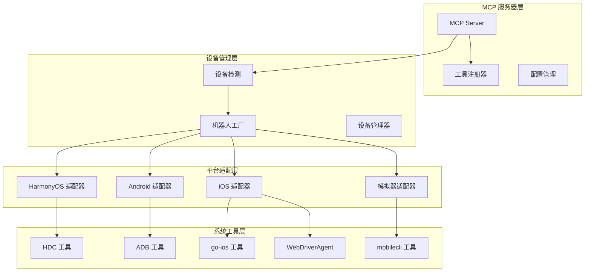
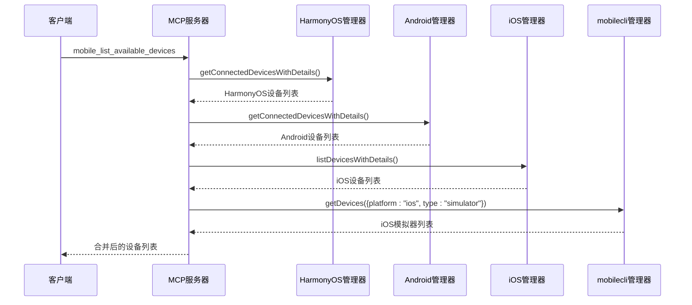
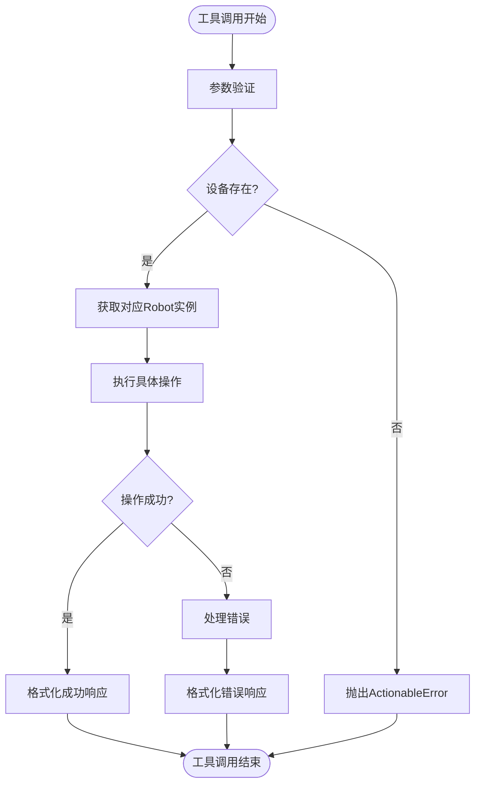
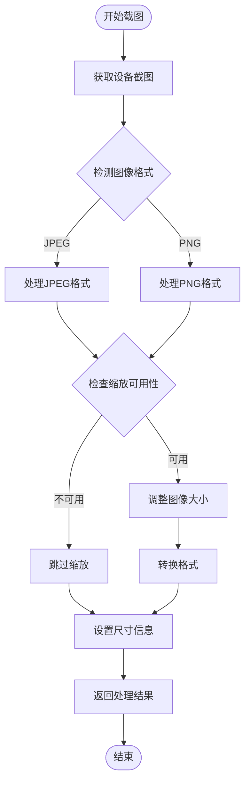
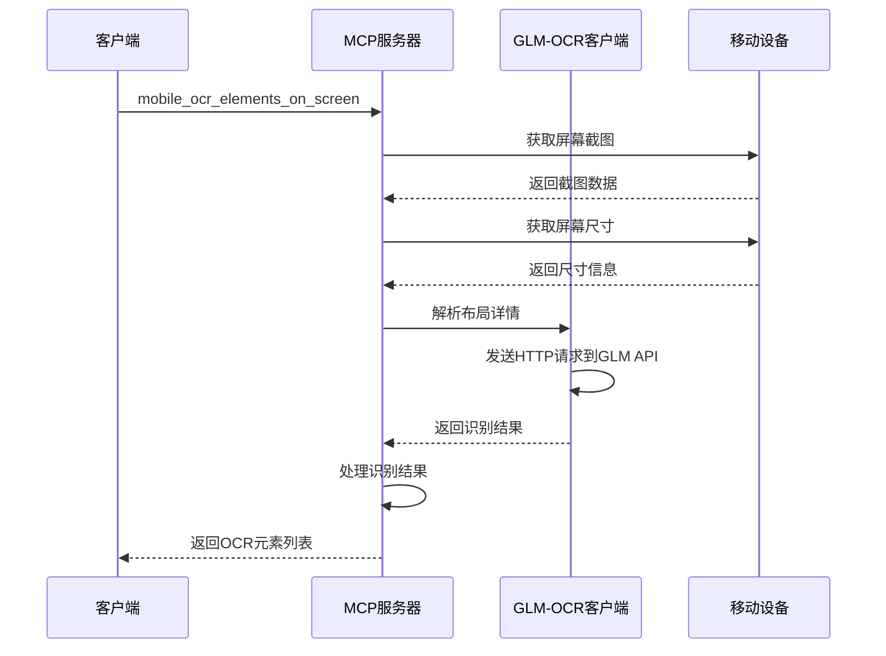

# 综合技术文档

<cite>
**本文档引用的文件**
- [README.md](file://README.md)
- [package.json](file://package.json)
- [src/index.ts](file://src/index.ts)
- [src/server.ts](file://src/server.ts)
- [src/robot.ts](file://src/robot.ts)
- [src/harmony.ts](file://src/harmony.ts)
- [src/android.ts](file://src/android.ts)
- [src/ios.ts](file://src/ios.ts)
- [src/mobile-device.ts](file://src/mobile-device.ts)
- [src/mobilecli.ts](file://src/mobilecli.ts)
- [src/webdriver-agent.ts](file://src/webdriver-agent.ts)
- [src/glm-ocr.ts](file://src/glm-ocr.ts)
- [src/image-utils.ts](file://src/image-utils.ts)
- [src/png.ts](file://src/png.ts)
- [src/logger.ts](file://src/logger.ts)
</cite>

## 目录
1. [简介](#简介)
2. [项目结构](#项目结构)
3. [核心组件](#核心组件)
4. [架构概览](#架构概览)
5. [详细组件分析](#详细组件分析)
6. [依赖关系分析](#依赖关系分析)
7. [性能考虑](#性能考虑)
8. [故障排除指南](#故障排除指南)
9. [结论](#结论)

## 简介

Mobile MCP HarmonyOS 是一个基于 Model Context Protocol (MCP) 的跨平台移动设备自动化服务器，专门为 iOS、Android 和 HarmonyOS 设备提供统一的自动化能力。该项目是 [@mobilenext/mobile-mcp](https://github.com/mobile-next/mobile-mcp) 的二次开发版本，新增了 HarmonyOS 设备自动化支持。

本项目的核心特性包括：
- 三端原生应用自动化：iOS、Android、HarmonyOS 统一 MCP 工具集
- LLM 友好：基于无障碍树 (Accessibility Tree) 的结构化数据交互
- 视觉兜底：当无障碍数据不可用时，自动回退到截图坐标分析
- 确定性操作：优先使用结构化数据，减少纯截图方案的歧义
- 结构化数据提取：从屏幕可见内容中提取结构化信息

## 项目结构

项目采用模块化的 TypeScript 架构，主要包含以下核心模块：



**图表来源**
- [src/index.ts:1-71](file://src/index.ts#L1-L71)
- [src/server.ts:1-758](file://src/server.ts#L1-L758)

**章节来源**
- [README.md:1-198](file://README.md#L1-L198)
- [package.json:1-74](file://package.json#L1-L74)

## 核心组件

### MCP 服务器核心

项目的核心是基于 Model Context Protocol 的服务器实现，提供了统一的工具接口来控制不同平台的移动设备。

### 设备抽象接口

所有平台都实现了统一的 Robot 接口，确保跨平台操作的一致性：



**图表来源**
- [src/robot.ts:48-147](file://src/robot.ts#L48-L147)
- [src/harmony.ts:43-416](file://src/harmony.ts#L43-L416)
- [src/android.ts:74-504](file://src/android.ts#L74-L504)
- [src/ios.ts:42-232](file://src/ios.ts#L42-L232)

### 平台特定实现

每个平台都有其独特的实现方式：

**HarmonyOS 实现特点：**
- 使用 HDC (HarmonyOS Device Connector) 直接驱动设备
- 无需 mobilecli 依赖，开箱即用
- 通过 uitest、hidumper 等工具进行 UI 操作和信息获取

**Android 实现特点：**
- 使用 ADB + UI Automator
- 支持多种设备类型（手机、电视）
- 内置非 ASCII 文本处理机制

**iOS 实现特点：**
- 通过 WebDriverAgent + 原生无障碍接口
- 需要 go-ios 工具链支持
- 支持隧道连接和端口转发

**章节来源**
- [src/harmony.ts:1-462](file://src/harmony.ts#L1-L462)
- [src/android.ts:1-593](file://src/android.ts#L1-L593)
- [src/ios.ts:1-294](file://src/ios.ts#L1-L294)

## 架构概览

项目采用分层架构设计，确保了良好的可扩展性和维护性：



**图表来源**
- [src/server.ts:154-202](file://src/server.ts#L154-L202)
- [src/harmony.ts:418-461](file://src/harmony.ts#L418-L461)
- [src/android.ts:506-592](file://src/android.ts#L506-L592)
- [src/ios.ts:234-293](file://src/ios.ts#L234-L293)

## 详细组件分析

### 设备发现与选择机制

设备发现是整个系统的关键组件，负责识别和分类不同类型的设备：



**图表来源**
- [src/server.ts:204-299](file://src/server.ts#L204-L299)
- [src/harmony.ts:418-461](file://src/harmony.ts#L418-L461)
- [src/android.ts:506-592](file://src/android.ts#L506-L592)
- [src/ios.ts:234-293](file://src/ios.ts#L234-L293)

### 工具调用流程

每个 MCP 工具都遵循相同的调用模式：



**图表来源**
- [src/server.ts:67-100](file://src/server.ts#L67-L100)
- [src/server.ts:154-202](file://src/server.ts#L154-L202)

### 截图处理流程

项目实现了智能的截图处理机制，支持多种图像格式和优化：



**图表来源**
- [src/server.ts:590-678](file://src/server.ts#L590-L678)
- [src/image-utils.ts:9-165](file://src/image-utils.ts#L9-L165)

### OCR 集成机制

项目提供了可选的 GLM-OCR 功能，用于处理复杂界面的文本识别：



**图表来源**
- [src/server.ts:711-754](file://src/server.ts#L711-L754)
- [src/glm-ocr.ts:34-102](file://src/glm-ocr.ts#L34-L102)

**章节来源**
- [src/server.ts:1-758](file://src/server.ts#L1-L758)
- [src/mobile-device.ts:1-217](file://src/mobile-device.ts#L1-L217)

## 依赖关系分析

项目使用了现代化的依赖管理策略，结合了核心依赖和可选依赖：

```mermaid
graph TB
subgraph "核心依赖"
MCP[@modelcontextprotocol/sdk]
EXPRESS[express]
ZOD[zod]
ZOD_JSON[zod-to-json-schema]
XML_PARSER[fast-xml-parser]
end
subgraph "可选依赖"
MOBILECLI[@mobilenext/mobilecli]
end
subgraph "开发依赖"
ESLINT[eslint]
TYPESCRIPT[typescript]
Mocha[mocha]
NYC[nyc]
TS_NODE[ts-node]
end
subgraph "运行时依赖"
COMMANDER[commander]
NODE_FS[node:fs]
NODE_OS[node:os]
NODE_CHILD[child_process]
end
```

**图表来源**
- [package.json:29-60](file://package.json#L29-L60)

### 关键依赖说明

**MCP SDK**: 提供了 Model Context Protocol 的核心实现，包括服务器、传输层和工具注册机制。

**Express**: 用于提供 HTTP 服务器功能，支持 SSE 模式。

**Zod**: 用于参数验证和类型安全，确保工具调用的正确性。

**可选 mobilecli**: 仅用于 iOS 和 Android 设备的模拟器检测，HarmonyOS 设备不需要此依赖。

**章节来源**
- [package.json:1-74](file://package.json#L1-L74)

## 性能考虑

项目在多个层面进行了性能优化：

### 图像处理优化
- 智能格式检测和转换
- 可选的图像缩放功能
- 缓存机制避免重复计算

### 设备连接优化
- 异步设备检测
- 连接池管理
- 超时控制机制

### 错误处理优化
- 细粒度的错误分类
- 可恢复的操作重试
- 详细的日志记录

## 故障排除指南

### 常见问题及解决方案

**设备无法被发现**
1. 检查设备连接状态
2. 验证平台工具是否正确安装
3. 确认必要的权限已授予

**HarmonyOS 设备连接失败**
1. 确认 HDC 工具在 PATH 中
2. 检查设备的开发者选项设置
3. 验证 USB 调试功能已启用

**iOS 设备连接问题**
1. 确认 go-ios 工具已正确安装
2. 检查 WebDriverAgent 是否正常运行
3. 验证设备信任设置

**OCR 功能异常**
1. 检查 API 密钥配置
2. 验证网络连接
3. 确认请求频率未超过限制

**章节来源**
- [src/harmony.ts:12-18](file://src/harmony.ts#L12-L18)
- [src/ios.ts:69-92](file://src/ios.ts#L69-L92)
- [src/glm-ocr.ts:70-81](file://src/glm-ocr.ts#L70-L81)

## 结论

Mobile MCP HarmonyOS 是一个设计精良的跨平台移动设备自动化解决方案。其核心优势包括：

1. **统一的抽象层**: 通过 Robot 接口实现了平台无关的操作
2. **灵活的架构**: 支持动态设备检测和工具注册
3. **强大的扩展性**: 易于添加新的平台支持
4. **完善的错误处理**: 提供详细的错误信息和恢复机制

该项目为 AI 代理和 LLM 提供了强大的移动设备控制能力，特别是在 HarmonyOS 平台的支持上具有独特优势。通过合理的架构设计和性能优化，为用户提供了稳定可靠的自动化体验。