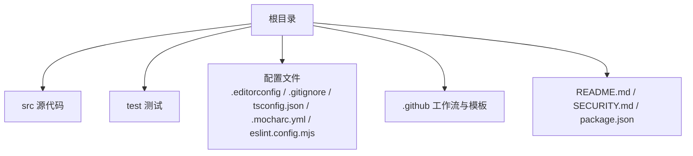
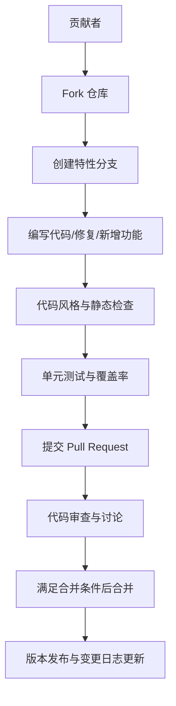
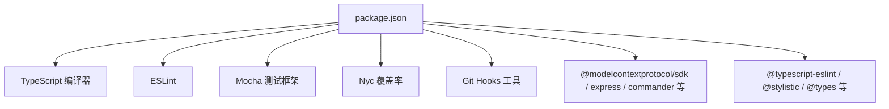

# 贡献指南

<cite>
**本文引用的文件**
- [README.md](file://README.md)
- [package.json](file://package.json)
- [eslint.config.mjs](file://eslint.config.mjs)
- [.mocharc.yml](file://.mocharc.yml)
- [tsconfig.json](file://tsconfig.json)
- [.editorconfig](file://.editorconfig)
- [.gitignore](file://.gitignore)
- [.github/ISSUE_TEMPLATE/bug_report.md](file://.github/ISSUE_TEMPLATE/bug_report.md)
- [SECURITY.md](file://SECURITY.md)
</cite>

## 目录
1. [简介](#简介)
2. [项目结构](#项目结构)
3. [核心组件](#核心组件)
4. [架构总览](#架构总览)
5. [详细组件分析](#详细组件分析)
6. [依赖分析](#依赖分析)
7. [性能考虑](#性能考虑)
8. [故障排查指南](#故障排查指南)
9. [结论](#结论)
10. [附录](#附录)

## 简介
本指南面向希望参与本项目的开发者，涵盖从 Fork 项目、创建分支、提交代码、发起 Pull Request 的完整流程；Issue 提交规范与模板使用；代码审查流程与合并标准；社区行为准则与沟通渠道；版本发布流程与变更日志维护；以及为新贡献者提供的快速融入建议与项目治理结构说明。

## 项目结构
本仓库采用“功能模块 + 测试 + 配置”的组织方式：
- 源代码位于 src 目录，包含多平台自动化能力的实现入口与工具函数
- 测试位于 test 目录，使用 Mocha 作为测试框架
- 根目录包含构建、质量检查、类型编译、编辑器配置、忽略规则、安全策略等配置文件
- GitHub 工作流与 Issue 模板位于 .github 目录

章节来源
- [README.md:1-198](file://README.md#L1-L198)
- [package.json:1-74](file://package.json#L1-L74)

## 核心组件
- 构建与脚本
  - 使用 TypeScript 编译为 CommonJS 输出至 lib 目录
  - 提供 lint、test、watch、build、clean 等常用脚本
- 质量与风格
  - ESLint 配置覆盖 TS 规则、样式插件与导入规则
  - EditorConfig 统一缩进、换行、行宽等编辑器行为
- 测试
  - Mocha 作为测试运行器，nyc 生成覆盖率报告
- 发布与运行
  - 通过 npm scripts 驱动构建与本地运行
  - 提供二进制入口名称，便于直接调用

章节来源
- [package.json:17-25](file://package.json#L17-L25)
- [eslint.config.mjs:1-162](file://eslint.config.mjs#L1-L162)
- [.mocharc.yml:1-2](file://.mocharc.yml#L1-L2)
- [tsconfig.json:1-14](file://tsconfig.json#L1-L14)
- [.editorconfig:1-10](file://.editorconfig#L1-L10)

## 架构总览
本项目围绕“MCP 服务器”提供跨平台移动端自动化能力，核心流程如下：

## 详细组件分析

### 贡献流程（Fork → 分支 → 提交 → PR）
- Fork 与克隆
  - 在 GitHub 上 Fork 仓库，然后克隆到本地
- 创建分支
  - 基于主分支创建特性分支，命名建议清晰表达改动意图
- 提交与推送
  - 本地完成编码后，先执行 lint 与测试，再提交并推送
- 发起 PR
  - 在 GitHub 上创建 Pull Request，填写模板要求的信息
  - 确保 PR 描述清晰、变更范围明确、关联相关 Issue

章节来源
- [package.json:17-25](file://package.json#L17-L25)
- [eslint.config.mjs:1-162](file://eslint.config.mjs#L1-L162)
- [.mocharc.yml:1-2](file://.mocharc.yml#L1-L2)

### Issue 提交规范与模板使用
- 模板类型
  - 仓库提供 Bug 报告模板，用于收集复现步骤、期望行为、截图等关键信息
- 提交要点
  - 清晰描述问题现象与预期结果
  - 补充环境信息（Agent、操作系统、设备类型/版本/型号）
  - 提供可复现实例与必要截图/日志

章节来源
- [.github/ISSUE_TEMPLATE/bug_report.md:1-31](file://.github/ISSUE_TEMPLATE/bug_report.md#L1-L31)

### 代码审查流程与合并标准
- 代码风格与静态检查
  - 提交前必须通过 ESLint 检查，确保风格一致与常见问题被发现
- 测试与覆盖率
  - 所有改动需通过 Mocha 测试，尽量保持或提升覆盖率
- 审查与反馈
  - PR 将由维护者进行审查，可能需要根据反馈进行修改
- 合并条件
  - 通过审查、无阻塞性问题、满足最小变更原则与可维护性要求

章节来源
- [eslint.config.mjs:1-162](file://eslint.config.mjs#L1-L162)
- [.mocharc.yml:1-2](file://.mocharc.yml#L1-L2)

### 社区行为准则与沟通渠道
- 行为准则
  - 请以尊重、包容与协作的态度参与讨论与贡献
- 沟通渠道
  - 安全问题请通过私信联系维护者（参见安全策略）
  - 日常问题与讨论可在 Issue 或 PR 中进行

章节来源
- [SECURITY.md:1-17](file://SECURITY.md#L1-L17)

### 版本发布流程与变更日志维护
- 版本号与发布
  - 版本号在 package.json 中定义，遵循语义化版本管理
- 发布准备
  - 在本地执行构建与测试，确保产物可运行且稳定
- 变更日志
  - 变更日志文件位于根目录，建议每次重要改动同步更新
- 发布渠道
  - 项目使用 npm registry 进行发布（发布配置见 package.json）

章节来源
- [package.json:4-8](file://package.json#L4-L8)
- [package.json:62-64](file://package.json#L62-L64)

### 新贡献者快速融入指南
- 环境准备
  - 确保 Node.js 版本满足要求（引擎约束见 package.json）
  - 安装依赖并执行构建脚本验证环境
- 代码风格
  - 遵循 EditorConfig 与 ESLint 规则，保持一致性
- 测试习惯
  - 在提交前运行测试与覆盖率检查
- 文档与模板
  - Issue 与 PR 请按模板填写必要信息，便于维护者快速理解

章节来源
- [package.json:13-15](file://package.json#L13-L15)
- [.editorconfig:1-10](file://.editorconfig#L1-L10)
- [eslint.config.mjs:1-162](file://eslint.config.mjs#L1-L162)
- [.mocharc.yml:1-2](file://.mocharc.yml#L1-L2)

### 项目治理结构与决策机制
- 维护者职责
  - 负责审查 PR、维护质量标准、推动版本发布与变更日志更新
- 决策流程
  - 对于重大变更，建议在 Issue 中充分讨论并达成共识后再实施
- 开放协作
  - 鼓励社区贡献，遵循行为准则与沟通规范

（本节为概念性说明，不直接分析具体文件）

## 依赖分析
项目构建与开发依赖关系概览：

图表来源
- [package.json:29-60](file://package.json#L29-L60)

章节来源
- [package.json:29-60](file://package.json#L29-L60)

## 性能考虑
- 构建与运行
  - 使用 TypeScript 编译输出 CommonJS，便于在 Node.js 环境直接运行
  - 通过脚本控制构建、清理与监听，提高迭代效率
- 测试与覆盖率
  - 使用 Mocha 与 nyc 进行测试与覆盖率统计，有助于发现潜在性能与稳定性问题
- 代码质量
  - ESLint 规则可帮助避免常见性能陷阱与风格问题

章节来源
- [package.json:17-25](file://package.json#L17-L25)
- [.mocharc.yml:1-2](file://.mocharc.yml#L1-L2)

## 故障排查指南
- 环境与依赖
  - 确认 Node.js 版本满足要求；若构建失败，先清理并重新安装依赖
- 构建产物
  - 构建产物输出至 lib 目录，确认产物存在且可运行
- 测试失败
  - 查看测试超时配置与失败用例，逐步定位问题
- 代码风格
  - 若 ESLint 报错，请根据规则调整代码风格

章节来源
- [package.json:13-15](file://package.json#L13-L15)
- [package.json:17-25](file://package.json#L17-L25)
- [.mocharc.yml:1-2](file://.mocharc.yml#L1-L2)
- [eslint.config.mjs:1-162](file://eslint.config.mjs#L1-L162)

## 结论
本贡献指南提供了从环境准备、编码规范、测试与审查到发布与沟通的全流程建议。请在贡献过程中遵循这些规范，共同维护高质量、可持续发展的开源项目生态。

## 附录
- 快速参考清单
  - 准备环境与依赖
  - 编写代码并遵循 EditorConfig 与 ESLint
  - 运行测试并通过覆盖率检查
  - 提交 PR 并按模板填写信息
  - 关注审查反馈并及时修订
  - 参与讨论与协作，遵守行为准则