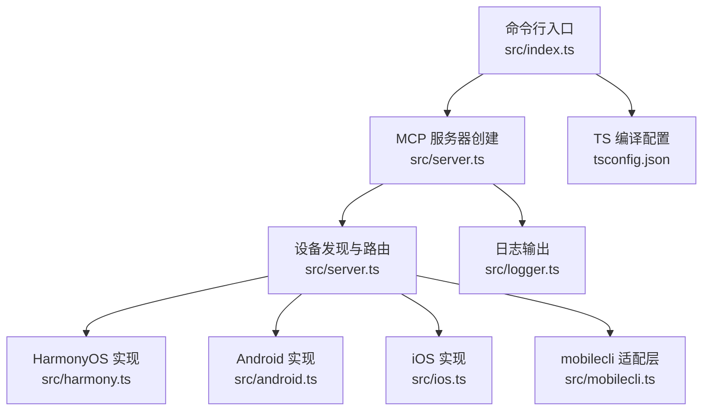
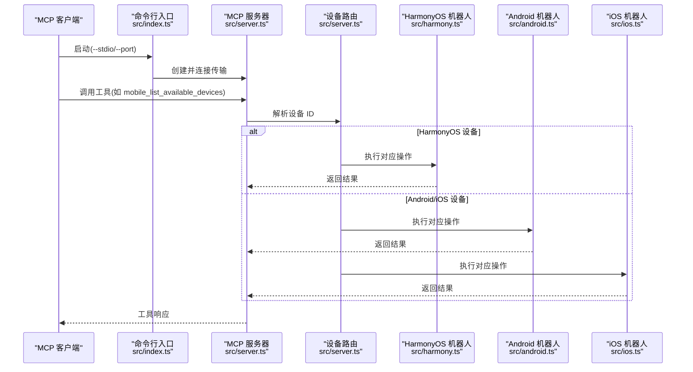
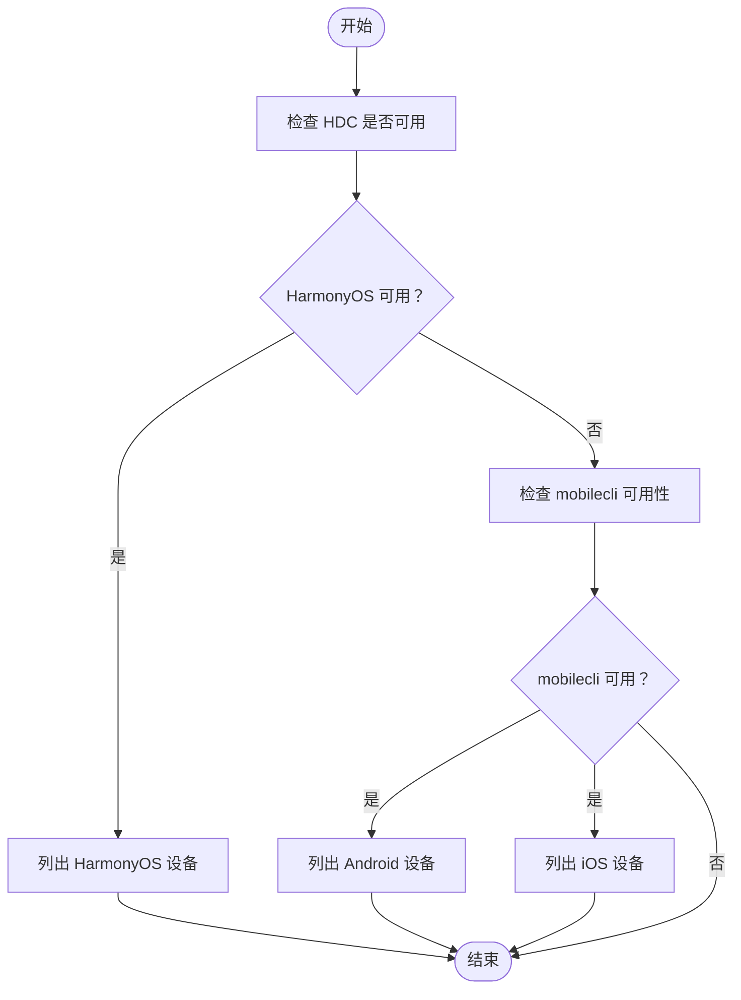
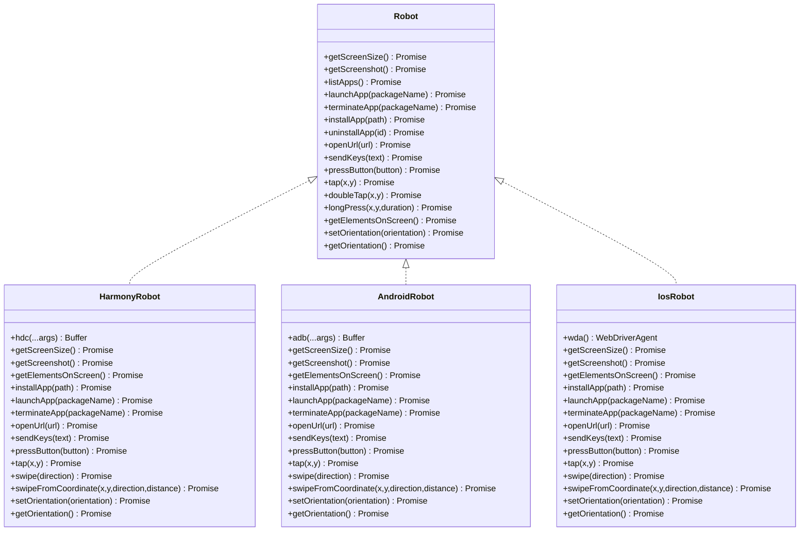
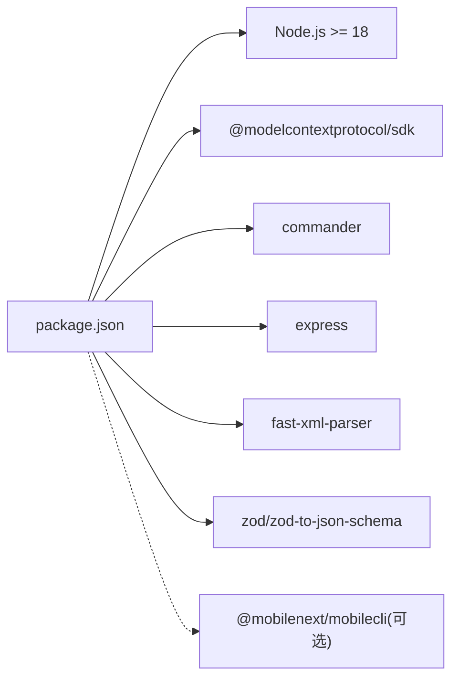

# 快速开始

<cite>
**本文引用的文件**
- [README.md](file://README.md)
- [package.json](file://package.json)
- [src/index.ts](file://src/index.ts)
- [src/server.ts](file://src/server.ts)
- [src/harmony.ts](file://src/harmony.ts)
- [src/android.ts](file://src/android.ts)
- [src/ios.ts](file://src/ios.ts)
- [src/mobilecli.ts](file://src/mobilecli.ts)
- [src/logger.ts](file://src/logger.ts)
- [src/robot.ts](file://src/robot.ts)
- [tsconfig.json](file://tsconfig.json)
- [eslint.config.mjs](file://eslint.config.mjs)
- [test/mobilecli.test.ts](file://test/mobilecli.test.ts)
</cite>

## 目录
1. [简介](#简介)
2. [项目结构](#项目结构)
3. [核心组件](#核心组件)
4. [架构总览](#架构总览)
5. [详细组件分析](#详细组件分析)
6. [依赖关系分析](#依赖关系分析)
7. [性能考虑](#性能考虑)
8. [故障排查指南](#故障排查指南)
9. [结论](#结论)
10. [附录](#附录)

## 简介
本指南面向首次接触 Mobile MCP HarmonyOS 的用户，帮助你在约 10 分钟内完成环境准备、安装与配置，并成功运行第一个 MCP 工具。你将学会：
- 安装前置依赖（Node.js、iOS/Android 的 mobilecli 或 HarmonyOS 的 HDC 工具）
- 在 Claude Code、Claude Desktop、VS Code/Copilot 等 MCP 客户端中配置本项目
- 使用 npm 安装、从源码构建、以及通过 npx 一键启动
- 启动服务器（--stdio 与 --port 模式）
- 调用首个工具 mobile_list_available_devices 查看设备列表
- 快速定位权限、设备连接与环境配置问题

## 项目结构
该项目采用 TypeScript 编写，核心入口负责解析命令行参数并选择传输模式（STDIO 或 SSE），服务端注册统一的 MCP 工具集，按设备类型分发到不同平台的机器人实现。

图表来源
- [src/index.ts:1-67](file://src/index.ts#L1-L67)
- [src/server.ts:1-708](file://src/server.ts#L1-L708)
- [src/harmony.ts:1-462](file://src/harmony.ts#L1-L462)
- [src/android.ts:1-593](file://src/android.ts#L1-L593)
- [src/ios.ts:1-294](file://src/ios.ts#L1-L294)
- [src/mobilecli.ts:1-136](file://src/mobilecli.ts#L1-L136)
- [src/logger.ts:1-22](file://src/logger.ts#L1-L22)
- [tsconfig.json:1-14](file://tsconfig.json#L1-L14)

章节来源
- [README.md:90-171](file://README.md#L90-L171)
- [package.json:17-64](file://package.json#L17-L64)
- [tsconfig.json:1-14](file://tsconfig.json#L1-L14)

## 核心组件
- 命令行入口与传输模式
  - 支持 --stdio（默认）与 --port <端口>（SSE）两种启动模式
  - 通过 @modelcontextprotocol/sdk 提供 STDIO 与 SSE 传输
- MCP 服务器与工具注册
  - 统一注册设备管理、应用管理、屏幕交互、输入与导航等工具
  - 工具参数使用 zod 校验，错误处理返回可读消息
- 平台机器人实现
  - HarmonyOS：通过 HDC/uitest/hidumper 等工具直接驱动
  - Android：通过 ADB + UIAutomator
  - iOS：通过 WebDriverAgent + go-ios（隧道与端口转发）
- 设备发现与路由
  - 优先检测 HarmonyOS 设备（无需 mobilecli）
  - 再检测 Android/iOS 设备（需要 mobilecli）

章节来源
- [src/index.ts:9-67](file://src/index.ts#L9-L67)
- [src/server.ts:35-708](file://src/server.ts#L35-L708)
- [src/harmony.ts:43-462](file://src/harmony.ts#L43-L462)
- [src/android.ts:74-593](file://src/android.ts#L74-L593)
- [src/ios.ts:42-294](file://src/ios.ts#L42-L294)

## 架构总览
下图展示了从客户端发起工具调用到具体平台操作的端到端流程。

图表来源
- [src/index.ts:35-67](file://src/index.ts#L35-L67)
- [src/server.ts:149-197](file://src/server.ts#L149-L197)
- [src/harmony.ts:43-462](file://src/harmony.ts#L43-L462)
- [src/android.ts:74-593](file://src/android.ts#L74-L593)
- [src/ios.ts:42-294](file://src/ios.ts#L42-L294)

## 详细组件分析

### 命令行与传输模式
- --stdio 模式（默认）：适合与 MCP 客户端直接集成
- --port 模式：以 SSE 方式监听指定端口，便于调试与外部接入
- 启动后输出版本与监听地址，便于确认运行状态

章节来源
- [src/index.ts:9-67](file://src/index.ts#L9-L67)
- [README.md:100-171](file://README.md#L100-L171)

### 设备发现与路由逻辑
- 优先尝试 HarmonyOS 设备探测（无需 mobilecli）
- 若 mobilecli 可用，则探测 Android/iOS 设备
- 根据设备 ID 动态选择对应平台机器人实例

图表来源
- [src/server.ts:209-294](file://src/server.ts#L209-L294)
- [src/harmony.ts:418-462](file://src/harmony.ts#L418-L462)
- [src/mobilecli.ts:94-136](file://src/mobilecli.ts#L94-L136)

章节来源
- [src/server.ts:149-197](file://src/server.ts#L149-L197)
- [src/server.ts:209-294](file://src/server.ts#L209-L294)

### 平台机器人接口与实现
- 统一接口定义于 robot.ts，覆盖屏幕尺寸、截图、元素识别、应用管理、输入与导航等
- HarmonyOS 通过 HDC/uitest/hidumper 等工具直接操作
- Android 通过 ADB + UIAutomator
- iOS 通过 WebDriverAgent + go-ios（隧道与端口转发）

图表来源
- [src/robot.ts:48-148](file://src/robot.ts#L48-L148)
- [src/harmony.ts:43-462](file://src/harmony.ts#L43-L462)
- [src/android.ts:74-593](file://src/android.ts#L74-L593)
- [src/ios.ts:42-294](file://src/ios.ts#L42-L294)

章节来源
- [src/robot.ts:1-148](file://src/robot.ts#L1-L148)
- [src/harmony.ts:1-462](file://src/harmony.ts#L1-L462)
- [src/android.ts:1-593](file://src/android.ts#L1-L593)
- [src/ios.ts:1-294](file://src/ios.ts#L1-L294)

### 移动端自动化工具清单与使用
- 设备管理：列出设备、获取屏幕尺寸、方向
- 应用管理：列出、启动、终止、安装、卸载
- 屏幕交互：截图、元素列表、点击、双击、长按、滑动
- 输入与导航：输入文本、按键、打开 URL

章节来源
- [README.md:47-86](file://README.md#L47-L86)
- [src/server.ts:199-704](file://src/server.ts#L199-L704)

## 依赖关系分析
- 运行时要求
  - Node.js >= 18（由 engines 字段约束）
  - HarmonyOS：HDC（HarmonyOS SDK 自带），确保在 PATH 或设置 HDC_SDK_PATH
  - iOS/Android：mobilecli（可选依赖，用于 Android/iOS 设备探测与部分操作）
- 关键依赖
  - @modelcontextprotocol/sdk：MCP 协议与传输
  - commander：命令行参数解析
  - express：SSE 服务器
  - fast-xml-parser：Android UIAutomator XML 解析
  - zod/zod-to-json-schema：工具参数校验与 JSON Schema 生成

图表来源
- [package.json:13-64](file://package.json#L13-L64)

章节来源
- [package.json:13-64](file://package.json#L13-L64)
- [README.md:92-99](file://README.md#L92-L99)

## 性能考虑
- 图像缩放：当截图为 JPEG 时，根据屏幕 scale 进行缩放以降低传输体积；PNG 截图则转换为 JPEG 并压缩
- 多显示器设备：Android 通过解析 SurfaceFlinger 与 display 信息选择主显示器，避免多屏设备截图异常
- 错误上报：内置轻量遥测上报（可忽略），便于统计工具使用情况

章节来源
- [src/server.ts:605-672](file://src/server.ts#L605-L672)
- [src/android.ts:295-310](file://src/android.ts#L295-L310)

## 故障排查指南
- 无法找到 mobilecli
  - 现象：提示 mobilecli 不可用或版本检查失败
  - 处理：安装 mobilecli 并确保在 PATH 中，或设置 MOBILECLI_PATH 环境变量
- HarmonyOS 设备未被识别
  - 现象：HDC 不可用或无法列出目标
  - 处理：确保 HDC 在 PATH 中，或设置 HDC_SDK_PATH；确认设备已连接且允许调试
- Android 设备未被识别
  - 现象：adb 命令失败或未列出设备
  - 处理：设置 ANDROID_HOME 或在默认路径下安装 SDK；确认 ADB 路径解析正确
- iOS 设备未被识别
  - 现象：go-ios 未安装或 WebDriverAgent 未就绪
  - 处理：安装 go-ios；确保隧道与端口转发正常；必要时重新安装/启动 WebDriverAgent
- 日志与诊断
  - 设置 LOG_FILE 环境变量以记录详细日志，便于定位问题

章节来源
- [src/server.ts:138-147](file://src/server.ts#L138-L147)
- [src/harmony.ts:12-18](file://src/harmony.ts#L12-L18)
- [src/android.ts:32-54](file://src/android.ts#L32-L54)
- [src/ios.ts:33-40](file://src/ios.ts#L33-L40)
- [src/logger.ts:3-22](file://src/logger.ts#L3-L22)

## 结论
通过本快速开始指南，你已经完成了：
- 环境准备与依赖安装
- MCP 客户端配置
- 服务器启动与工具调用
- 常见问题的快速排查

建议在实际项目中结合日志与工具注解，逐步扩展自动化流程，并关注平台差异带来的行为差异。

## 附录

### 安装与配置步骤
- 安装前置依赖
  - Node.js >= 18
  - HarmonyOS：确保 HDC 在 PATH 或设置 HDC_SDK_PATH
  - iOS/Android：安装 mobilecli（可选，用于 Android/iOS 设备）
- 配置 MCP 客户端
  - Claude Code/桌面/VS Code/Copilot：参考 README 中的标准配置片段
- 启动服务器
  - --stdio（默认）：适合与 MCP 客户端直接集成
  - --port <端口>：SSE 模式，便于调试
- 调用首个工具
  - mobile_list_available_devices：列出所有可用设备（HarmonyOS、Android、iOS）

章节来源
- [README.md:90-171](file://README.md#L90-L171)
- [src/index.ts:50-67](file://src/index.ts#L50-L67)

### 开发与测试
- 编译与清理
  - npm run build：编译 TypeScript 到 lib 目录
  - npm run clean：删除 lib 目录
- 测试
  - npm test：运行 Mocha 测试套件
- 代码规范
  - ESLint 规则已配置，支持 TypeScript 语法检查与风格约束

章节来源
- [package.json:17-24](file://package.json#L17-L24)
- [eslint.config.mjs:1-162](file://eslint.config.mjs#L1-L162)
- [test/mobilecli.test.ts:1-120](file://test/mobilecli.test.ts#L1-L120)