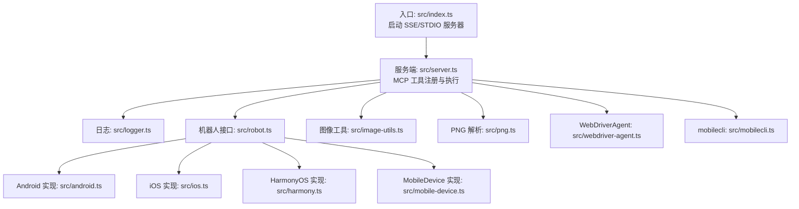
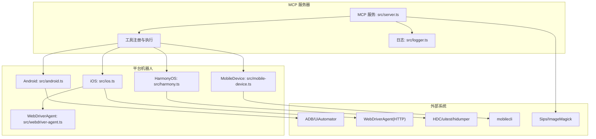
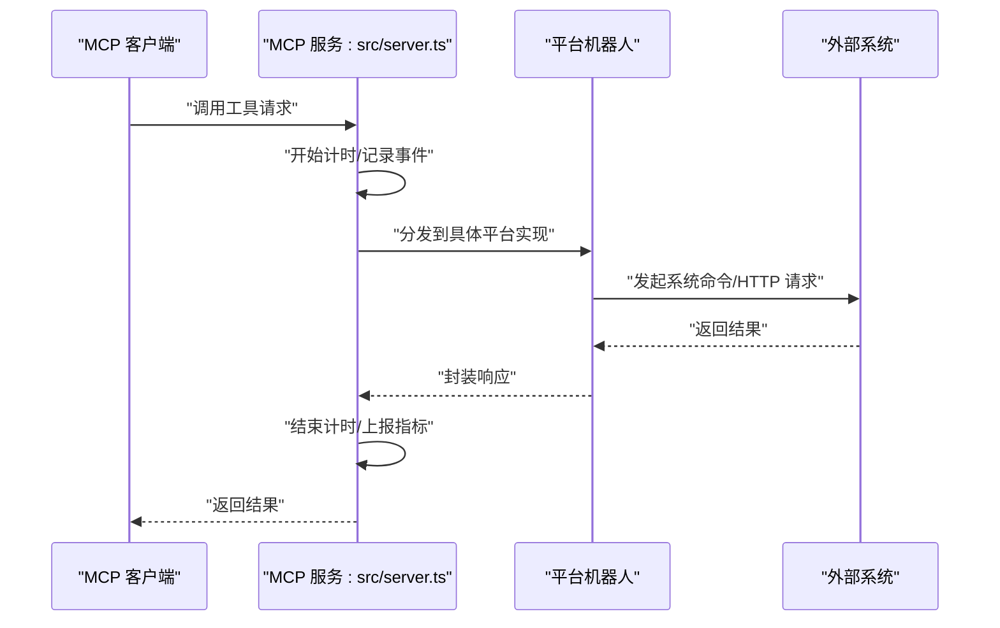
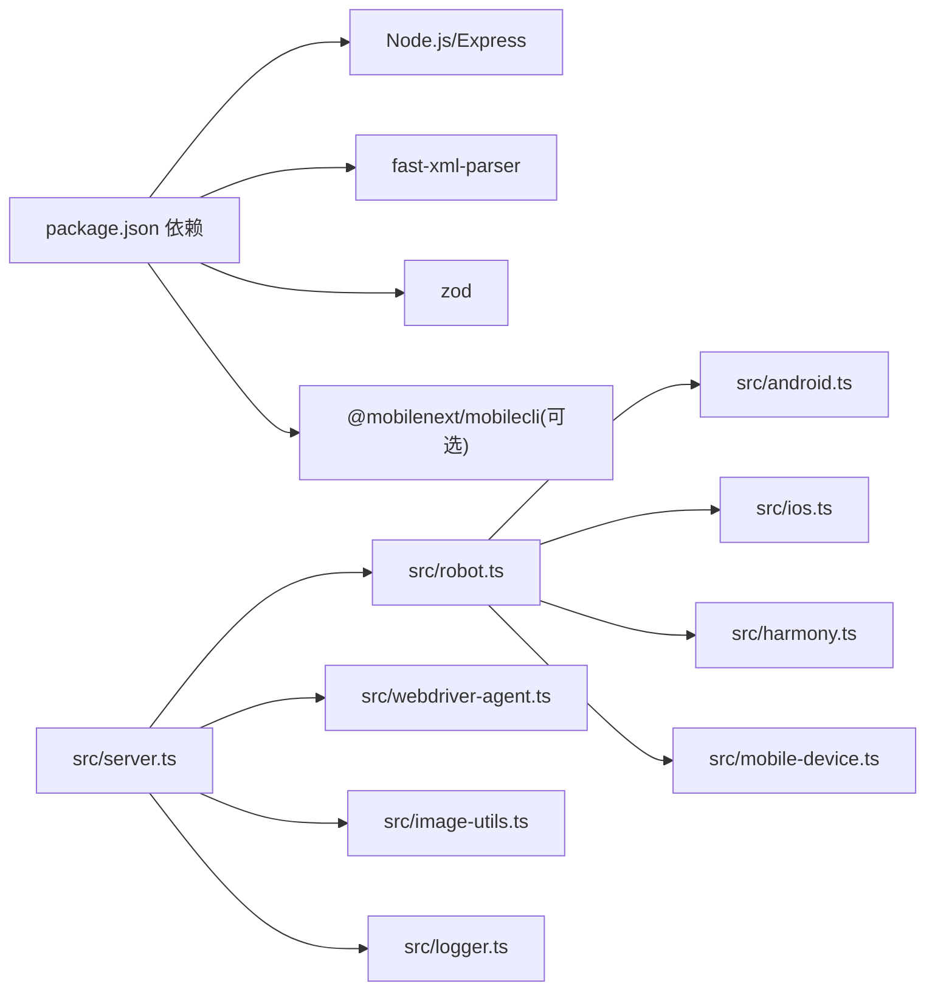

# 性能问题

<cite>
**本文引用的文件**
- [package.json](file://package.json)
- [README.md](file://README.md)
- [src/index.ts](file://src/index.ts)
- [src/server.ts](file://src/server.ts)
- [src/logger.ts](file://src/logger.ts)
- [src/robot.ts](file://src/robot.ts)
- [src/mobile-device.ts](file://src/mobile-device.ts)
- [src/android.ts](file://src/android.ts)
- [src/ios.ts](file://src/ios.ts)
- [src/harmony.ts](file://src/harmony.ts)
- [src/webdriver-agent.ts](file://src/webdriver-agent.ts)
- [src/mobilecli.ts](file://src/mobilecli.ts)
- [src/image-utils.ts](file://src/image-utils.ts)
- [src/png.ts](file://src/png.ts)
- [test/mobilecli.test.ts](file://test/mobilecli.test.ts)
</cite>

## 目录
1. [简介](#简介)
2. [项目结构](#项目结构)
3. [核心组件](#核心组件)
4. [架构总览](#架构总览)
5. [详细组件分析](#详细组件分析)
6. [依赖关系分析](#依赖关系分析)
7. [性能考量](#性能考量)
8. [故障排查指南](#故障排查指南)
9. [结论](#结论)
10. [附录](#附录)

## 简介
本指南聚焦于该移动端自动化 MCP 服务的性能问题诊断与优化，覆盖响应延迟（设备操作延迟、网络通信延迟、服务器响应时间）、内存使用（内存泄漏检测、内存优化策略、垃圾回收调优）、CPU 使用率过高（并发处理优化、资源竞争分析、性能瓶颈定位）。同时提供性能监控工具使用方法、性能指标分析与基准测试思路，并给出最佳实践与配置调优建议，以及性能问题的自动化检测与告警机制。

## 项目结构
该项目为基于 Node.js 的 MCP 服务器，提供 iOS、Android、HarmonyOS 的统一自动化能力。核心入口负责启动 SSE 或 STDIO 服务器，MCP 工具注册与执行由服务端完成；各平台机器人（Android、iOS、HarmonyOS、MobileDevice）封装底层系统命令与协议调用；图像处理模块提供截图缩放与格式转换能力；日志模块提供可选文件落盘与控制台输出。

**图表来源**
- [src/index.ts:1-67](file://src/index.ts#L1-L67)
- [src/server.ts:1-708](file://src/server.ts#L1-L708)
- [src/robot.ts:1-148](file://src/robot.ts#L1-L148)
- [src/android.ts:1-593](file://src/android.ts#L1-L593)
- [src/ios.ts:1-294](file://src/ios.ts#L1-L294)
- [src/harmony.ts:1-462](file://src/harmony.ts#L1-L462)
- [src/mobile-device.ts:1-217](file://src/mobile-device.ts#L1-L217)
- [src/webdriver-agent.ts:1-455](file://src/webdriver-agent.ts#L1-L455)
- [src/mobilecli.ts:1-136](file://src/mobilecli.ts#L1-L136)
- [src/image-utils.ts:1-165](file://src/image-utils.ts#L1-L165)
- [src/png.ts:1-21](file://src/png.ts#L1-L21)

**章节来源**
- [src/index.ts:1-67](file://src/index.ts#L1-L67)
- [src/server.ts:1-708](file://src/server.ts#L1-L708)
- [README.md:1-198](file://README.md#L1-L198)

## 核心组件
- 入口与传输层
  - SSE/STDIO 服务器：在入口文件中根据参数选择启动方式，SSE 模式提供 HTTP 接口，STDIO 模式适合与 MCP 客户端直接对接。
  - 参考路径：[src/index.ts:9-33](file://src/index.ts#L9-L33)、[src/index.ts:35-48](file://src/index.ts#L35-L48)

- MCP 服务与工具注册
  - 服务端创建 MCP 服务器实例，注册大量工具（设备管理、应用管理、屏幕交互、输入与导航等），每个工具在执行前后记录耗时与事件，便于性能观测。
  - 参考路径：[src/server.ts:35-95](file://src/server.ts#L35-L95)、[src/server.ts:654-672](file://src/server.ts#L654-L672)

- 平台机器人
  - Android：通过 ADB 执行 shell 命令，涉及子进程调用与 XML 解析。
  - iOS：通过 WebDriverAgent 发起 HTTP 请求，依赖本地隧道与端口转发。
  - HarmonyOS：通过 HDC 执行 shell 命令，包含布局 dump、截图、应用管理等。
  - MobileDevice：通过 mobilecli 封装的命令行工具与设备交互。
  - 参考路径：[src/android.ts:74-504](file://src/android.ts#L74-L504)、[src/ios.ts:42-232](file://src/ios.ts#L42-L232)、[src/harmony.ts:43-416](file://src/harmony.ts#L43-L416)、[src/mobile-device.ts:62-216](file://src/mobile-device.ts#L62-L216)

- 图像处理
  - 截图后根据格式进行缩放与编码，支持 Sips/ImageMagick，用于降低传输体积。
  - 参考路径：[src/server.ts:615-650](file://src/server.ts#L615-L650)、[src/image-utils.ts:9-165](file://src/image-utils.ts#L9-L165)

- 日志与可观测性
  - 控制台输出与可选文件落盘，便于收集性能与错误信息。
  - 参考路径：[src/logger.ts:1-22](file://src/logger.ts#L1-L22)

**章节来源**
- [src/index.ts:1-67](file://src/index.ts#L1-L67)
- [src/server.ts:1-708](file://src/server.ts#L1-L708)
- [src/android.ts:1-593](file://src/android.ts#L1-L593)
- [src/ios.ts:1-294](file://src/ios.ts#L1-L294)
- [src/harmony.ts:1-462](file://src/harmony.ts#L1-L462)
- [src/mobile-device.ts:1-217](file://src/mobile-device.ts#L1-L217)
- [src/image-utils.ts:1-165](file://src/image-utils.ts#L1-L165)
- [src/logger.ts:1-22](file://src/logger.ts#L1-L22)

## 架构总览
下图展示 MCP 服务器与各平台机器人之间的交互关系，以及关键性能影响点（子进程调用、HTTP 请求、图像处理）。

**图表来源**
- [src/server.ts:1-708](file://src/server.ts#L1-L708)
- [src/android.ts:1-593](file://src/android.ts#L1-L593)
- [src/ios.ts:1-294](file://src/ios.ts#L1-L294)
- [src/harmony.ts:1-462](file://src/harmony.ts#L1-L462)
- [src/mobile-device.ts:1-217](file://src/mobile-device.ts#L1-L217)
- [src/webdriver-agent.ts:1-455](file://src/webdriver-agent.ts#L1-L455)
- [src/image-utils.ts:1-165](file://src/image-utils.ts#L1-L165)

## 详细组件分析

### 响应延迟问题诊断与优化
- 设备操作延迟
  - Android：ADB 子进程调用频繁，XML 解析与布局遍历可能成为瓶颈；建议缓存设备信息、复用会话、批量操作减少往返。
    - 参考路径：[src/android.ts:79-92](file://src/android.ts#L79-L92)、[src/android.ts:466-491](file://src/android.ts#L466-L491)
  - iOS：WebDriverAgent HTTP 请求与会话管理，隧道与端口转发不稳定会导致超时；建议预检查隧道状态、重试与降级策略。
    - 参考路径：[src/ios.ts:69-92](file://src/ios.ts#L69-L92)、[src/webdriver-agent.ts:30-40](file://src/webdriver-agent.ts#L30-L40)
  - HarmonyOS：HDC 命令调用与布局 dump、截图传输，注意清理临时文件与远程路径。
    - 参考路径：[src/harmony.ts:48-53](file://src/harmony.ts#L48-L53)、[src/harmony.ts:294-332](file://src/harmony.ts#L294-L332)
  - MobileDevice：mobilecli 命令行封装，注意超时与缓冲区限制。
    - 参考路径：[src/mobile-device.ts:70-73](file://src/mobile-device.ts#L70-L73)、[src/mobilecli.ts:24-51](file://src/mobilecli.ts#L24-L51)

- 网络通信延迟
  - iOS 通过本地 HTTP 与 WebDriverAgent 通信，需关注端口占用与防火墙；建议固定端口、健康检查与快速失败。
    - 参考路径：[src/webdriver-agent.ts:25-455](file://src/webdriver-agent.ts#L25-L455)

- 服务器响应时间
  - 工具执行计时与事件上报，可用于定位慢工具与异常。
    - 参考路径：[src/server.ts:70-95](file://src/server.ts#L70-L95)、[src/server.ts:97-133](file://src/server.ts#L97-L133)

**图表来源**
- [src/server.ts:62-95](file://src/server.ts#L62-L95)
- [src/android.ts:79-92](file://src/android.ts#L79-L92)
- [src/ios.ts:69-92](file://src/ios.ts#L69-L92)
- [src/harmony.ts:48-53](file://src/harmony.ts#L48-L53)
- [src/webdriver-agent.ts:30-40](file://src/webdriver-agent.ts#L30-L40)

**章节来源**
- [src/server.ts:62-95](file://src/server.ts#L62-L95)
- [src/android.ts:79-92](file://src/android.ts#L79-L92)
- [src/ios.ts:69-92](file://src/ios.ts#L69-L92)
- [src/harmony.ts:48-53](file://src/harmony.ts#L48-L53)
- [src/webdriver-agent.ts:30-40](file://src/webdriver-agent.ts#L30-L40)

### 内存使用问题诊断与优化
- 内存泄漏检测
  - 关注大对象（截图 Buffer）生命周期与释放，确保临时文件与远程路径清理。
    - 参考路径：[src/harmony.ts:164-181](file://src/harmony.ts#L164-L181)、[src/harmony.ts:298-331](file://src/harmony.ts#L298-L331)
  - 图像处理链路中的 Buffer 复用与中间文件清理。
    - 参考路径：[src/image-utils.ts:66-102](file://src/image-utils.ts#L66-L102)、[src/image-utils.ts:104-114](file://src/image-utils.ts#L104-L114)

- 内存优化策略
  - 截图后尽量压缩与缩放，避免传输过大的 PNG/JPEG。
    - 参考路径：[src/server.ts:615-650](file://src/server.ts#L615-L650)
  - 减少重复解析 XML/JSON，必要时缓存结果。
    - 参考路径：[src/android.ts:483-491](file://src/android.ts#L483-L491)

- 垃圾回收调优
  - 通过 Node.js 参数与运行时配置（如大堆内存、GC 策略）优化长任务稳定性，结合日志观察内存峰值。
    - 参考路径：[package.json:13-15](file://package.json#L13-L15)

**章节来源**
- [src/harmony.ts:164-181](file://src/harmony.ts#L164-L181)
- [src/harmony.ts:298-331](file://src/harmony.ts#L298-L331)
- [src/image-utils.ts:66-102](file://src/image-utils.ts#L66-L102)
- [src/image-utils.ts:104-114](file://src/image-utils.ts#L104-L114)
- [src/server.ts:615-650](file://src/server.ts#L615-L650)
- [src/android.ts:483-491](file://src/android.ts#L483-L491)
- [package.json:13-15](file://package.json#L13-L15)

### CPU 使用率过高问题诊断与优化
- 并发处理优化
  - 工具执行采用串行化包装，避免多工具并发导致设备资源争用；如需并发，建议引入队列与限流。
    - 参考路径：[src/server.ts:62-95](file://src/server.ts#L62-L95)

- 资源竞争分析
  - ADB/HDC/WebDriverAgent 均为外部进程，存在资源竞争与锁竞争风险；建议错峰执行、合并操作。
    - 参考路径：[src/android.ts:79-92](file://src/android.ts#L79-L92)、[src/harmony.ts:48-53](file://src/harmony.ts#L48-L53)、[src/ios.ts:69-92](file://src/ios.ts#L69-L92)

- 性能瓶颈定位
  - 利用工具计时与事件上报，识别耗时工具与异常。
    - 参考路径：[src/server.ts:70-95](file://src/server.ts#L70-L95)、[src/server.ts:97-133](file://src/server.ts#L97-L133)

**章节来源**
- [src/server.ts:62-95](file://src/server.ts#L62-L95)
- [src/android.ts:79-92](file://src/android.ts#L79-L92)
- [src/harmony.ts:48-53](file://src/harmony.ts#L48-L53)
- [src/ios.ts:69-92](file://src/ios.ts#L69-L92)

### 性能监控与指标
- 工具执行耗时与事件上报
  - 工具执行前后记录耗时，并向遥测服务发送事件，便于趋势分析与告警。
    - 参考路径：[src/server.ts:70-95](file://src/server.ts#L70-L95)、[src/server.ts:97-133](file://src/server.ts#L97-L133)

- 截图尺寸与大小
  - 记录截图 MIME、宽高、字节数，辅助评估图像处理效果与网络传输成本。
    - 参考路径：[src/server.ts:654-660](file://src/server.ts#L654-L660)

- 日志落盘
  - 可通过环境变量启用日志文件落盘，便于离线分析。
    - 参考路径：[src/logger.ts:3-13](file://src/logger.ts#L3-L13)

**章节来源**
- [src/server.ts:70-95](file://src/server.ts#L70-L95)
- [src/server.ts:97-133](file://src/server.ts#L97-L133)
- [src/server.ts:654-660](file://src/server.ts#L654-L660)
- [src/logger.ts:3-13](file://src/logger.ts#L3-L13)

### 基准测试与自动化检测
- 基准测试建议
  - 针对不同平台与操作组合（启动应用、截图、元素识别、滑动、按键）建立基准用例，记录平均耗时与 P95/P99。
  - 使用工具计时与事件上报作为天然指标采集点。
    - 参考路径：[src/server.ts:70-95](file://src/server.ts#L70-L95)

- 自动化检测与告警
  - 结合事件上报与日志，设置阈值告警（单工具耗时、错误率、截图失败率）。
    - 参考路径：[src/server.ts:97-133](file://src/server.ts#L97-L133)、[src/logger.ts:3-13](file://src/logger.ts#L3-L13)

**章节来源**
- [src/server.ts:70-95](file://src/server.ts#L70-L95)
- [src/server.ts:97-133](file://src/server.ts#L97-L133)
- [src/logger.ts:3-13](file://src/logger.ts#L3-L13)

## 依赖关系分析
- 外部依赖
  - Node.js 与 Express：提供 HTTP/SSE 服务器能力。
  - fast-xml-parser：解析 Android UIAutomator 输出。
  - zod：工具输入参数校验。
  - mobilecli（可选）：HarmonyOS 之外平台的设备与应用管理。
- 内部耦合
  - 服务端与平台机器人通过统一接口解耦，利于扩展与替换。
  - 图像处理模块独立于平台实现，便于优化与替换。

**图表来源**
- [package.json:29-39](file://package.json#L29-L39)
- [src/server.ts:1-708](file://src/server.ts#L1-L708)
- [src/robot.ts:1-148](file://src/robot.ts#L1-L148)
- [src/android.ts:1-593](file://src/android.ts#L1-L593)
- [src/ios.ts:1-294](file://src/ios.ts#L1-L294)
- [src/harmony.ts:1-462](file://src/harmony.ts#L1-L462)
- [src/mobile-device.ts:1-217](file://src/mobile-device.ts#L1-L217)
- [src/webdriver-agent.ts:1-455](file://src/webdriver-agent.ts#L1-L455)
- [src/image-utils.ts:1-165](file://src/image-utils.ts#L1-L165)
- [src/logger.ts:1-22](file://src/logger.ts#L1-L22)

**章节来源**
- [package.json:29-39](file://package.json#L29-L39)
- [src/server.ts:1-708](file://src/server.ts#L1-L708)

## 性能考量
- 响应延迟
  - 优先使用结构化数据（无障碍树）而非纯截图，减少解析与传输成本。
  - 对高频操作（如截图、元素识别）进行缓存与去重。
  - 优化子进程与 HTTP 请求的超时与重试策略。
- 内存
  - 截图 Buffer 生命周期管理，及时释放临时文件与远程路径。
  - 图像处理链路避免不必要的中间 Buffer。
- CPU
  - 串行化工具执行，避免设备资源争用；如需并发，引入队列与限流。
  - 合理设置 Node.js 运行时参数以提升稳定性。

[本节为通用指导，不直接分析具体文件]

## 故障排查指南
- 设备不可用或命令失败
  - 检查平台依赖是否就绪（ADB/HDC/WebDriverAgent、mobilecli），查看工具错误返回与日志。
    - 参考路径：[src/android.ts:520-527](file://src/android.ts#L520-L527)、[src/harmony.ts:420-433](file://src/harmony.ts#L420-L433)、[src/ios.ts:236-244](file://src/ios.ts#L236-L244)、[src/mobilecli.ts:94-105](file://src/mobilecli.ts#L94-L105)

- 截图异常
  - 检查截图格式与尺寸校验、图像缩放链路与临时文件清理。
    - 参考路径：[src/server.ts:626-633](file://src/server.ts#L626-L633)、[src/server.ts:637-650](file://src/server.ts#L637-L650)、[src/png.ts:10-19](file://src/png.ts#L10-L19)

- 网络与隧道问题
  - iOS 隧道与端口转发状态检查，失败时提示用户文档链接。
    - 参考路径：[src/ios.ts:69-92](file://src/ios.ts#L69-L92)

**章节来源**
- [src/android.ts:520-527](file://src/android.ts#L520-L527)
- [src/harmony.ts:420-433](file://src/harmony.ts#L420-L433)
- [src/ios.ts:69-92](file://src/ios.ts#L69-L92)
- [src/mobilecli.ts:94-105](file://src/mobilecli.ts#L94-L105)
- [src/server.ts:626-633](file://src/server.ts#L626-L633)
- [src/server.ts:637-650](file://src/server.ts#L637-L650)
- [src/png.ts:10-19](file://src/png.ts#L10-L19)

## 结论
本项目通过统一的 MCP 工具接口与平台机器人实现，具备良好的可扩展性与可观测性。针对性能问题，建议从“减少外部调用次数与往返”“优化图像处理链路”“合理并发与资源调度”三个方面入手，并结合工具计时与事件上报构建自动化监控与告警体系，持续迭代以获得稳定低延迟的自动化体验。

[本节为总结，不直接分析具体文件]

## 附录
- 最佳实践清单
  - 使用结构化数据优先，截图仅作为兜底。
  - 缓存设备与应用列表，减少重复查询。
  - 截图后按需缩放与压缩，控制传输体积。
  - 为外部进程设置合理超时与重试，避免阻塞。
  - 通过日志与事件上报建立性能基线与告警阈值。

- 配置调优建议
  - Node.js 运行时：根据负载调整堆大小与 GC 策略。
  - 环境变量：LOG_FILE 开启日志落盘，便于离线分析。
  - 平台依赖：确保 ADB/HDC/WebDriverAgent/mobilecli 正常可用。

**章节来源**
- [package.json:13-15](file://package.json#L13-L15)
- [src/logger.ts:3-13](file://src/logger.ts#L3-L13)
- [README.md:90-198](file://README.md#L90-L198)