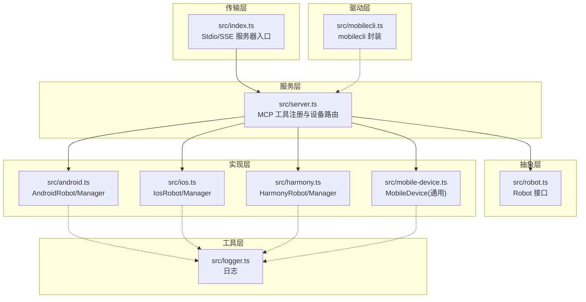
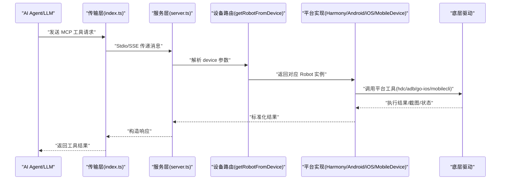
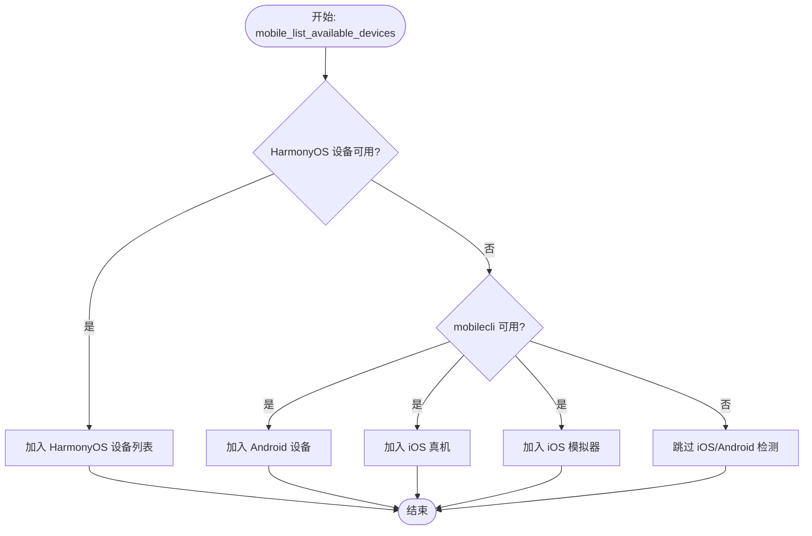
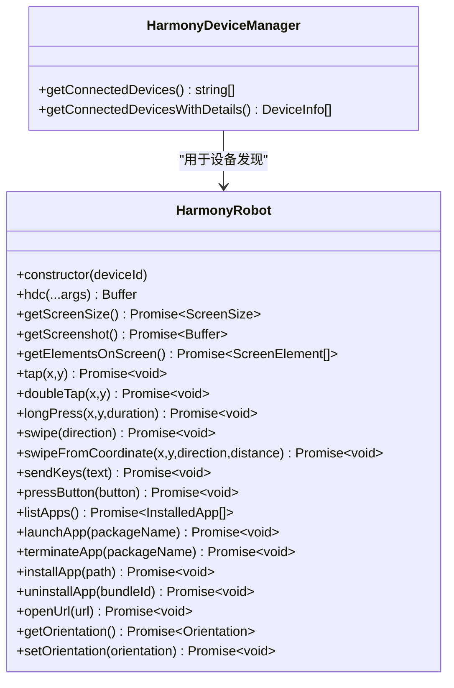
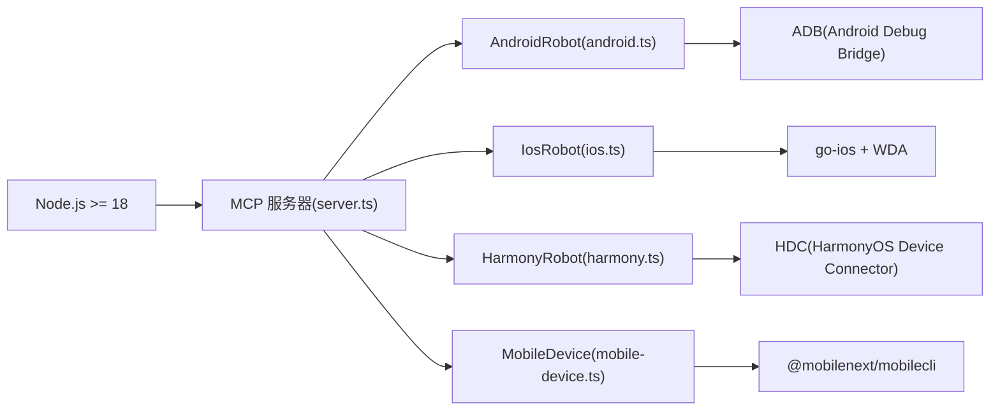

# 故障排除

<cite>
**本文引用的文件**
- [README.md](file://README.md)
- [package.json](file://package.json)
- [src/index.ts](file://src/index.ts)
- [src/server.ts](file://src/server.ts)
- [src/robot.ts](file://src/robot.ts)
- [src/harmony.ts](file://src/harmony.ts)
- [src/android.ts](file://src/android.ts)
- [src/ios.ts](file://src/ios.ts)
- [src/mobilecli.ts](file://src/mobilecli.ts)
- [src/mobile-device.ts](file://src/mobile-device.ts)
- [src/logger.ts](file://src/logger.ts)
- [DEEPWIKI.md](file://DEEPWIKI.md)
- [SECURITY.md](file://SECURITY.md)
- [test/mobilecli.test.ts](file://test/mobilecli.test.ts)
</cite>

## 目录
1. [简介](#简介)
2. [项目结构](#项目结构)
3. [核心组件](#核心组件)
4. [架构总览](#架构总览)
5. [详细组件分析](#详细组件分析)
6. [依赖关系分析](#依赖关系分析)
7. [性能考虑](#性能考虑)
8. [故障排除指南](#故障排除指南)
9. [结论](#结论)
10. [附录](#附录)

## 简介
本指南面向使用 Mobile MCP HarmonyOS 的工程师与测试人员，系统性整理设备连接、权限、性能与配置等常见问题的诊断步骤、日志分析方法与调试工具使用建议，并提供平台特定的排查策略与问题报告模板，帮助快速定位与解决问题。

## 项目结构
项目采用分层架构：传输层负责 MCP 协议接入（Stdio/SSE），服务层注册工具并进行设备路由，抽象层定义统一的 Robot 接口，实现层分别对接 Android、iOS、HarmonyOS 与通用 mobilecli 设备，驱动层封装底层工具（ADB、go-ios、mobilecli、HDC 等），工具层提供图像处理与日志等通用能力。

图表来源
- [src/index.ts:1-67](file://src/index.ts#L1-L67)
- [src/server.ts:1-708](file://src/server.ts#L1-L708)
- [src/robot.ts:1-148](file://src/robot.ts#L1-L148)
- [src/android.ts:1-200](file://src/android.ts#L1-L200)
- [src/ios.ts:1-200](file://src/ios.ts#L1-L200)
- [src/harmony.ts:1-462](file://src/harmony.ts#L1-L462)
- [src/mobile-device.ts:1-217](file://src/mobile-device.ts#L1-L217)
- [src/mobilecli.ts:1-136](file://src/mobilecli.ts#L1-L136)
- [src/logger.ts:1-22](file://src/logger.ts#L1-L22)

章节来源
- [DEEPWIKI.md:32-54](file://DEEPWIKI.md#L32-L54)
- [src/index.ts:1-67](file://src/index.ts#L1-L67)
- [src/server.ts:1-708](file://src/server.ts#L1-L708)

## 核心组件
- 传输层：支持 Stdio（默认）与 SSE（HTTP）两种 MCP 传输模式，便于不同客户端集成。
- 服务层：注册 20 个工具，统一设备路由与错误处理，内置遥测上报。
- 抽象层：Robot 接口定义跨平台一致的操作能力，便于扩展 HarmonyOS 等新平台。
- 实现层：AndroidRobot、IosRobot、HarmonyRobot、MobileDevice 分别对接不同平台自动化能力。
- 驱动层：封装 ADB、go-ios、mobilecli、HDC 等底层工具调用。
- 工具层：日志记录、图像处理与 PNG 解析等通用能力。

章节来源
- [src/index.ts:1-67](file://src/index.ts#L1-L67)
- [src/server.ts:1-708](file://src/server.ts#L1-L708)
- [src/robot.ts:1-148](file://src/robot.ts#L1-L148)
- [src/harmony.ts:1-462](file://src/harmony.ts#L1-L462)
- [src/android.ts:1-200](file://src/android.ts#L1-L200)
- [src/ios.ts:1-200](file://src/ios.ts#L1-L200)
- [src/mobile-device.ts:1-217](file://src/mobile-device.ts#L1-L217)
- [src/mobilecli.ts:1-136](file://src/mobilecli.ts#L1-L136)
- [src/logger.ts:1-22](file://src/logger.ts#L1-L22)

## 架构总览
MCP 工具调用经由传输层进入服务层，服务层根据设备 ID 路由到对应平台的 Robot 实现，再通过底层驱动与设备交互。HarmonyOS 通过 HDC/uitest/hidumper 等工具直接驱动，无需 mobilecli 依赖。

图表来源
- [src/index.ts:1-67](file://src/index.ts#L1-L67)
- [src/server.ts:149-197](file://src/server.ts#L149-L197)
- [src/harmony.ts:43-462](file://src/harmony.ts#L43-L462)
- [src/android.ts:74-200](file://src/android.ts#L74-L200)
- [src/ios.ts:42-200](file://src/ios.ts#L42-L200)
- [src/mobile-device.ts:62-217](file://src/mobile-device.ts#L62-L217)
- [src/mobilecli.ts:27-136](file://src/mobilecli.ts#L27-L136)

## 详细组件分析

### 设备路由与工具注册（server.ts）
- 设备路由：优先识别 HarmonyOS 设备（通过 HDC 查询），其次检查 mobilecli 可用性，再识别 iOS/Android/模拟器。
- 工具注册：统一参数校验、错误处理与遥测上报，工具失败时区分“可修复错误”与“系统异常”。

图表来源
- [src/server.ts:207-294](file://src/server.ts#L207-L294)
- [src/server.ts:149-197](file://src/server.ts#L149-L197)

章节来源
- [src/server.ts:135-197](file://src/server.ts#L135-L197)
- [src/server.ts:207-294](file://src/server.ts#L207-L294)

### HarmonyOS 自动化（harmony.ts）
- 设备发现：通过 HDC list targets 与 shell param 获取设备名与版本。
- 截图：通过 snapshot_display 截图并 recv 到本地临时目录，再读取 Buffer。
- UI 元素：通过 uitest dumpLayout 保存到设备临时路径，再 recv 到本地解析。
- 按键/输入：通过 uitest uiInput 与 hidumper 获取屏幕尺寸/方向。

图表来源
- [src/harmony.ts:43-462](file://src/harmony.ts#L43-L462)

章节来源
- [src/harmony.ts:12-18](file://src/harmony.ts#L12-L18)
- [src/harmony.ts:43-462](file://src/harmony.ts#L43-L462)

### Android 自动化（android.ts）
- ADB 路径查找：支持 ANDROID_HOME、Windows/macOS 默认路径与回退到 PATH。
- 截图：exec-out screencap，多屏设备通过 display ID 指定。
- UI 元素：uiautomator dump XML，解析节点集合。

章节来源
- [src/android.ts:32-54](file://src/android.ts#L32-L54)
- [src/android.ts:103-131](file://src/android.ts#L103-L131)
- [src/android.ts:159-191](file://src/android.ts#L159-L191)

### iOS 自动化（ios.ts）
- go-ios + WebDriverAgent：通过隧道与端口转发保障连接，WDA 提供截图、动作与页面源。
- iOS 17+ 需要 tunnel（端口 60105）与 WDA 端口转发（端口 8100）。

章节来源
- [src/ios.ts:33-40](file://src/ios.ts#L33-L40)
- [src/ios.ts:69-92](file://src/ios.ts#L69-L92)
- [src/ios.ts:110-118](file://src/ios.ts#L110-L118)

### 通用设备（mobile-device.ts + mobilecli.ts）
- 通过 mobilecli 二进制工具桥接 iOS/Android 模拟器能力，命令映射到具体子命令。
- mobilecli 封装：支持环境变量与多平台二进制查找。

章节来源
- [src/mobile-device.ts:62-217](file://src/mobile-device.ts#L62-L217)
- [src/mobilecli.ts:27-136](file://src/mobilecli.ts#L27-L136)

## 依赖关系分析
- 运行时要求：Node.js >= 18，HarmonyOS 依赖 HDC（随 HarmonyOS SDK 提供）。
- 可选依赖：mobilecli（用于 iOS/Android 模拟器与通用设备）。
- 传输模式：Stdio（默认）与 SSE（HTTP）。

图表来源
- [package.json:13-15](file://package.json#L13-L15)
- [package.json:37-39](file://package.json#L37-L39)
- [README.md:92-99](file://README.md#L92-L99)
- [src/server.ts:135-147](file://src/server.ts#L135-L147)

章节来源
- [package.json:13-15](file://package.json#L13-L15)
- [package.json:37-39](file://package.json#L37-L39)
- [README.md:92-99](file://README.md#L92-L99)
- [src/server.ts:135-147](file://src/server.ts#L135-L147)

## 性能考虑
- 截图优化：当可用时将 PNG 缩放后转 JPEG，降低传输体积与 Agent 处理成本。
- 超时与缓冲：各平台调用设置合理超时与最大缓冲，避免长时间阻塞。
- 日志与遥测：仅在必要时记录 trace/error，避免影响工具执行性能。

章节来源
- [src/server.ts:615-650](file://src/server.ts#L615-L650)
- [src/harmony.ts:9-18](file://src/harmony.ts#L9-L18)
- [src/android.ts:69-71](file://src/android.ts#L69-L71)
- [src/ios.ts:110-118](file://src/ios.ts#L110-L118)
- [src/logger.ts:15-21](file://src/logger.ts#L15-L21)

## 故障排除指南

### 一、设备连接问题

#### 1. HDC 连接失败（HarmonyOS）
- 现象
  - 设备未出现在 mobile_list_available_devices 列表
  - 截图/元素获取报错或返回空数据
- 诊断步骤
  - 确认 HDC 可用：检查环境变量 HDC_SDK_PATH 或 PATH 中是否存在 hdc
  - 手动验证：在终端执行 hdc list targets 与 hdc -t <device> shell hidumper
- 常见原因
  - HDC 未安装或未加入 PATH
  - 设备未启用开发者选项与调试功能
  - 设备与主机网络/USB 未正确连接
- 解决方案
  - 设置 HDC_SDK_PATH 指向 HarmonyOS SDK bin 目录
  - 在设备上开启“开发者选项”和“USB 调试”
  - 更换 USB 线缆与端口，尝试不同电脑
  - 使用 hdc -t <device> shell param get 命令确认设备连通性

章节来源
- [src/harmony.ts:12-18](file://src/harmony.ts#L12-L18)
- [src/harmony.ts:420-460](file://src/harmony.ts#L420-L460)
- [README.md:96-98](file://README.md#L96-L98)

#### 2. iOS 设备无法识别
- 现象
  - iOS 设备未出现在设备列表
  - 工具调用报“隧道/端口转发/WDA 未运行”
- 诊断步骤
  - 检查 go-ios 是否可用（环境变量 GO_IOS_PATH 或 PATH）
  - iOS 17+ 是否已启动隧道（端口 60105）与端口转发（端口 8100）
  - WDA 是否在设备上运行
- 常见原因
  - go-ios 未安装或未加入 PATH
  - 隧道/端口转发未配置
  - WDA 未安装或未运行
- 解决方案
  - 安装并配置 go-ios，确保可执行文件在 PATH
  - 按照文档配置隧道与端口转发
  - 确保 WebDriverAgent 在设备上安装并运行

章节来源
- [src/ios.ts:33-40](file://src/ios.ts#L33-L40)
- [src/ios.ts:69-92](file://src/ios.ts#L69-L92)
- [src/ios.ts:104-108](file://src/ios.ts#L104-L108)

#### 3. Android 设备无响应
- 现象
  - 设备未出现在设备列表
  - 截图/点击无效
- 诊断步骤
  - 检查 ADB 路径：ANDROID_HOME、Windows/macOS 默认路径与 PATH
  - 手动执行 adb devices 与 adb -s <device> shell wm size
- 常见原因
  - ADB 未安装或未加入 PATH
  - USB 调试未开启或驱动未安装
  - 设备被系统限制（厂商定制系统）
- 解决方案
  - 设置 ANDROID_HOME 或在默认路径安装 Android SDK
  - 开启开发者选项与 USB 调试，重新授权
  - 更换数据线与 USB 端口，尝试不同电脑

章节来源
- [src/android.ts:32-54](file://src/android.ts#L32-L54)
- [src/android.ts:103-116](file://src/android.ts#L103-L116)

#### 4. 移动端模拟器（iOS/Android）无响应
- 现象
  - 模拟器未出现在设备列表
  - mobilecli 版本检查失败
- 诊断步骤
  - 检查 mobilecli 可用性：MOBILECLI_PATH 或 node_modules 中二进制
  - 手动执行 mobilecli devices
- 常见原因
  - mobilecli 未安装或路径不正确
  - 模拟器未启动或状态异常
- 解决方案
  - 设置 MOBILECLI_PATH 指向正确的二进制
  - 启动模拟器后再执行工具

章节来源
- [src/mobilecli.ts:53-92](file://src/mobilecli.ts#L53-L92)
- [src/server.ts:138-147](file://src/server.ts#L138-L147)

### 二、权限问题

#### 1. HDC 权限不足
- 现象
  - hdc 命令执行失败或提示权限不足
- 诊断步骤
  - 在终端以管理员/当前用户身份执行 hdc 命令
- 解决方案
  - 在 Linux/macOS 上赋予 hdc 可执行权限
  - 使用 sudo（谨慎）或切换到具备权限的用户

章节来源
- [src/harmony.ts:48-53](file://src/harmony.ts#L48-L53)

#### 2. iOS 开发者权限
- 现象
  - go-ios 无法与设备通信或安装应用失败
- 诊断步骤
  - 检查设备信任弹窗是否已确认
  - 确认开发者证书与设备绑定
- 解决方案
  - 在设备上信任开发者证书与电脑
  - 重新授权设备并重启 go-ios

章节来源
- [src/ios.ts:69-92](file://src/ios.ts#L69-L92)

#### 3. Android USB 调试
- 现象
  - adb devices 无设备或权限受限
- 诊断步骤
  - 检查开发者选项中的“USB 调试”是否开启
  - 重新拔插 USB 线并选择“传输数据/仅充电”以外的模式
- 解决方案
  - 重新开启 USB 调试并授权
  - 更换 USB 线与端口，更换电脑尝试

章节来源
- [src/android.ts:32-54](file://src/android.ts#L32-L54)

### 三、性能问题

#### 1. 响应缓慢
- 现象
  - 工具调用耗时较长
- 诊断步骤
  - 查看日志中工具执行耗时统计
  - 检查截图大小与格式转换是否触发
- 优化建议
  - 使用内置截图优化（PNG→缩放→JPEG），减少传输体积
  - 避免频繁截图与元素解析

章节来源
- [src/server.ts:70-75](file://src/server.ts#L70-L75)
- [src/server.ts:615-650](file://src/server.ts#L615-L650)

#### 2. 内存泄漏
- 现象
  - 长时间运行后内存占用持续增长
- 诊断步骤
  - 使用 Node.js 性能分析工具（如 --inspect）观察堆快照
- 优化建议
  - 确保临时文件与目录在 finally 中清理
  - 避免在循环中累积大对象

章节来源
- [src/harmony.ts:164-181](file://src/harmony.ts#L164-L181)
- [src/harmony.ts:298-331](file://src/harmony.ts#L298-L331)

#### 3. CPU 占用过高
- 现象
  - 截图/元素解析导致 CPU 占用高
- 诊断步骤
  - 观察截图处理链路与 UI 树解析
- 优化建议
  - 合理设置截图质量与尺寸
  - 减少不必要的元素解析与重复抓取

章节来源
- [src/server.ts:615-650](file://src/server.ts#L615-L650)

### 四、配置问题

#### 1. 环境变量设置
- 常用变量
  - HDC_SDK_PATH：HDC 可执行文件所在目录
  - ANDROID_HOME：Android SDK 路径
  - GO_IOS_PATH：go-ios 可执行文件路径
  - MOBILECLI_PATH：mobilecli 二进制路径
  - LOG_FILE：日志输出文件路径
- 设置建议
  - 在 ~/.bashrc 或 ~/.zshrc 中添加 PATH 与变量
  - 使用绝对路径避免相对路径问题

章节来源
- [src/harmony.ts:12-18](file://src/harmony.ts#L12-L18)
- [src/android.ts:32-54](file://src/android.ts#L32-L54)
- [src/ios.ts:33-40](file://src/ios.ts#L33-L40)
- [src/mobilecli.ts:53-92](file://src/mobilecli.ts#L53-L92)
- [src/logger.ts:3-13](file://src/logger.ts#L3-L13)

#### 2. 路径配置
- ADB/HDC/go-ios/mobilecli 二进制需在 PATH 或通过环境变量显式指定
- 跨平台二进制命名与架构映射需正确

章节来源
- [src/android.ts:32-54](file://src/android.ts#L32-L54)
- [src/harmony.ts:12-18](file://src/harmony.ts#L12-L18)
- [src/mobilecli.ts:53-92](file://src/mobilecli.ts#L53-L92)

#### 3. 版本兼容性
- Node.js 版本需满足 >= 18
- mobilecli 可用性检查失败时需按文档安装
- iOS 17+ 需要隧道与端口转发

章节来源
- [package.json:13-15](file://package.json#L13-L15)
- [src/server.ts:138-147](file://src/server.ts#L138-L147)
- [src/ios.ts:104-108](file://src/ios.ts#L104-L108)

### 五、日志分析与调试工具

#### 1. 日志输出
- 日志同时输出到 stderr，并可选写入文件（LOG_FILE）
- trace/error 两条路径，便于区分调试与错误

章节来源
- [src/logger.ts:3-21](file://src/logger.ts#L3-L21)

#### 2. 调试工具
- 截图：mobile_take_screenshot 返回 base64 图像，便于人工核验
- 元素：mobile_list_elements_on_screen 返回结构化 UI 元素，便于定位控件
- 设备：mobile_list_available_devices 返回设备列表，便于确认设备状态

章节来源
- [src/server.ts:585-673](file://src/server.ts#L585-L673)
- [src/server.ts:445-483](file://src/server.ts#L445-L483)
- [src/server.ts:199-294](file://src/server.ts#L199-L294)

#### 3. 单元测试参考
- mobilecli 封装的版本与设备查询行为可通过单元测试断言

章节来源
- [test/mobilecli.test.ts:24-57](file://test/mobilecli.test.ts#L24-L57)
- [test/mobilecli.test.ts:59-118](file://test/mobilecli.test.ts#L59-L118)

### 六、平台特定排查方法

#### 1. HarmonyOS
- 设备发现：hdc list targets → hdc -t <device> shell param get
- 截图：snapshot_display → file recv
- UI 元素：uitest dumpLayout → 本地解析 JSON
- 方向：hidumper DisplayManagerService

章节来源
- [src/harmony.ts:420-460](file://src/harmony.ts#L420-L460)
- [src/harmony.ts:159-182](file://src/harmony.ts#L159-L182)
- [src/harmony.ts:294-332](file://src/harmony.ts#L294-L332)
- [src/harmony.ts:401-415](file://src/harmony.ts#L401-L415)

#### 2. Android
- ADB 路径：ANDROID_HOME、默认路径、PATH
- 截图：screencap → 多屏 display ID
- UI 元素：uiautomator dump XML

章节来源
- [src/android.ts:32-54](file://src/android.ts#L32-L54)
- [src/android.ts:103-131](file://src/android.ts#L103-L131)
- [src/android.ts:159-191](file://src/android.ts#L159-L191)

#### 3. iOS
- go-ios + WDA：隧道、端口转发、WDA 运行状态
- iOS 17+：必须满足隧道与端口转发要求

章节来源
- [src/ios.ts:33-40](file://src/ios.ts#L33-L40)
- [src/ios.ts:69-92](file://src/ios.ts#L69-L92)
- [src/ios.ts:104-108](file://src/ios.ts#L104-L108)

### 七、问题报告模板
- 环境信息
  - 操作系统与版本
  - Node.js 版本
  - 平台与设备型号/版本
- 复现步骤
  - 期望行为与实际行为
  - 已尝试的修复措施
- 日志与截图
  - 关键日志片段（含时间戳）
  - 截图与元素列表
- 附加信息
  - 环境变量与 PATH
  - 已安装的工具版本

### 八、社区支持
- 问题反馈：通过 GitHub Issues 提交
- 安全漏洞：通过 Slack 渠道私下报告

章节来源
- [SECURITY.md:11-16](file://SECURITY.md#L11-L16)

## 结论
通过明确的设备路由、平台特定的自动化工具链与完善的日志/遥测机制，Mobile MCP HarmonyOS 能够稳定地为多端设备提供一致的自动化能力。遵循本指南的诊断步骤与优化建议，可有效提升问题定位效率与系统稳定性。

## 附录

### A. 常用命令速查
- HarmonyOS：hdc list targets、hdc -t <device> shell hidumper、hdc shell snapshot_display、hdc shell uitest
- Android：adb devices、adb -s <device> shell wm size、adb exec-out screencap
- iOS：go-ios 设备列表与应用管理、WDA 状态检查
- 通用：mobilecli devices、mobilecli screenshot

章节来源
- [src/harmony.ts:420-460](file://src/harmony.ts#L420-L460)
- [src/android.ts:103-116](file://src/android.ts#L103-L116)
- [src/mobilecli.ts:107-134](file://src/mobilecli.ts#L107-L134)