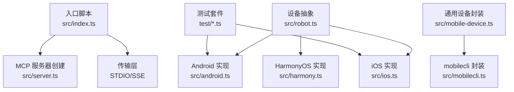
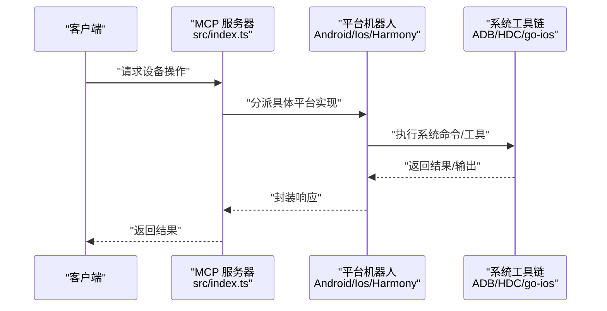
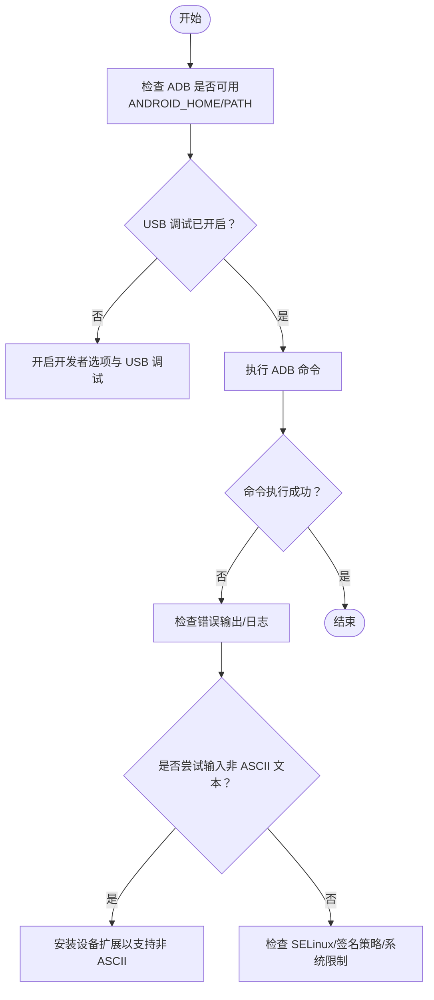
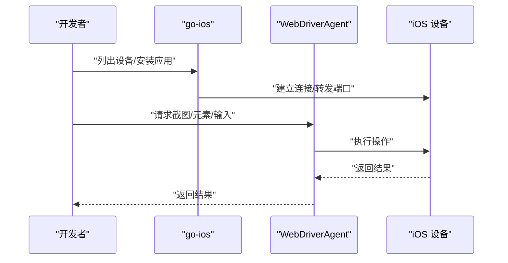
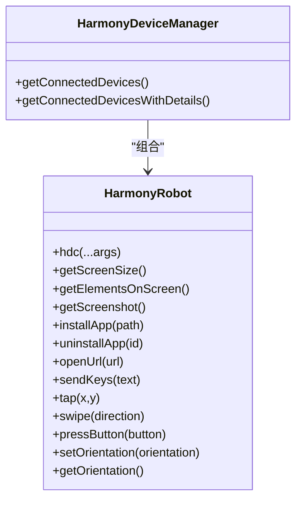
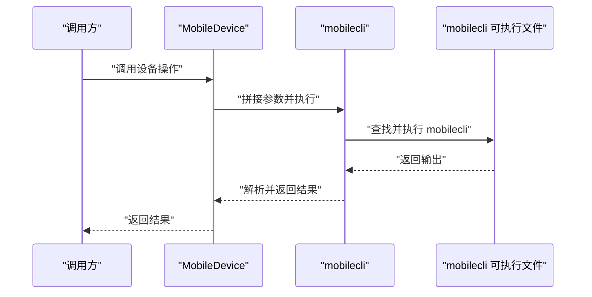
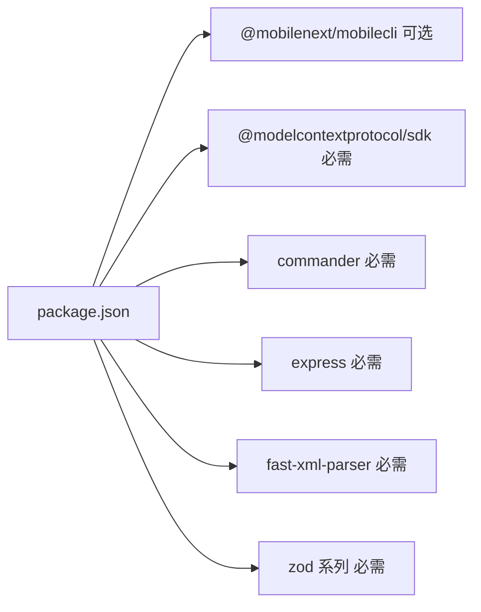

# 权限问题

<cite>
**本文引用的文件**
- [README.md](file://README.md)
- [package.json](file://package.json)
- [SECURITY.md](file://SECURITY.md)
- [src/index.ts](file://src/index.ts)
- [src/robot.ts](file://src/robot.ts)
- [src/mobile-device.ts](file://src/mobile-device.ts)
- [src/mobilecli.ts](file://src/mobilecli.ts)
- [src/android.ts](file://src/android.ts)
- [src/ios.ts](file://src/ios.ts)
- [src/harmony.ts](file://src/harmony.ts)
- [src/iphone-simulator.ts](file://src/iphone-simulator.ts)
- [test/android.ts](file://test/android.ts)
- [test/ios.ts](file://test/ios.ts)
</cite>

## 目录
1. [简介](#简介)
2. [项目结构](#项目结构)
3. [核心组件](#核心组件)
4. [架构总览](#架构总览)
5. [详细组件分析](#详细组件分析)
6. [依赖分析](#依赖分析)
7. [性能考量](#性能考量)
8. [故障排除指南](#故障排除指南)
9. [结论](#结论)
10. [附录](#附录)

## 简介
本指南聚焦于本仓库涉及的三大平台（Android、iOS、HarmonyOS/HDC）在自动化测试与设备控制场景中的权限问题，覆盖权限配置、检查清单、申请流程、验证方法、失效原因与恢复步骤，并结合代码实现给出可落地的安全建议与自动化检测思路。文档同时提供面向企业环境的批量配置与管理建议。

## 项目结构
该项目为一个 MCP（Model Context Protocol）服务器，统一抽象 iOS、Android、HarmonyOS 的设备控制能力，核心模块包括：
- 服务入口与传输层：命令行参数解析、STDIO/SSE 两种传输模式
- 设备与机器人抽象：统一的 Robot 接口定义，各平台具体实现
- 平台适配层：Android（ADB）、iOS（go-ios/WebDriverAgent）、HarmonyOS（HDC/uitest/hidumper）
- 测试与示例：基础功能测试，验证截图、元素识别、应用启停等

图表来源
- [src/index.ts:1-67](file://src/index.ts#L1-L67)
- [src/robot.ts:1-148](file://src/robot.ts#L1-L148)
- [src/android.ts:1-593](file://src/android.ts#L1-L593)
- [src/ios.ts:1-294](file://src/ios.ts#L1-L294)
- [src/harmony.ts:1-462](file://src/harmony.ts#L1-L462)
- [src/mobile-device.ts:1-217](file://src/mobile-device.ts#L1-L217)
- [src/mobilecli.ts:1-136](file://src/mobilecli.ts#L1-L136)
- [test/android.ts:1-140](file://test/android.ts#L1-L140)
- [test/ios.ts:1-29](file://test/ios.ts#L1-L29)

章节来源
- [README.md:1-198](file://README.md#L1-L198)
- [src/index.ts:1-67](file://src/index.ts#L1-L67)
- [src/robot.ts:1-148](file://src/robot.ts#L1-L148)

## 核心组件
- Robot 接口：统一设备操作契约（屏幕尺寸、截图、元素识别、应用启停、输入、按键、滑动、方向等）
- 平台实现：
  - AndroidRobot：通过 ADB 执行 shell 命令，读取 UI 层级、截图、输入、按键、应用管理
  - IosRobot：通过 go-ios 与 WebDriverAgent 协作，完成截图、元素识别、应用启停、输入等
  - HarmonyRobot：通过 HDC/uitest/hidumper 等工具链完成设备交互与布局 dump
- 通用封装：MobileDevice 以 mobilecli 作为统一入口；HarmonyDeviceManager/AndroidDeviceManager/IosManager 提供设备枚举与基础信息

章节来源
- [src/robot.ts:48-147](file://src/robot.ts#L48-L147)
- [src/android.ts:74-504](file://src/android.ts#L74-L504)
- [src/ios.ts:42-232](file://src/ios.ts#L42-L232)
- [src/harmony.ts:43-416](file://src/harmony.ts#L43-L416)
- [src/mobile-device.ts:62-216](file://src/mobile-device.ts#L62-L216)

## 架构总览
下图展示 MCP 服务器如何通过不同传输层接入，并调用各平台机器人实现完成设备控制。

图表来源
- [src/index.ts:9-48](file://src/index.ts#L9-L48)
- [src/android.ts:79-92](file://src/android.ts#L79-L92)
- [src/harmony.ts:48-53](file://src/harmony.ts#L48-L53)
- [src/ios.ts:94-96](file://src/ios.ts#L94-L96)

## 详细组件分析

### Android 权限与安全要点
- ADB 权限与调试：
  - 需要正确配置 ANDROID_HOME 或在 PATH 中提供 adb，且设备处于“允许 USB 调试”状态
  - 代码通过 adb shell 执行 UIAutomator、screencap、input、am 等命令，权限不足会导致失败
- 非 ASCII 文本输入：
  - 若未安装特定设备扩展（如 DeviceKit），非 ASCII 文本输入会被拒绝，需按错误提示安装相应组件
- 应用安装/卸载：
  - install/uninstall 命令可能因签名策略、系统限制或权限不足而失败
- 方向设置：
  - 通过系统设置写入 user_rotation 控制方向，需要关闭自动旋转后写入

图表来源
- [src/android.ts:32-54](file://src/android.ts#L32-L54)
- [src/android.ts:422-427](file://src/android.ts#L422-L427)
- [src/android.ts:453-464](file://src/android.ts#L453-L464)

章节来源
- [src/android.ts:74-504](file://src/android.ts#L74-L504)
- [test/android.ts:1-140](file://test/android.ts#L1-L140)

### iOS 权限与安全要点
- go-ios 与 WebDriverAgent：
  - go-ios 用于设备枚举、应用安装/卸载、URL 打开等；WebDriverAgent 用于触摸、输入、截图、元素识别
  - 代码对隧道端口与 WDA 端口监听状态进行校验，若未就绪会抛出可定位的错误
- 真机与模拟器差异：
  - 代码区分 iOS 版本是否需要隧道；模拟器路径由独立模块处理
- 安全与证书：
  - 证书与信任链影响真机调试；若证书过期或不受信，可能导致连接失败

图表来源
- [src/ios.ts:42-232](file://src/ios.ts#L42-L232)
- [src/iphone-simulator.ts:32-236](file://src/iphone-simulator.ts#L32-L236)

章节来源
- [src/ios.ts:1-294](file://src/ios.ts#L1-L294)
- [src/iphone-simulator.ts:1-236](file://src/iphone-simulator.ts#L1-L236)
- [test/ios.ts:1-29](file://test/ios.ts#L1-L29)

### HarmonyOS/HDC 权限与安全要点
- HDC 工具链：
  - 通过 HDC 列举目标、shell 命令、文件收发、uitest/hidumper 等工具完成交互
  - 代码通过环境变量 HDC_SDK_PATH 或 PATH 解析 hdc 可执行文件
- 设备发现与能力：
  - 使用 hdc list targets 发现设备；通过 hidumper 获取屏幕尺寸与方向
- 安全与证书：
  - 代码未直接体现证书管理逻辑，但 HDC 通信与证书信任链会影响设备连接稳定性

图表来源
- [src/harmony.ts:43-416](file://src/harmony.ts#L43-L416)
- [src/harmony.ts:418-461](file://src/harmony.ts#L418-L461)

章节来源
- [src/harmony.ts:1-462](file://src/harmony.ts#L1-L462)

### 通用设备封装与 mobilecli
- MobileDevice 通过 mobilecli 统一调用底层命令，传入 --device 指定目标设备
- mobilecli 二进制位置解析逻辑支持多平台与多架构，找不到时会抛出明确错误

图表来源
- [src/mobile-device.ts:70-73](file://src/mobile-device.ts#L70-L73)
- [src/mobilecli.ts:39-51](file://src/mobilecli.ts#L39-L51)
- [src/mobilecli.ts:53-92](file://src/mobilecli.ts#L53-L92)

章节来源
- [src/mobile-device.ts:1-217](file://src/mobile-device.ts#L1-L217)
- [src/mobilecli.ts:1-136](file://src/mobilecli.ts#L1-L136)

## 依赖分析
- 运行时依赖与可选依赖：
  - 必需：@modelcontextprotocol/sdk、commander、express、fast-xml-parser、zod 系列
  - 可选：@mobilenext/mobilecli（用于某些设备能力）
- 平台工具链：
  - Android：ADB（ANDROID_HOME 或 PATH）
  - iOS：go-ios、WebDriverAgent（端口转发）
  - HarmonyOS：HDC（HDC_SDK_PATH 或 PATH）

图表来源
- [package.json:29-39](file://package.json#L29-L39)
- [package.json:61-64](file://package.json#L61-L64)

章节来源
- [package.json:1-74](file://package.json#L1-L74)
- [README.md:90-100](file://README.md#L90-L100)

## 性能考量
- 命令超时与缓冲区大小：
  - 各平台实现均设置了合理的超时与最大缓冲区，避免长时间阻塞与内存溢出
- 截图与 UI dump：
  - Android 使用 screencap 与 uiautomator；iOS 通过 WebDriverAgent；HarmonyOS 使用 snapshot_display 与 dumpLayout
- 失败重试：
  - Android 的 UIAutomator dump 存在多次重试逻辑，提升稳定性

章节来源
- [src/android.ts:69-71](file://src/android.ts#L69-L71)
- [src/android.ts:466-481](file://src/android.ts#L466-L481)
- [src/harmony.ts:9-11](file://src/harmony.ts#L9-L11)
- [src/ios.ts:7-8](file://src/ios.ts#L7-L8)

## 故障排除指南

### 通用权限检查清单
- 系统工具链可用性
  - Android：adb 可执行文件存在且可执行；ANDROID_HOME 或 PATH 正确
  - iOS：go-ios 可执行文件存在；端口转发与 WebDriverAgent 就绪
  - HarmonyOS：hdc 可执行文件存在；HDC_SDK_PATH 或 PATH 正确
- 设备连接状态
  - Android：adb devices 输出包含目标设备
  - iOS：go-ios list 输出包含目标设备；隧道与端口监听正常
  - HarmonyOS：hdc list targets 输出包含目标设备
- 权限与调试开关
  - Android：USB 调试已开启；必要时授予安装未知来源应用权限
  - iOS：证书受信；必要时重启设备与 Xcode/WebDriverAgent
  - HarmonyOS：设备已授权 HDC 访问；证书/信任链有效

章节来源
- [src/android.ts:32-54](file://src/android.ts#L32-L54)
- [src/ios.ts:33-40](file://src/ios.ts#L33-L40)
- [src/harmony.ts:12-18](file://src/harmony.ts#L12-L18)
- [src/ios.ts:69-92](file://src/ios.ts#L69-L92)

### 权限申请流程与验证方法
- Android
  - 申请流程：开启开发者选项与 USB 调试；必要时允许安装未知来源应用
  - 验证方法：执行 adb devices 与 adb shell wm size；尝试 screencap 与 uiautomator dump
- iOS
  - 申请流程：信任开发者证书；确保端口转发（本地 8100）可用；启动 WebDriverAgent
  - 验证方法：go-ios list；检查本地端口监听；执行截图与元素识别
- HarmonyOS
  - 申请流程：确保 HDC 可用；设备已授权；必要时更新证书
  - 验证方法：hdc list targets；执行 hidumper 与 snapshot_display；dumpLayout

章节来源
- [src/android.ts:551-591](file://src/android.ts#L551-L591)
- [src/ios.ts:258-292](file://src/ios.ts#L258-L292)
- [src/harmony.ts:418-461](file://src/harmony.ts#L418-L461)

### 权限失效的常见原因与恢复步骤
- Android
  - 常见原因：USB 调试被关闭、设备授权被撤销、SELinux 策略限制
  - 恢复步骤：重新开启开发者选项与 USB 调试；重新授权设备；检查 SELinux 状态
- iOS
  - 常见原因：证书过期或不受信；端口转发异常；WebDriverAgent 未运行
  - 恢复步骤：重新信任证书；重启隧道与端口转发；重启 WebDriverAgent
- HarmonyOS
  - 常见原因：HDC 未找到或无权限；设备未授权；证书链异常
  - 恢复步骤：设置 HDC_SDK_PATH 或确保 hdc 在 PATH；重新授权设备；更新证书

章节来源
- [src/android.ts:551-591](file://src/android.ts#L551-L591)
- [src/ios.ts:69-92](file://src/ios.ts#L69-L92)
- [src/harmony.ts:418-461](file://src/harmony.ts#L418-L461)

### 权限相关的安全考虑
- 最小权限原则：仅授予必要的调试与安装权限
- 证书与信任：定期更新证书，避免过期导致连接中断
- 网络与端口：严格控制本地端口转发，避免暴露给不受信网络
- 日志与审计：记录关键权限变更与失败事件，便于追踪与审计

章节来源
- [SECURITY.md:1-17](file://SECURITY.md#L1-L17)

### 自动化检测工具与修复脚本思路
- 检测思路（可作为脚本逻辑参考）
  - Android：检测 adb 可执行文件与 PATH；执行 adb devices；尝试 screencap 与 uiautomator dump
  - iOS：检测 go-ios 可执行文件；检查本地端口监听；尝试截图与元素识别
  - HarmonyOS：检测 hdc 可执行文件；执行 hdc list targets；尝试 hidumper 与 snapshot_display
- 修复建议（可作为脚本动作参考）
  - Android：提示开启开发者选项与 USB 调试；建议授予安装未知来源应用权限
  - iOS：提示重新信任证书；重启隧道与端口转发；重启 WebDriverAgent
  - HarmonyOS：提示设置 HDC_SDK_PATH 或添加 hdc 到 PATH；重新授权设备

章节来源
- [src/android.ts:32-54](file://src/android.ts#L32-L54)
- [src/ios.ts:33-40](file://src/ios.ts#L33-L40)
- [src/harmony.ts:12-18](file://src/harmony.ts#L12-L18)

### 企业环境下的权限管理与批量配置
- 策略与基线
  - 统一配置 ANDROID_HOME/PATH 与 HDC_SDK_PATH，确保工具链全局可用
  - 为 CI/CD 环境预置证书与信任链，减少交互式授权
- 批量配置建议
  - Android：通过脚本批量开启开发者选项与 USB 调试（需设备支持自动化）
  - iOS：集中管理证书与信任链，统一启动 WebDriverAgent 与端口转发
  - HarmonyOS：集中部署 HDC 并统一授权策略，定期轮换证书
- 监控与告警
  - 对设备离线、证书过期、端口不可达等事件建立监控与告警

章节来源
- [README.md:90-100](file://README.md#L90-L100)
- [SECURITY.md:1-17](file://SECURITY.md#L1-L17)

## 结论
本项目通过统一的 Robot 抽象屏蔽了 Android、iOS、HarmonyOS 的差异，权限问题主要集中在系统工具链可用性、设备授权与证书信任链。遵循本文的检查清单、申请流程与恢复步骤，可在多数情况下快速定位并解决权限相关问题。企业环境下建议建立标准化的工具链与证书管理策略，并通过自动化脚本实现批量配置与持续监控。

## 附录
- 关键实现参考路径
  - Android 设备枚举与命令执行：[src/android.ts:551-591](file://src/android.ts#L551-L591)
  - iOS 设备枚举与端口检查：[src/ios.ts:258-292](file://src/ios.ts#L258-L292)
  - HarmonyOS 设备枚举与命令执行：[src/harmony.ts:418-461](file://src/harmony.ts#L418-L461)
  - 通用入口与传输层：[src/index.ts:9-48](file://src/index.ts#L9-L48)
  - Robot 接口定义：[src/robot.ts:48-147](file://src/robot.ts#L48-L147)