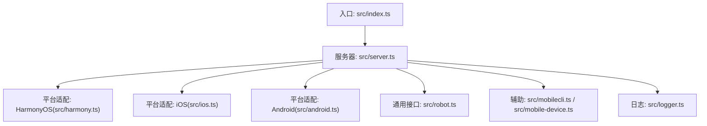
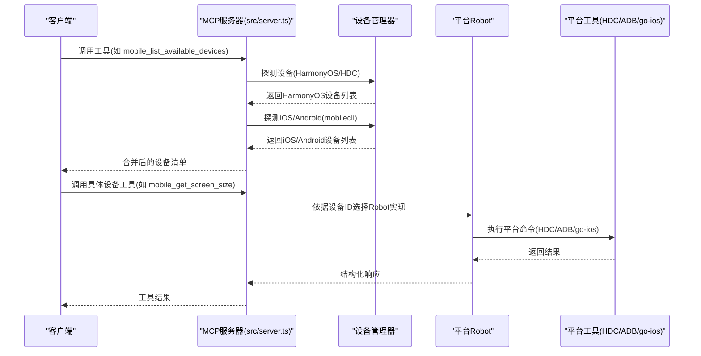
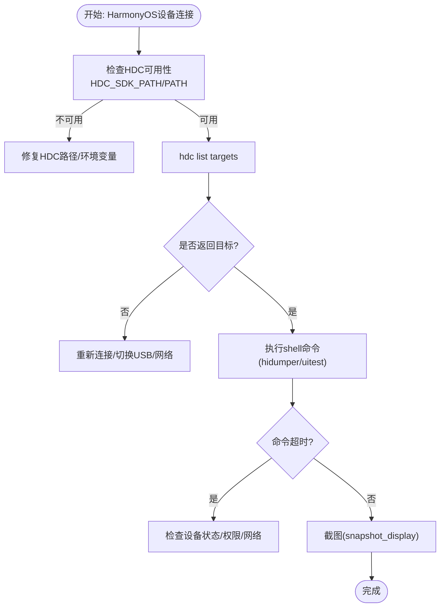
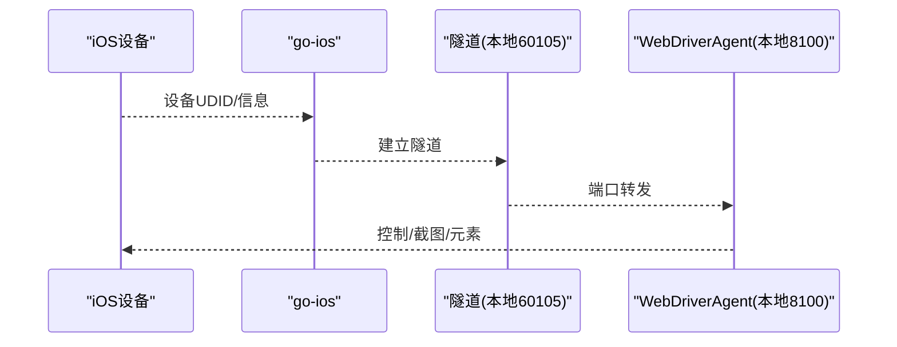
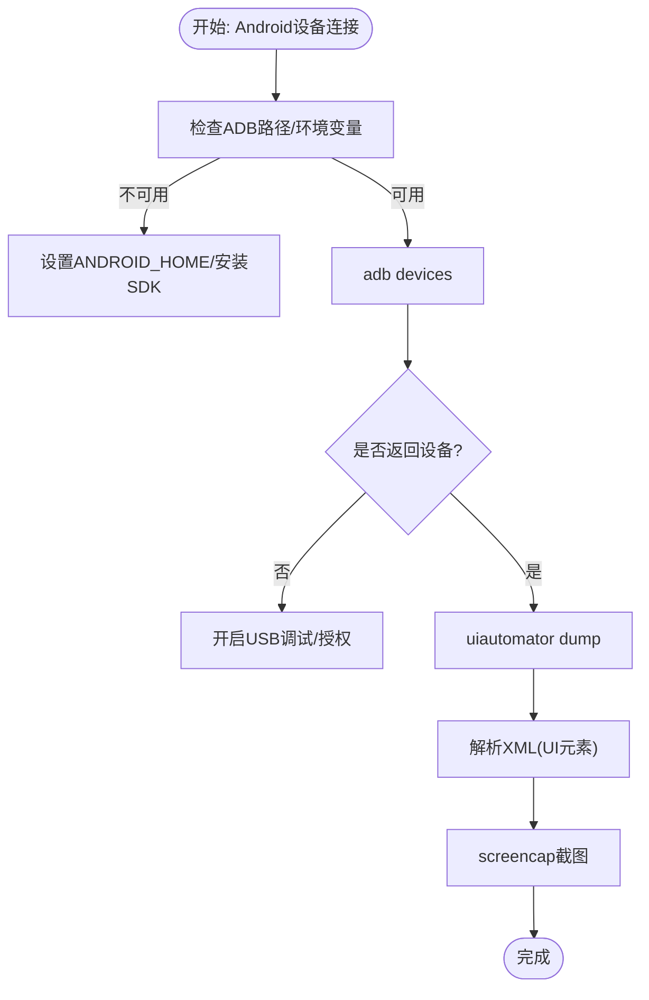
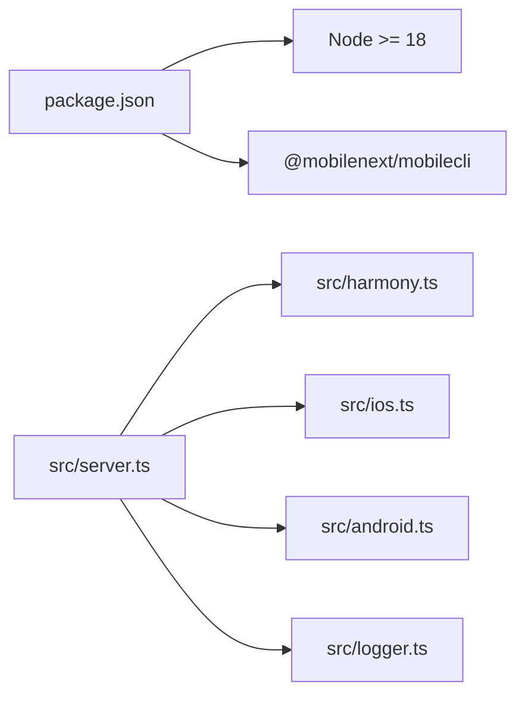

# 设备连接问题

<cite>
**本文引用的文件**
- [README.md](file://README.md)
- [package.json](file://package.json)
- [src/index.ts](file://src/index.ts)
- [src/server.ts](file://src/server.ts)
- [src/robot.ts](file://src/robot.ts)
- [src/mobilecli.ts](file://src/mobilecli.ts)
- [src/mobile-device.ts](file://src/mobile-device.ts)
- [src/android.ts](file://src/android.ts)
- [src/ios.ts](file://src/ios.ts)
- [src/harmony.ts](file://src/harmony.ts)
- [src/logger.ts](file://src/logger.ts)
- [test/mobilecli.test.ts](file://test/mobilecli.test.ts)
- [test/android.ts](file://test/android.ts)
- [test/ios.ts](file://test/ios.ts)
</cite>

## 目录
1. [简介](#简介)
2. [项目结构](#项目结构)
3. [核心组件](#核心组件)
4. [架构总览](#架构总览)
5. [详细组件分析](#详细组件分析)
6. [依赖关系分析](#依赖关系分析)
7. [性能考量](#性能考量)
8. [故障排除指南](#故障排除指南)
9. [结论](#结论)
10. [附录](#附录)

## 简介
本指南聚焦于设备连接问题的系统化故障排除，覆盖 HarmonyOS 设备连接（HDC 工具链配置、设备识别失败、连接超时）、iOS 设备连接（Xcode 调试证书、设备授权、网络连接）、Android 设备连接（ADB 服务、USB 驱动、设备识别）。文档提供分层说明、诊断步骤、错误代码与解决方案、预防措施与最佳实践，并给出设备连接测试脚本与自动化诊断工具的使用方法。

## 项目结构
该项目为 MCP 服务器，统一抽象 iOS、Android、HarmonyOS 三大平台的移动设备自动化能力。核心模块包括：
- 服务器入口与工具注册：负责设备发现、工具调用与错误处理
- 平台适配层：HarmonyOS（HDC/uitest/hidumper）、iOS（go-ios/WebDriverAgent）、Android（ADB/UIAutomator）
- 通用机器人接口：定义统一的设备操作能力
- 日志与诊断：统一日志输出与可选文件落盘

图表来源
- [src/index.ts:1-67](file://src/index.ts#L1-L67)
- [src/server.ts:1-708](file://src/server.ts#L1-L708)
- [src/harmony.ts:1-462](file://src/harmony.ts#L1-L462)
- [src/ios.ts:1-294](file://src/ios.ts#L1-L294)
- [src/android.ts:1-593](file://src/android.ts#L1-L593)
- [src/robot.ts:1-148](file://src/robot.ts#L1-L148)
- [src/mobilecli.ts:1-136](file://src/mobilecli.ts#L1-L136)
- [src/mobile-device.ts:1-217](file://src/mobile-device.ts#L1-L217)
- [src/logger.ts:1-22](file://src/logger.ts#L1-L22)

章节来源
- [README.md:1-198](file://README.md#L1-L198)
- [src/index.ts:1-67](file://src/index.ts#L1-L67)
- [src/server.ts:1-708](file://src/server.ts#L1-L708)

## 核心组件
- 设备发现与路由
  - 统一工具 mobile_list_available_devices 返回设备清单，内部优先探测 HarmonyOS（HDC），再探测 iOS/Android（mobilecli）
  - 根据设备 ID 动态选择对应平台的 Robot 实现
- 平台适配
  - HarmonyOS：HDC/uitest/hidumper/snapshot_display/bm/aa
  - iOS：go-ios + WebDriverAgent（端口转发与隧道）
  - Android：ADB + UIAutomator
- 通用接口 Robot：统一的屏幕尺寸、截图、元素列表、应用管理、输入与手势、方向等能力
- 错误处理：ActionableError 用于可指导修复的错误；统一日志 trace/error 输出

章节来源
- [src/server.ts:149-197](file://src/server.ts#L149-L197)
- [src/server.ts:207-294](file://src/server.ts#L207-L294)
- [src/robot.ts:48-147](file://src/robot.ts#L48-L147)
- [src/harmony.ts:43-461](file://src/harmony.ts#L43-L461)
- [src/ios.ts:42-232](file://src/ios.ts#L42-L232)
- [src/android.ts:74-504](file://src/android.ts#L74-L504)

## 架构总览
下图展示设备连接与工具调用的关键路径：客户端通过 MCP 工具请求，服务器解析设备类型并调用对应平台实现。

图表来源
- [src/server.ts:207-294](file://src/server.ts#L207-L294)
- [src/server.ts:149-197](file://src/server.ts#L149-L197)
- [src/harmony.ts:418-461](file://src/harmony.ts#L418-L461)
- [src/ios.ts:234-293](file://src/ios.ts#L234-L293)
- [src/android.ts:506-592](file://src/android.ts#L506-L592)

## 详细组件分析

### HarmonyOS 设备连接（HDC 工具链）
- 关键点
  - 设备发现：HDC list targets；支持获取设备名称与软件版本
  - 屏幕尺寸与方向：通过 hidumper 抓取 DisplayManagerService
  - 截图：snapshot_display 写入设备临时目录后 recv 拉取
  - 应用管理：bm dump/list/install/uninstall；aa 启停 Ability
  - 坐标输入：uitest uiInput click/swipe/inputText/keyEvent
- 常见问题与定位
  - HDC 不可用：HDC_SDK_PATH 或 PATH 缺失；导致设备发现失败
  - 设备无响应：HDC shell 命令超时；需检查 USB/网络与设备状态
  - 截图失败：远程路径写入失败或权限不足；需确认设备存储空间与权限
  - 应用启动失败：未找到主 Ability 或包名错误；需先 bm dump 确认

图表来源
- [src/harmony.ts:418-461](file://src/harmony.ts#L418-L461)
- [src/harmony.ts:55-182](file://src/harmony.ts#L55-L182)
- [src/harmony.ts:221-288](file://src/harmony.ts#L221-L288)

章节来源
- [src/harmony.ts:12-18](file://src/harmony.ts#L12-L18)
- [src/harmony.ts:418-461](file://src/harmony.ts#L418-L461)
- [src/harmony.ts:55-182](file://src/harmony.ts#L55-L182)
- [src/harmony.ts:221-288](file://src/harmony.ts#L221-L288)

### iOS 设备连接（Xcode 调试证书、设备授权、网络）
- 关键点
  - go-ios 安装与可用性检测；设备列表与详情
  - WebDriverAgent 端口转发与监听（本地 8100）；iOS 17+ 需隧道
  - 屏幕尺寸与截图：通过 WebDriverAgent；支持 PNG/JPEG 处理
- 常见问题与定位
  - go-ios 未安装：无法列出物理设备
  - 隧道未运行：iOS 17+ 必须启动隧道；否则工具调用报错
  - 端口转发未建立：WDA 未监听或被占用
  - 证书/授权：设备未信任开发者证书或未授权调试

图表来源
- [src/ios.ts:42-92](file://src/ios.ts#L42-L92)
- [src/ios.ts:234-293](file://src/ios.ts#L234-L293)

章节来源
- [src/ios.ts:33-40](file://src/ios.ts#L33-L40)
- [src/ios.ts:69-92](file://src/ios.ts#L69-L92)
- [src/ios.ts:234-293](file://src/ios.ts#L234-L293)

### Android 设备连接（ADB 服务、USB 驱动、设备识别）
- 关键点
  - ADB 路径解析：ANDROID_HOME/LOCALAPPDATA/HOME 下的 platform-tools
  - 设备列表与详情：devices/devices-with-details；支持 TV/手机类型识别
  - 截图：screencap/exec-out；多显示器场景解析 display id
  - UI 元素：uiautomator dump + fast-xml-parser 解析
  - 文本输入：ASCII 直接 input；非 ASCII 通过设备配套组件或报错
- 常见问题与定位
  - ANDROID_HOME 未设置：ADB 命令找不到
  - 设备未授权/USB 调试关闭：devices 列表为空
  - ADB 服务异常：重启 ADB 或更换 USB 线/端口
  - UIAutomator 失败：重试机制与空根节点保护

图表来源
- [src/android.ts:32-54](file://src/android.ts#L32-L54)
- [src/android.ts:551-592](file://src/android.ts#L551-L592)
- [src/android.ts:466-491](file://src/android.ts#L466-L491)
- [src/android.ts:295-310](file://src/android.ts#L295-L310)

章节来源
- [src/android.ts:32-54](file://src/android.ts#L32-L54)
- [src/android.ts:551-592](file://src/android.ts#L551-L592)
- [src/android.ts:466-491](file://src/android.ts#L466-L491)
- [src/android.ts:295-310](file://src/android.ts#L295-L310)

## 依赖关系分析
- 运行时依赖
  - Node.js >= 18（package.json engines）
  - optionalDependencies：@mobilenext/mobilecli（用于 iOS/Android/Simulator）
  - 平台工具：HDC（HarmonyOS）、ADB（Android）、go-ios/WebDriverAgent（iOS）
- 组件耦合
  - server.ts 作为中枢，按设备类型动态注入对应 Robot
  - HarmonyOS 与 iOS/Android 的探测逻辑相互独立，避免互相阻塞
  - 日志模块统一输出，便于问题追踪

图表来源
- [package.json:13-14](file://package.json#L13-L14)
- [package.json:37-39](file://package.json#L37-L39)
- [src/server.ts:149-197](file://src/server.ts#L149-L197)
- [src/logger.ts:1-22](file://src/logger.ts#L1-22)

章节来源
- [package.json:13-14](file://package.json#L13-L14)
- [package.json:37-39](file://package.json#L37-L39)
- [src/server.ts:149-197](file://src/server.ts#L149-L197)

## 性能考量
- 截图优化：根据图像格式与尺寸进行缩放与编码，降低传输体积
- 命令超时与缓冲区限制：统一设置超时与最大缓冲，避免长时间阻塞
- UI 元素解析：XML 解析与递归收集，注意大布局树的内存占用

章节来源
- [src/server.ts:606-650](file://src/server.ts#L606-L650)
- [src/harmony.ts:9-10](file://src/harmony.ts#L9-L10)
- [src/android.ts:69-70](file://src/android.ts#L69-L70)
- [src/ios.ts:47-58](file://src/ios.ts#L47-L58)

## 故障排除指南

### 通用诊断步骤
- 确认 MCP 服务器运行状态（stdio/SSE）
- 使用 mobile_list_available_devices 获取设备清单，核对设备 ID/平台/状态
- 查看日志（控制台与可选 LOG_FILE）定位错误堆栈
- 分别针对 HarmonyOS/iOS/Android 执行最小化验证（截图/元素列表）

章节来源
- [src/index.ts:9-33](file://src/index.ts#L9-L33)
- [src/server.ts:207-294](file://src/server.ts#L207-L294)
- [src/logger.ts:3-13](file://src/logger.ts#L3-L13)

### HarmonyOS（HDC）
- 症状与定位
  - 设备未出现在清单：检查 HDC 是否在 PATH 或设置 HDC_SDK_PATH
  - 命令超时：设备离线/USB/网络不稳定；尝试切换端口/网线
  - 截图失败：设备存储空间不足或权限问题；清理缓存后重试
  - 应用启动失败：确认包名与主 Ability；先执行 bm dump 校验
- 解决方案
  - 环境变量：确保 HDC 可执行文件可达
  - 重连：断开/重新连接设备；切换 USB 线/端口
  - 权限：授予必要的调试/文件读写权限
  - 降级：若 HDC 不可用，暂时跳过 HarmonyOS 设备
- 预防与最佳实践
  - 固定 HDC 路径并通过环境变量统一管理
  - 在 CI 中预热设备连接，避免首次超时
  - 对截图与布局 dump 增加重试与清理逻辑

章节来源
- [README.md:92-99](file://README.md#L92-L99)
- [src/harmony.ts:418-461](file://src/harmony.ts#L418-L461)
- [src/harmony.ts:55-182](file://src/harmony.ts#L55-L182)

### iOS
- 症状与定位
  - 设备未出现：go-ios 未安装或版本不匹配
  - iOS 17+ 无法连接：隧道未运行或端口转发未建立
  - WDA 未运行：检查 WebDriverAgent 是否安装并启动
  - 证书/授权：设备未信任开发者证书或未授权调试
- 解决方案
  - 安装/升级 go-ios；确保本地 8100 端口可用
  - iOS 17+ 启动隧道（本地 60105），并建立端口转发
  - 重新信任证书并授权设备调试
  - 使用工具前先调用 getScreenSize/getElementsOnScreen 做健康检查
- 预防与最佳实践
  - 在 CI 中预装 go-ios 并配置隧道
  - 保持 Xcode 开发者证书有效
  - 对端口占用做前置检查

章节来源
- [src/ios.ts:33-40](file://src/ios.ts#L33-L40)
- [src/ios.ts:69-92](file://src/ios.ts#L69-L92)
- [src/ios.ts:234-293](file://src/ios.ts#L234-L293)

### Android
- 症状与定位
  - 设备未出现：ANDROID_HOME 未设置或 ADB 路径不正确
  - 设备列表为空：未开启开发者选项/USB 调试；未授权
  - 截图失败：screencap 命令异常；多显示器场景 display id 解析失败
  - UI 元素为空：uiautomator 返回空根节点；重试或等待稳定
- 解决方案
  - 设置 ANDROID_HOME 或在默认路径放置 platform-tools
  - 开启开发者选项与 USB 调试；授权设备
  - 更换 USB 线/端口；重启 ADB 服务
  - 多显示器场景：解析 display id 或回退默认显示
- 预防与最佳实践
  - 在 CI 中预装 Android SDK 并设置环境变量
  - 对 UIAutomator 做重试与容错处理
  - 使用 getScreenSize 与截图双重校验

章节来源
- [src/android.ts:32-54](file://src/android.ts#L32-L54)
- [src/android.ts:551-592](file://src/android.ts#L551-L592)
- [src/android.ts:466-491](file://src/android.ts#L466-L491)

### 错误代码与处理建议
- ActionableError：可指导修复的错误，通常包含明确提示
- 通用错误：命令执行失败、超时、权限不足、设备离线
- 建议处理流程
  - 记录日志与堆栈
  - 根据平台与错误类型执行针对性修复
  - 重试与回退策略（如 UIAutomator 重试、截图格式转换）

章节来源
- [src/robot.ts:40-44](file://src/robot.ts#L40-L44)
- [src/server.ts:79-94](file://src/server.ts#L79-L94)

### 连接日志分析
- 日志输出
  - 控制台输出：trace/error
  - 文件输出：设置 LOG_FILE 环境变量，记录时间戳与级别
- 分析要点
  - 关注工具调用耗时与错误堆栈
  - 区分平台特定错误（HDC/ADB/go-ios）
  - 截图与元素解析失败的前置条件（设备状态/权限）

章节来源
- [src/logger.ts:1-22](file://src/logger.ts#L1-L22)
- [src/server.ts:70-94](file://src/server.ts#L70-L94)

### 网络配置验证
- iOS 隧道与端口
  - 确认本地 60105 隧道与 8100 端口可用
  - iOS 17+ 必须启用隧道
- Android ADB
  - 确认 ADB 服务正常；必要时重启 ADB
  - 使用不同 USB 线/端口验证网络稳定性
- HarmonyOS
  - 确保 hdc 可用且设备在线
  - 检查网络直连/USB 调试模式

章节来源
- [src/ios.ts:69-92](file://src/ios.ts#L69-L92)
- [src/android.ts:551-592](file://src/android.ts#L551-L592)
- [src/harmony.ts:418-461](file://src/harmony.ts#L418-L461)

### 设备连接测试脚本与自动化诊断
- 测试脚本建议
  - HarmonyOS：执行 mobile_list_available_devices、mobile_get_screen_size、mobile_take_screenshot
  - iOS：执行 mobile_list_available_devices、mobile_get_screen_size、mobile_take_screenshot
  - Android：执行 mobile_list_available_devices、mobile_get_screen_size、mobile_take_screenshot、mobile_list_elements_on_screen
- 自动化诊断
  - 使用测试套件（test/mobilecli.test.ts、test/android.ts、test/ios.ts）验证各平台最小功能
  - 在 CI 中固定环境变量（HDC_SDK_PATH/ANDROID_HOME/MOBILECLI_PATH）与工具版本

章节来源
- [test/mobilecli.test.ts:1-120](file://test/mobilecli.test.ts#L1-L120)
- [test/android.ts:1-140](file://test/android.ts#L1-L140)
- [test/ios.ts:1-29](file://test/ios.ts#L1-L29)

## 结论
通过统一的设备发现与路由、平台化的工具链适配、完善的日志与错误处理，本项目提供了跨平台的设备连接与自动化能力。针对 HarmonyOS/iOS/Android 的连接问题，建议优先检查工具链可用性、设备授权与网络配置，结合日志与最小化测试快速定位并修复问题。

## 附录
- 平台工具与依赖
  - HarmonyOS：HDC、uitest、hidumper、snapshot_display、bm、aa
  - iOS：go-ios、WebDriverAgent（端口 8100）、隧道（端口 60105）
  - Android：ADB、UIAutomator、fast-xml-parser
- 环境变量
  - HDC_SDK_PATH：HDC 可执行文件路径
  - ANDROID_HOME：Android SDK 路径
  - MOBILECLI_PATH：mobilecli 可执行文件路径
  - LOG_FILE：日志文件路径（可选）

章节来源
- [README.md:92-99](file://README.md#L92-L99)
- [src/harmony.ts:12-18](file://src/harmony.ts#L12-L18)
- [src/android.ts:32-54](file://src/android.ts#L32-L54)
- [src/mobilecli.ts:53-92](file://src/mobilecli.ts#L53-L92)
- [src/logger.ts:3-13](file://src/logger.ts#L3-L13)