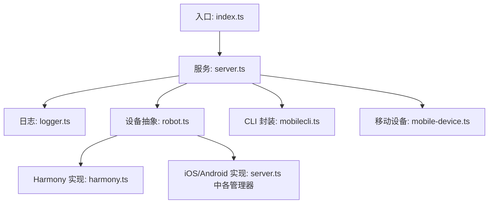
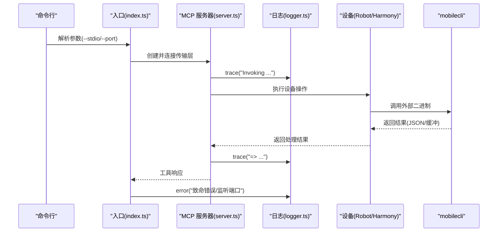
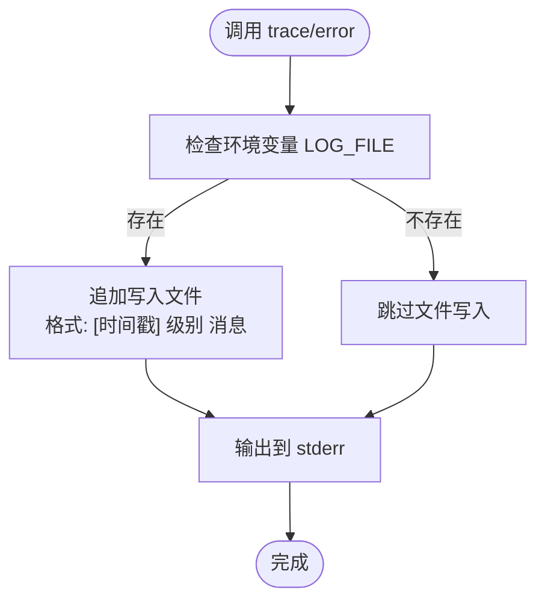
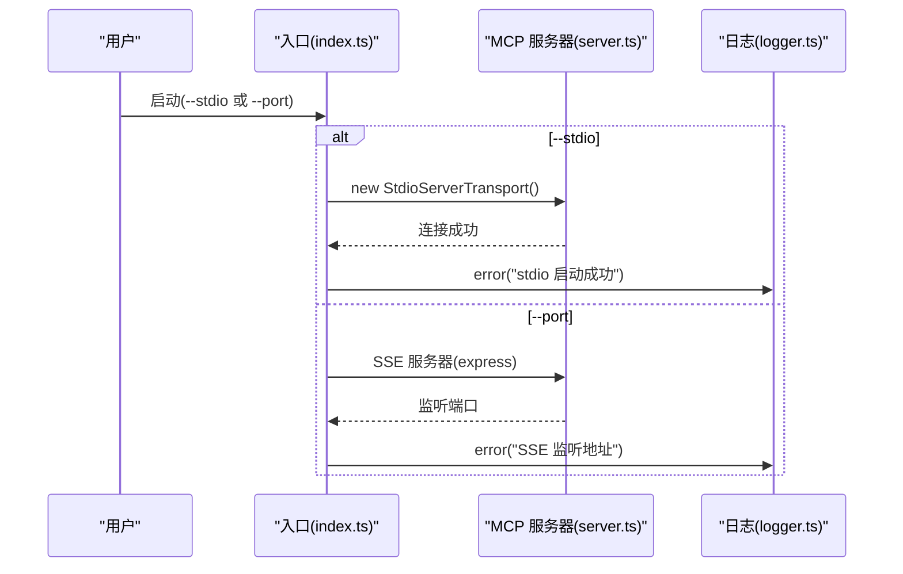
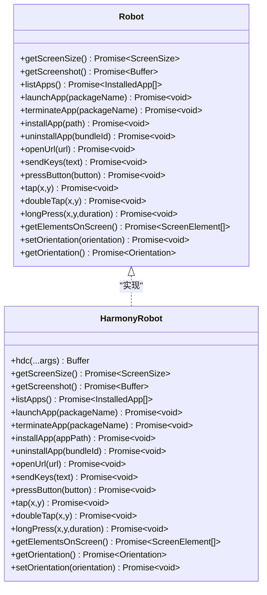
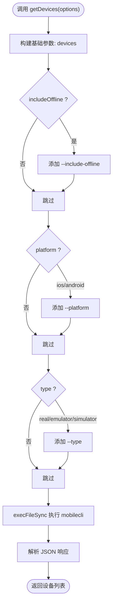
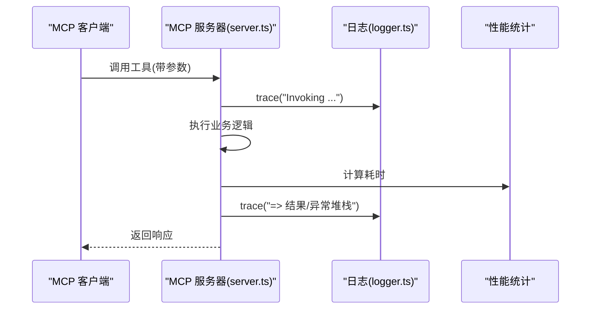
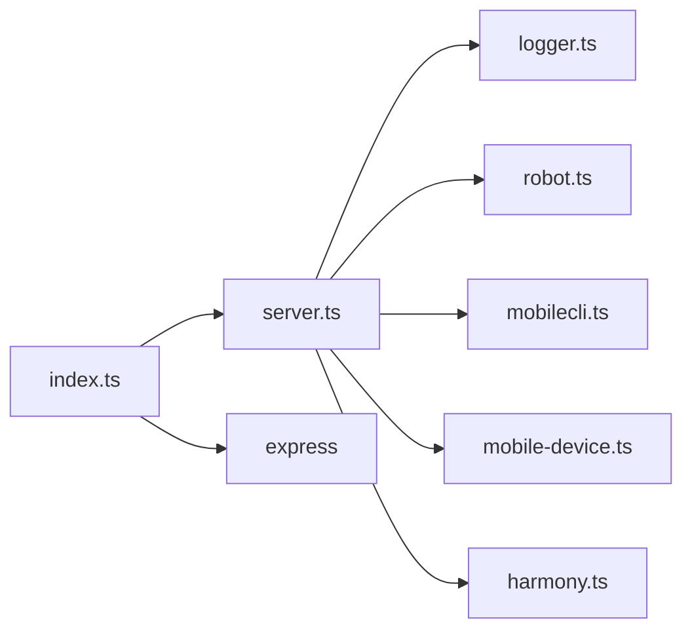

# 调试工具和日志分析

<cite>
**本文引用的文件**
- [logger.ts](file://src/logger.ts)
- [index.ts](file://src/index.ts)
- [server.ts](file://src/server.ts)
- [mobilecli.ts](file://src/mobilecli.ts)
- [mobile-device.ts](file://src/mobile-device.ts)
- [robot.ts](file://src/robot.ts)
- [harmony.ts](file://src/harmony.ts)
- [README.md](file://README.md)
- [package.json](file://package.json)
- [mobilecli.test.ts](file://test/mobilecli.test.ts)
</cite>

## 目录
1. [简介](#简介)
2. [项目结构](#项目结构)
3. [核心组件](#核心组件)
4. [架构总览](#架构总览)
5. [详细组件分析](#详细组件分析)
6. [依赖关系分析](#依赖关系分析)
7. [性能考量](#性能考量)
8. [故障排查指南](#故障排查指南)
9. [结论](#结论)
10. [附录](#附录)

## 简介
本指南面向使用该移动自动化 MCP 服务器的开发者与运维人员，系统讲解内置日志系统、调试工具与日志分析方法，并提供第三方调试工具（Chrome DevTools、Android Studio、Xcode 调试器）的集成建议，以及调试脚本与自动化诊断工具的编写与使用实践。文档同时覆盖设备状态查询、操作序列跟踪、性能监控等主题，帮助快速定位问题、优化交互路径。

## 项目结构
该项目为一个基于 Model Context Protocol 的移动端自动化 MCP 服务器，支持 iOS、Android 与 HarmonyOS（鸿蒙）设备。核心模块包括：
- 日志系统：统一输出 trace 与 error 级别日志，可选写入文件
- 服务入口：支持 stdio 与 SSE 两种运行模式
- 设备抽象：Robot 接口与具体实现（HarmonyOS、iOS、Android）
- 移动 CLI 封装：封装外部 mobilecli 二进制调用
- 服务器工具注册：将设备与 UI 操作封装为 MCP 工具

图表来源
- [index.ts:1-67](file://src/index.ts#L1-L67)
- [server.ts:1-708](file://src/server.ts#L1-L708)
- [logger.ts:1-22](file://src/logger.ts#L1-L22)
- [robot.ts:1-148](file://src/robot.ts#L1-L148)
- [harmony.ts:1-462](file://src/harmony.ts#L1-L462)
- [mobilecli.ts:1-136](file://src/mobilecli.ts#L1-L136)
- [mobile-device.ts:1-217](file://src/mobile-device.ts#L1-L217)

章节来源
- [README.md:1-198](file://README.md#L1-L198)
- [package.json:1-74](file://package.json#L1-L74)

## 核心组件
- 日志系统
  - 提供 trace 与 error 两个导出函数，统一输出到控制台；当设置环境变量 LOG_FILE 时，将消息追加到指定文件
  - 日志格式包含时间戳与固定级别字符串，便于解析与聚合
- 服务入口
  - 支持 stdio 与 SSE 两种模式启动，stderr 输出关键状态与错误堆栈
- 设备抽象与实现
  - Robot 接口定义了屏幕尺寸、截图、应用管理、输入与手势、元素列表、方向等能力
  - HarmonyRobot、iOS/Android 实现分别对接不同平台工具链
- 移动 CLI 封装
  - 自动定位 mobilecli 二进制，支持版本检测与设备枚举，参数校验严格
- 服务器工具注册
  - 将设备与 UI 操作封装为 MCP 工具，统一输入参数与返回结构，内部广泛使用 trace 记录调用与耗时

章节来源
- [logger.ts:1-22](file://src/logger.ts#L1-L22)
- [index.ts:1-67](file://src/index.ts#L1-L67)
- [server.ts:1-708](file://src/server.ts#L1-L708)
- [robot.ts:1-148](file://src/robot.ts#L1-L148)
- [mobilecli.ts:1-136](file://src/mobilecli.ts#L1-L136)
- [harmony.ts:1-462](file://src/harmony.ts#L1-L462)

## 架构总览
下图展示 MCP 服务器启动、工具注册与日志输出的关键交互：

图表来源
- [index.ts:1-67](file://src/index.ts#L1-L67)
- [server.ts:1-708](file://src/server.ts#L1-L708)
- [logger.ts:1-22](file://src/logger.ts#L1-L22)
- [mobilecli.ts:1-136](file://src/mobilecli.ts#L1-L136)
- [harmony.ts:1-462](file://src/harmony.ts#L1-L462)

## 详细组件分析

### 日志系统与日志格式
- 写入策略
  - 若设置了环境变量 LOG_FILE，则将带时间戳与固定级别的日志追加到文件末尾
  - 同时将消息输出到 stderr，便于终端与容器日志采集
- 日志级别
  - 当前实现以 INFO 级别输出 trace 与 error；如需区分 trace/error，可在扩展中增加条件分支
- 日志格式
  - 时间戳采用 ISO 字符串，便于排序与聚合
  - 建议在生产环境统一接入日志收集系统（如 ELK、Loki、Cloud Logging）

图表来源
- [logger.ts:1-22](file://src/logger.ts#L1-L22)

章节来源
- [logger.ts:1-22](file://src/logger.ts#L1-L22)

### 服务入口与运行模式
- stdio 模式
  - 默认启动，适合与 MCP 客户端直接通信
  - 错误通过 error 函数输出到 stderr，并记录堆栈
- SSE 模式
  - 通过 HTTP SSE 提供 MCP 通道，便于浏览器或代理场景
  - 启动后输出监听地址与版本信息

图表来源
- [index.ts:1-67](file://src/index.ts#L1-L67)
- [server.ts:1-708](file://src/server.ts#L1-L708)
- [logger.ts:1-22](file://src/logger.ts#L1-L22)

章节来源
- [index.ts:1-67](file://src/index.ts#L1-L67)

### 设备抽象与实现
- Robot 接口
  - 定义了屏幕尺寸、截图、应用管理、输入与手势、元素列表、方向等能力
  - 便于在 HarmonyOS、iOS、Android 之间统一调用
- HarmonyRobot
  - 使用 hdc/uitest/hidumper 等工具链实现设备操作
  - 在关键路径（如 swipe）记录 trace 以便调试
- iOS/Android 实现
  - 由 server.ts 中的管理器与机器人类提供，统一通过 getRobotFromDevice 分发

图表来源
- [robot.ts:1-148](file://src/robot.ts#L1-L148)
- [harmony.ts:1-462](file://src/harmony.ts#L1-L462)

章节来源
- [robot.ts:1-148](file://src/robot.ts#L1-L148)
- [harmony.ts:1-462](file://src/harmony.ts#L1-L462)

### 移动 CLI 封装与设备发现
- 自动定位 mobilecli 二进制
  - 优先读取环境变量 MOBILECLI_PATH；否则根据平台与架构拼接二进制名称并查找
- 版本检测与设备枚举
  - getVersion 用于验证二进制可用性
  - getDevices 支持过滤 includeOffline、platform、type
- 参数校验
  - 对非法 platform/type 抛出错误，避免无效调用

图表来源
- [mobilecli.ts:1-136](file://src/mobilecli.ts#L1-L136)

章节来源
- [mobilecli.ts:1-136](file://src/mobilecli.ts#L1-L136)
- [mobilecli.test.ts:1-120](file://test/mobilecli.test.ts#L1-L120)

### 服务器工具注册与性能监控
- 工具注册
  - server.ts 中通过 registerTool 注册各类 MCP 工具，统一输入参数与返回结构
  - 每个工具在执行前后记录 trace，便于追踪调用与耗时
- 性能监控
  - 工具执行前后记录时间差，可用于统计平均耗时、失败率与异常堆栈
  - 截图工具在处理图片时记录尺寸、格式与大小变化，便于评估网络传输成本

图表来源
- [server.ts:1-708](file://src/server.ts#L1-L708)
- [logger.ts:1-22](file://src/logger.ts#L1-L22)

章节来源
- [server.ts:1-708](file://src/server.ts#L1-L708)

### 设备状态查询与操作序列跟踪
- 设备状态查询
  - mobile_list_available_devices：统一列出 HarmonyOS、iOS、Android 设备
  - mobile_get_screen_size、mobile_get_orientation：查询设备屏幕与方向
- 操作序列跟踪
  - 每个工具调用都会记录 trace，结合工具参数与返回值，可还原完整操作序列
  - 截图工具记录文件大小与 MIME 类型，便于定位网络传输瓶颈

章节来源
- [server.ts:1-708](file://src/server.ts#L1-L708)

## 依赖关系分析
- 外部依赖
  - @mobilenext/mobilecli：HarmonyOS 以外平台的设备与操作依赖
  - express：SSE 模式下的 HTTP 服务器
  - @modelcontextprotocol/sdk：MCP 协议实现
- 内部依赖
  - server.ts 依赖 logger、robot、mobilecli、mobile-device、harmony 等模块
  - index.ts 仅负责启动与错误输出

图表来源
- [index.ts:1-67](file://src/index.ts#L1-L67)
- [server.ts:1-708](file://src/server.ts#L1-L708)
- [logger.ts:1-22](file://src/logger.ts#L1-L22)
- [robot.ts:1-148](file://src/robot.ts#L1-L148)
- [mobilecli.ts:1-136](file://src/mobilecli.ts#L1-L136)
- [mobile-device.ts:1-217](file://src/mobile-device.ts#L1-L217)
- [harmony.ts:1-462](file://src/harmony.ts#L1-L462)

章节来源
- [package.json:1-74](file://package.json#L1-L74)

## 性能考量
- 截图与图像处理
  - 截图工具在检测到 JPEG 时会尝试缩放并转换为 JPEG，以降低传输体积；若无法缩放则验证 PNG 尺寸有效性
  - 建议在高分辨率设备上启用缩放，以减少带宽占用
- 工具耗时统计
  - 工具执行前后记录时间差，可用于识别慢调用与异常堆栈
- 外部进程调用
  - mobilecli 与 hdc 等外部二进制调用可能受设备响应影响，建议在工具层增加超时与重试策略

章节来源
- [server.ts:1-708](file://src/server.ts#L1-L708)

## 故障排查指南
- 环境变量
  - LOG_FILE：开启文件日志输出
  - MOBILECLI_PATH：指定 mobilecli 二进制路径
  - HDC_SDK_PATH：指定 HarmonyOS SDK 路径（hdc 可执行文件所在目录）
- 常见问题定位
  - mobilecli 不可用：通过 getVersion 检查版本，若返回 failed，参考 README 的安装与配置说明
  - 设备未被识别：使用 mobile_list_available_devices 确认设备列表；HarmonyOS 通过 hdc list targets 探测
  - 截图失败：检查截图尺寸与格式，确认设备支持 snapshot_display 与文件传输
- 日志分析
  - 关键日志模式
    - trace("Invoking ...")：工具调用开始
    - trace("=> ...")：工具返回或异常堆栈
    - error(...)：启动与致命错误输出
  - 错误堆栈分析
    - 在工具捕获异常时，trace 会记录 message 与 stack，结合客户端名称与工具名定位问题
  - 性能瓶颈定位
    - 通过工具耗时统计与截图大小变化，识别网络传输与图像处理瓶颈

章节来源
- [logger.ts:1-22](file://src/logger.ts#L1-L22)
- [server.ts:1-708](file://src/server.ts#L1-L708)
- [mobilecli.ts:1-136](file://src/mobilecli.ts#L1-L136)
- [README.md:1-198](file://README.md#L1-L198)

## 结论
本指南提供了从日志系统、调试工具到第三方调试器集成的完整实践路径。通过统一的日志格式、工具级 trace 记录与性能统计，可以高效定位问题、优化交互路径。建议在生产环境中配合日志收集系统与监控告警，持续改进自动化稳定性与性能。

## 附录

### 第三方调试工具集成建议
- Chrome DevTools
  - 适用于 Web 场景或 WebView 调试；结合浏览器开发者工具查看网络请求与页面行为
- Android Studio
  - 使用 Logcat 查看 ADB 输出；结合设备日志与应用日志定位问题
- Xcode 调试器
  - iOS 真机/模拟器调试；结合系统日志与应用崩溃堆栈分析

### 调试脚本与自动化诊断工具编写要点
- 脚本化设备发现与状态查询
  - 使用 mobile_list_available_devices、mobile_get_screen_size、mobile_get_orientation 快速确认设备可用性与屏幕状态
- 操作序列自动化
  - 将常用操作（如截图、元素列表、点击、滑动）封装为脚本，记录 trace 与耗时，便于回归验证
- 日志与指标采集
  - 将 trace 与 error 输出接入日志系统，建立关键指标（成功率、平均耗时、错误分布）监控