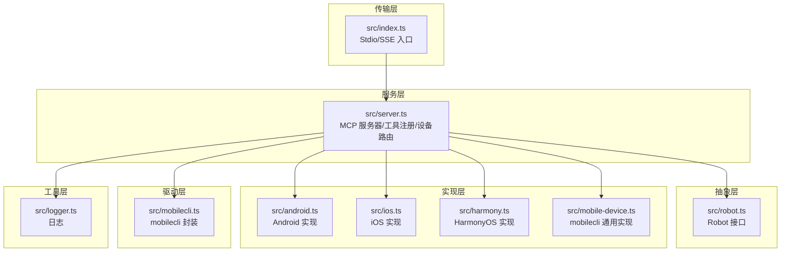
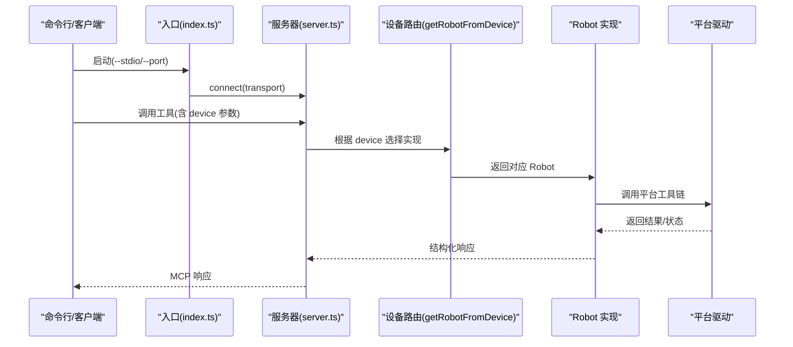
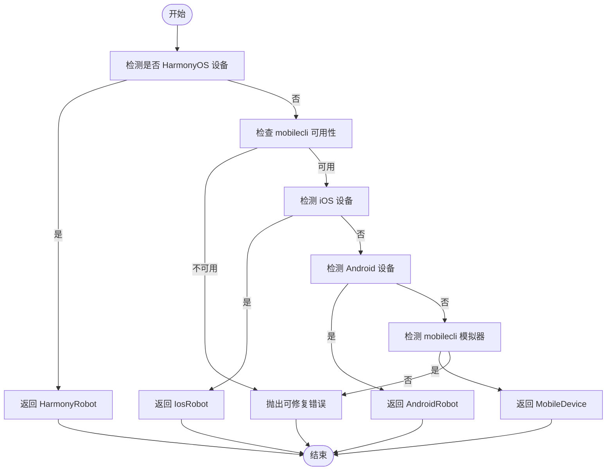
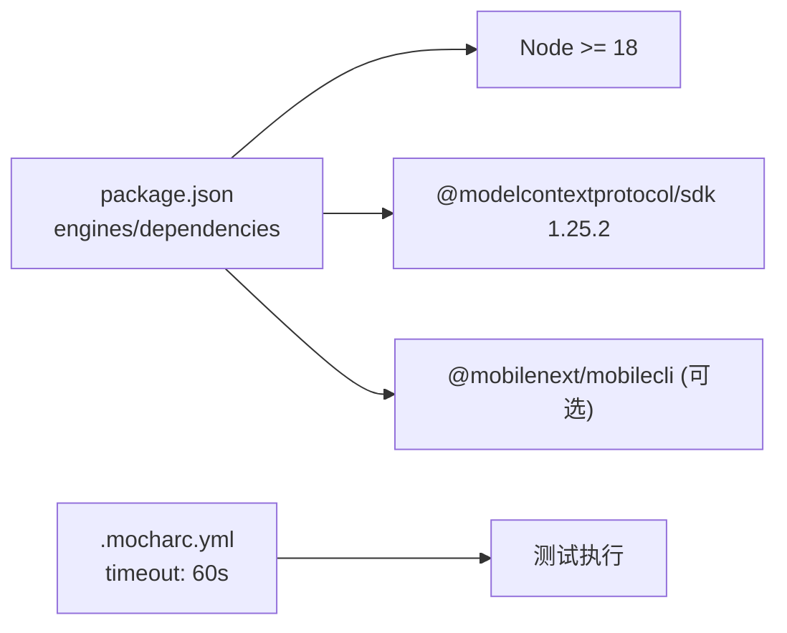

# 配置问题

<cite>
**本文引用的文件**
- [package.json](file://package.json)
- [README.md](file://README.md)
- [DEEPWIKI.md](file://DEEPWIKI.md)
- [server.json](file://server.json)
- [src/index.ts](file://src/index.ts)
- [src/server.ts](file://src/server.ts)
- [src/logger.ts](file://src/logger.ts)
- [src/mobilecli.ts](file://src/mobilecli.ts)
- [src/mobile-device.ts](file://src/mobile-device.ts)
- [src/android.ts](file://src/android.ts)
- [src/ios.ts](file://src/ios.ts)
- [src/harmony.ts](file://src/harmony.ts)
- [.mocharc.yml](file://.mocharc.yml)
</cite>

## 目录
1. [简介](#简介)
2. [项目结构](#项目结构)
3. [核心组件](#核心组件)
4. [架构总览](#架构总览)
5. [详细组件分析](#详细组件分析)
6. [依赖关系分析](#依赖关系分析)
7. [性能考量](#性能考量)
8. [故障排除指南](#故障排除指南)
9. [结论](#结论)
10. [附录](#附录)

## 简介
本指南聚焦于配置问题的排查与解决，覆盖环境变量配置（日志、设备选择、传输端口等）、路径配置问题（工具链路径、证书与缓存路径）、版本兼容性问题（MCP 协议版本、平台 SDK 版本、依赖库版本），并提供配置文件验证方法、配置冲突检测与迁移建议。同时给出常见症状与修复步骤、配置模板与自动化工具使用方法，以及不同部署环境下的配置差异与注意事项。

## 项目结构
该仓库采用分层架构与模块化组织，核心入口负责传输层（Stdio/SSE），服务层负责工具注册与设备路由，抽象层定义统一接口，实现层针对 Android、iOS、HarmonyOS 提供具体驱动，工具层提供日志、图像处理等通用能力。

**图表来源**
- [src/index.ts:1-67](file://src/index.ts#L1-L67)
- [src/server.ts:1-708](file://src/server.ts#L1-L708)
- [src/robot.ts:1-148](file://src/robot.ts#L1-L148)
- [src/android.ts:571-592](file://src/android.ts#L571-L592)
- [src/ios.ts:234-293](file://src/ios.ts#L234-L293)
- [src/harmony.ts:418-461](file://src/harmony.ts#L418-L461)
- [src/mobile-device.ts:62-217](file://src/mobile-device.ts#L62-L217)
- [src/mobilecli.ts:27-136](file://src/mobilecli.ts#L27-L136)
- [src/logger.ts:1-22](file://src/logger.ts#L1-L22)

**章节来源**
- [DEEPWIKI.md:32-54](file://DEEPWIKI.md#L32-L54)
- [src/index.ts:1-67](file://src/index.ts#L1-L67)
- [src/server.ts:1-708](file://src/server.ts#L1-L708)

## 核心组件
- 传输层入口：支持 Stdio（默认）与 SSE（HTTP）两种 MCP 传输方式，通过命令行选项选择。
- 服务层：注册 20 个 MCP 工具，完成设备路由与参数校验，并进行遥测上报。
- 抽象层：统一的 Robot 接口，屏蔽平台差异。
- 实现层：Android、iOS、HarmonyOS、mobilecli 通用设备的具体实现。
- 驱动层：mobilecli 封装与平台工具链（ADB、go-ios、HDC）路径解析。
- 工具层：日志记录（支持写入文件）、图像处理、PNG 解析等。

**章节来源**
- [src/index.ts:50-67](file://src/index.ts#L50-L67)
- [src/server.ts:35-708](file://src/server.ts#L35-L708)
- [src/robot.ts:48-148](file://src/robot.ts#L48-L148)
- [src/mobilecli.ts:27-136](file://src/mobilecli.ts#L27-L136)
- [src/logger.ts:1-22](file://src/logger.ts#L1-L22)

## 架构总览
MCP 服务器启动后，根据传入的设备标识选择对应的 Robot 实现，进而调用平台工具链执行操作。HarmonyOS 设备无需 mobilecli 依赖，直接通过 HDC 等工具链驱动。

**图表来源**
- [src/index.ts:9-48](file://src/index.ts#L9-L48)
- [src/server.ts:149-197](file://src/server.ts#L149-L197)
- [src/mobile-device.ts:66-73](file://src/mobile-device.ts#L66-L73)
- [src/harmony.ts:418-461](file://src/harmony.ts#L418-L461)

## 详细组件分析

### 传输层与启动参数
- Stdio 默认模式：适合本地集成（如 Claude Desktop、VS Code）。
- SSE 模式：通过 --port 指定端口，提供 HTTP + SSE 通道。
- 版本号来自 package.json 的 version 字段。

**章节来源**
- [src/index.ts:50-67](file://src/index.ts#L50-L67)
- [src/index.ts:9-48](file://src/index.ts#L9-L48)
- [package.json:4](file://package.json#L4)

### 日志与环境变量
- 日志输出到 stderr，可选写入文件（通过 LOG_FILE 环境变量）。
- 错误与调试信息均走同一写入逻辑，便于集中收集。

**章节来源**
- [src/logger.ts:3-21](file://src/logger.ts#L3-L21)

### 设备路由与平台工具链
- 设备路由优先判断 HarmonyOS（无需 mobilecli），再检查 iOS/Android，最后尝试 mobilecli 模拟器。
- Android：通过 ADB 命令执行，路径查找支持 ANDROID_HOME、Windows/macOS 默认路径与 PATH 回退。
- iOS：通过 go-ios 与 WebDriverAgent，需确保 WDA 运行与端口转发。
- HarmonyOS：通过 HDC、uitest、hidumper 等工具链，无需 mobilecli。
- mobilecli：二进制路径优先使用 MOBILECLI_PATH，否则按平台/架构查找 node_modules 中的预编译二进制。

**图表来源**
- [src/server.ts:149-197](file://src/server.ts#L149-L197)
- [src/mobilecli.ts:53-92](file://src/mobilecli.ts#L53-L92)
- [src/android.ts:571-592](file://src/android.ts#L571-L592)
- [src/ios.ts:234-293](file://src/ios.ts#L234-L293)
- [src/harmony.ts:418-461](file://src/harmony.ts#L418-L461)

**章节来源**
- [src/server.ts:149-197](file://src/server.ts#L149-L197)
- [src/mobilecli.ts:53-92](file://src/mobilecli.ts#L53-L92)
- [src/android.ts:571-592](file://src/android.ts#L571-L592)
- [src/ios.ts:234-293](file://src/ios.ts#L234-L293)
- [src/harmony.ts:418-461](file://src/harmony.ts#L418-L461)

### 截图与图像处理
- 截图流程：先获取原始 PNG，验证尺寸，若可用则按设备像素比缩放并转 JPEG，最终返回 base64 图像数据。
- 支持 Sips（macOS）与 ImageMagick（跨平台）作为缩放工具。

**章节来源**
- [src/server.ts:602-672](file://src/server.ts#L602-L672)
- [DEEPWIKI.md:456-476](file://DEEPWIKI.md#L456-L476)

### 配置文件与元数据
- server.json：MCP 服务器元数据，包含名称、描述、版本占位符与包信息。
- README.md：提供 MCP 客户端的标准配置示例（npx 方式）与从源码构建说明。

**章节来源**
- [server.json:1-22](file://server.json#L1-L22)
- [README.md:100-171](file://README.md#L100-L171)

## 依赖关系分析
- Node.js 版本要求：>= 18（engines 字段）。
- MCP SDK 版本：1.25.2。
- optionalDependencies：@mobilenext/mobilecli（可选，用于 iOS/Android 与部分模拟器场景）。
- 测试超时：Mocha 超时配置为 60 秒。

**图表来源**
- [package.json:13-39](file://package.json#L13-L39)
- [.mocharc.yml:1](file://.mocharc.yml#L1)

**章节来源**
- [package.json:13-39](file://package.json#L13-L39)
- [.mocharc.yml:1](file://.mocharc.yml#L1)

## 性能考量
- 截图优化：PNG → 缩放 → JPEG 压缩，降低传输体积与内存占用。
- 并发与超时：平台命令执行设置了最大缓冲区与超时限制，避免阻塞。
- 传输方式：Stdio 更轻量，SSE 适合远程场景但存在网络开销。

**章节来源**
- [src/server.ts:602-672](file://src/server.ts#L602-L672)
- [src/mobilecli.ts:24-25](file://src/mobilecli.ts#L24-L25)

## 故障排除指南

### 一、环境变量配置问题
- LOG_FILE：启用后将日志写入指定文件，便于离线分析。若无权限或路径不存在，日志仍会输出到 stderr。
- MOBILECLI_PATH：强制指定 mobilecli 二进制路径，避免自动查找失败。
- ANDROID_HOME：Android 工具链（ADB）路径查找依赖此变量，未设置可能导致设备发现失败。
- GO_IOS_PATH：go-ios 路径可由环境变量指定，否则按默认策略查找。
- HDC_SDK_PATH：HarmonyOS 自动化依赖 HDC，可在 PATH 中或通过环境变量指定 SDK 路径。

**章节来源**
- [src/logger.ts:4-10](file://src/logger.ts#L4-L10)
- [src/mobilecli.ts:54-56](file://src/mobilecli.ts#L54-L56)
- [src/android.ts:571-592](file://src/android.ts#L571-L592)
- [src/ios.ts:234-293](file://src/ios.ts#L234-L293)
- [README.md:96-98](file://README.md#L96-L98)

### 二、路径配置问题
- mobilecli 二进制查找顺序：
  1) 使用 MOBILECLI_PATH；
  2) 在 node_modules/@mobilenext/mobilecli/bin 下按平台/架构查找；
  3) 回退到上级目录的 node_modules。
- Android ADB 查找顺序：
  1) $ANDROID_HOME/platform-tools/adb；
  2) Windows/macOS 默认路径；
  3) PATH。
- iOS go-ios 与 WebDriverAgent：确保 go-ios 可执行且 WDA 正常运行。
- HarmonyOS HDC：确保 hdc 在 PATH 或通过 HDC_SDK_PATH 指定。

**章节来源**
- [src/mobilecli.ts:53-92](file://src/mobilecli.ts#L53-L92)
- [src/android.ts:571-592](file://src/android.ts#L571-L592)
- [src/ios.ts:234-293](file://src/ios.ts#L234-L293)
- [src/harmony.ts:418-461](file://src/harmony.ts#L418-L461)
- [README.md:96-98](file://README.md#L96-L98)

### 三、版本兼容性问题
- Node.js：要求 >= 18。
- MCP SDK：使用 1.25.2。
- mobilecli：与平台工具链版本需匹配，建议使用官方发布版本。
- Android/iOS：确保 ADB、go-ios、HDC 与目标设备系统版本兼容。
- 依赖库：optionalDependencies 中的 mobilecli 为可选，若不满足需求可忽略。

**章节来源**
- [package.json:13-39](file://package.json#L13-L39)
- [package.json:30](file://package.json#L30)
- [README.md:96-98](file://README.md#L96-L98)

### 四、配置文件验证方法
- server.json：包含服务器元数据与包信息，版本字段使用占位符，发布时需替换。
- README 中提供 MCP 客户端的标准配置示例（npx 方式），可用于快速验证。
- 从源码构建后，可通过 Stdio 或 SSE 模式启动，观察日志输出与工具列表。

**章节来源**
- [server.json:1-22](file://server.json#L1-L22)
- [README.md:100-171](file://README.md#L100-L171)

### 五、配置冲突检测
- 设备标识冲突：确保传入的 device 参数唯一且存在于设备列表中。
- 工具链冲突：同一平台不要同时配置多个工具链路径，避免解析歧义。
- 传输冲突：Stdio 与 SSE 模式不可同时使用，选择其一。

**章节来源**
- [src/server.ts:200-294](file://src/server.ts#L200-L294)
- [src/index.ts:50-67](file://src/index.ts#L50-L67)

### 六、配置迁移指南
- 从 mobilecli 迁移到平台原生工具链：优先使用 ADB/HDC，减少对可选依赖的依赖。
- 从 Stdio 迁移到 SSE：在远程场景部署时启用 --port，注意防火墙与反向代理配置。
- 从旧版 mobilecli 迁移：升级至最新版本，确保命令与参数兼容。

**章节来源**
- [src/mobilecli.ts:53-92](file://src/mobilecli.ts#L53-L92)
- [src/index.ts:59-63](file://src/index.ts#L59-L63)

### 七、常见症状与修复步骤
- 症状：无法列出设备
  - 检查 ANDROID_HOME/GO_IOS_PATH/MOBILECLI_PATH/HDC_SDK_PATH 是否正确设置。
  - 确认平台工具链可执行且版本兼容。
- 症状：截图失败或为空
  - 检查截图工具链（Sips/ImageMagick）可用性与权限。
  - 确认设备屏幕方向与像素比计算正确。
- 症状：工具调用报错“设备未找到”
  - 使用 mobile_list_available_devices 确认设备 ID。
  - 检查设备连接状态与平台驱动是否正常。
- 症状：SSE 模式无法访问
  - 检查端口占用与防火墙规则。
  - 确认客户端与服务器在同一网络或正确配置代理。

**章节来源**
- [src/server.ts:200-294](file://src/server.ts#L200-L294)
- [src/server.ts:602-672](file://src/server.ts#L602-L672)
- [src/index.ts:59-63](file://src/index.ts#L59-L63)

### 八、配置模板与自动化工具
- MCP 客户端配置模板（npx 方式）：见 README 的“MCP 配置”部分。
- 从源码构建与启动：见 README 的“从源码构建”部分。
- 自动化工具：使用 npx 直接运行，或通过本地二进制入口启动。

**章节来源**
- [README.md:100-171](file://README.md#L100-L171)

### 九、不同部署环境下的配置差异
- 本地开发：Stdio 模式更便捷；日志输出到 stderr，可结合 LOG_FILE 写文件。
- 远程/容器：SSE 模式更合适；确保端口开放与网络连通。
- CI/CD：建议固定版本与缓存依赖，避免工具链版本漂移。
- HarmonyOS 专属：无需 mobilecli，仅需 HDC 与相关工具链。

**章节来源**
- [src/index.ts:59-63](file://src/index.ts#L59-L63)
- [src/logger.ts:4-10](file://src/logger.ts#L4-L10)
- [README.md:96-98](file://README.md#L96-L98)

## 结论
通过明确环境变量、路径与版本兼容性要求，结合配置文件验证与冲突检测机制，可以有效降低配置问题带来的风险。建议在生产环境中固定工具链版本、使用 SSE 模式并开启日志持久化，同时为 HarmonyOS 等平台提供独立的工具链路径配置。

## 附录

### A. 环境变量一览
- LOG_FILE：日志文件路径（可选）
- MOBILECLI_PATH：mobilecli 二进制路径（可选）
- ANDROID_HOME：Android SDK 路径（用于 ADB）
- GO_IOS_PATH：go-ios 二进制路径（用于 iOS）
- HDC_SDK_PATH：HarmonyOS SDK 路径（用于 HDC）

**章节来源**
- [src/logger.ts:4-10](file://src/logger.ts#L4-L10)
- [src/mobilecli.ts:54-56](file://src/mobilecli.ts#L54-L56)
- [src/android.ts:571-592](file://src/android.ts#L571-L592)
- [src/ios.ts:234-293](file://src/ios.ts#L234-L293)
- [README.md:96-98](file://README.md#L96-L98)

### B. 传输模式与端口
- Stdio：默认模式，适合本地集成。
- SSE：通过 --port 指定端口，提供 HTTP + SSE 通道。

**章节来源**
- [src/index.ts:59-63](file://src/index.ts#L59-L63)