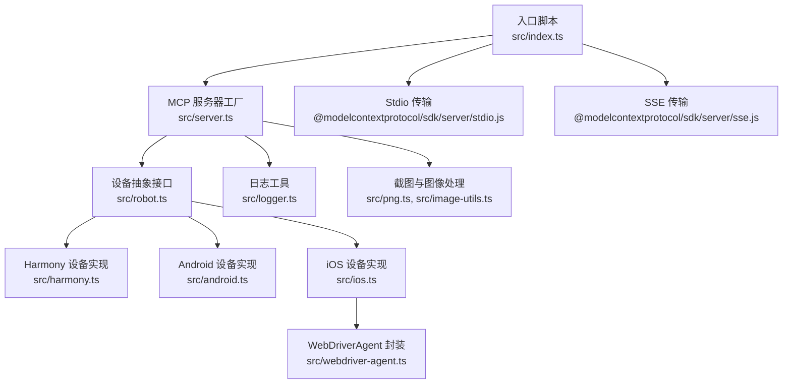
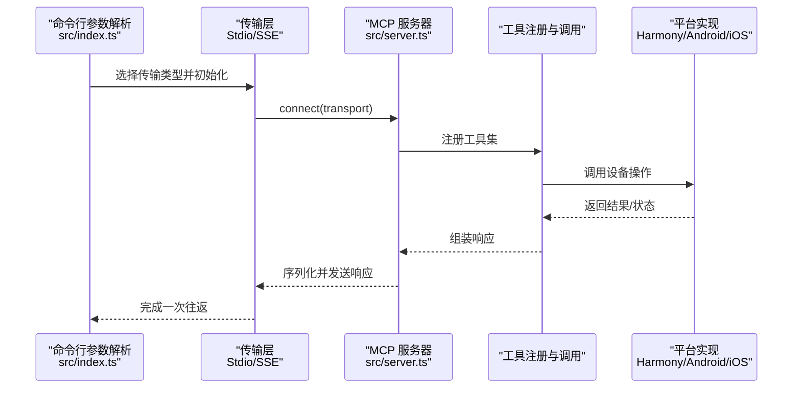
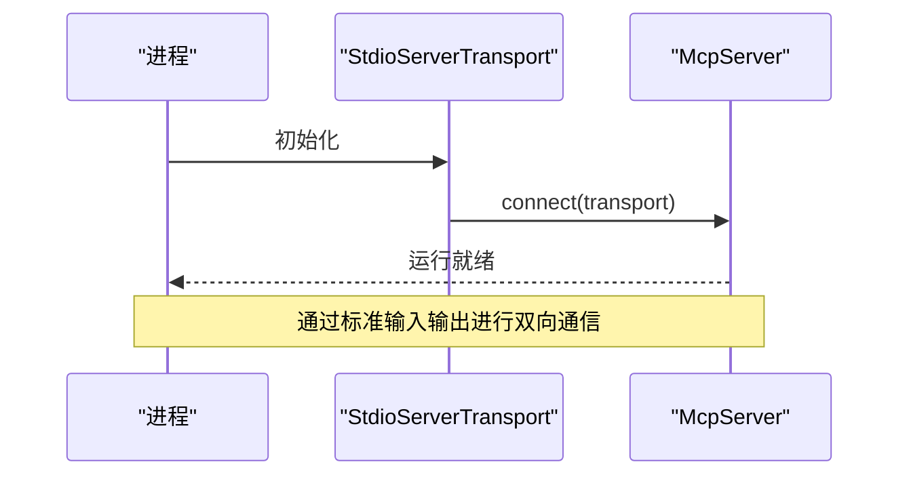
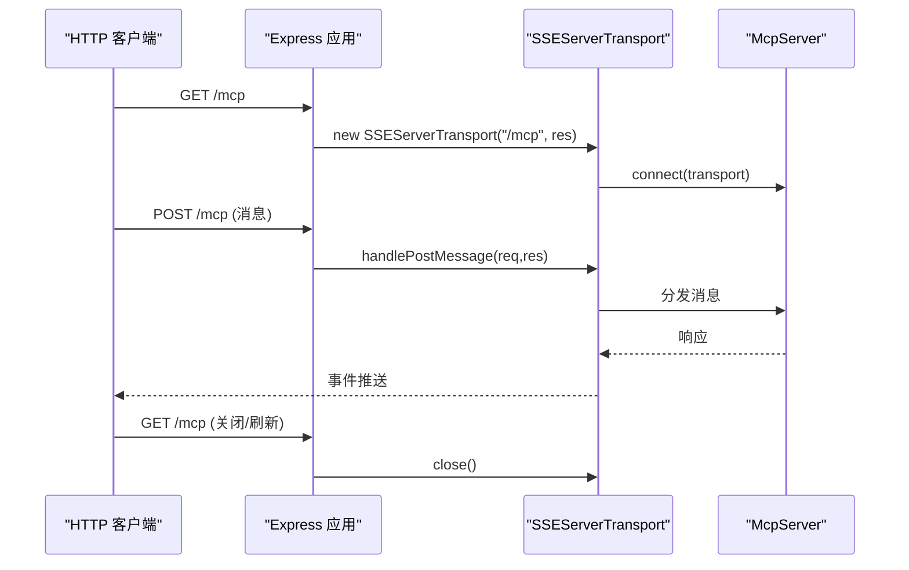
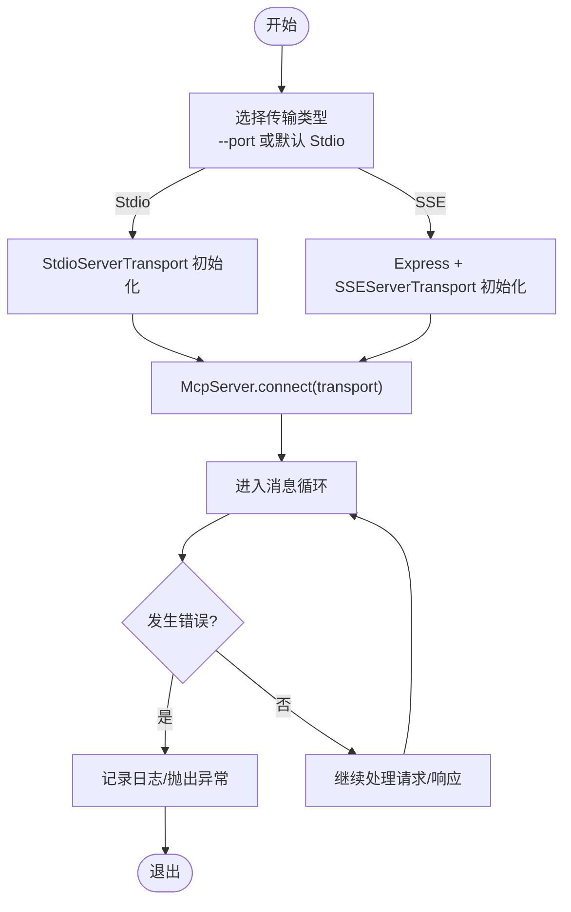
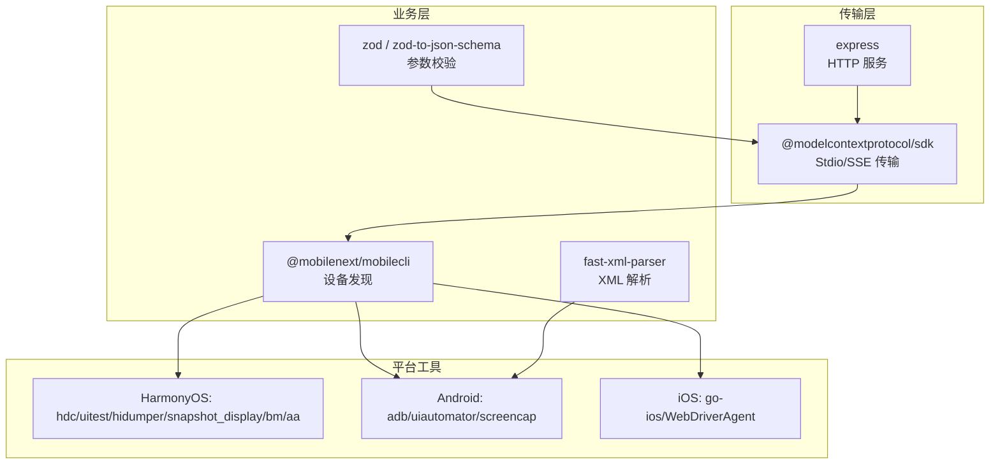

# 传输层设计

<cite>
**本文引用的文件**
- [src/index.ts](file://src/index.ts)
- [src/server.ts](file://src/server.ts)
- [src/mobilecli.ts](file://src/mobilecli.ts)
- [src/logger.ts](file://src/logger.ts)
- [src/harmony.ts](file://src/harmony.ts)
- [src/android.ts](file://src/android.ts)
- [src/ios.ts](file://src/ios.ts)
- [src/robot.ts](file://src/robot.ts)
- [src/webdriver-agent.ts](file://src/webdriver-agent.ts)
- [src/png.ts](file://src/png.ts)
- [src/image-utils.ts](file://src/image-utils.ts)
- [package.json](file://package.json)
- [README.md](file://README.md)
</cite>

## 目录
1. [简介](#简介)
2. [项目结构](#项目结构)
3. [核心组件](#核心组件)
4. [架构总览](#架构总览)
5. [详细组件分析](#详细组件分析)
6. [依赖关系分析](#依赖关系分析)
7. [性能考量](#性能考量)
8. [故障排查指南](#故障排查指南)
9. [结论](#结论)
10. [附录](#附录)

## 简介
本设计文档聚焦于 Mobile MCP HarmonyOS 项目的传输层实现，系统性阐述两种传输协议：Stdio 传输与 SSE（Server-Sent Events）传输。文档将解释每种传输方式的工作原理、适用场景与性能特点；分析传输层与 MCP 协议的集成方式，涵盖消息序列化、连接管理、错误处理等机制；提供配置选项与使用示例（命令行参数与运行时行为）；说明传输层如何支持 MCP 协议的双向通信特性，并给出连接断开与重连策略建议。

## 项目结构
该项目采用以功能域划分的模块化组织方式，传输层位于入口脚本中，MCP 服务由独立模块创建并注入传输层，设备抽象通过统一接口 Robot 实现，平台适配分别封装在 Harmony、Android、iOS 等模块中。

图表来源
- [src/index.ts:1-67](file://src/index.ts#L1-L67)
- [src/server.ts:1-708](file://src/server.ts#L1-L708)
- [src/robot.ts:1-148](file://src/robot.ts#L1-L148)
- [src/harmony.ts:1-462](file://src/harmony.ts#L1-L462)
- [src/android.ts:1-593](file://src/android.ts#L1-L593)
- [src/ios.ts:1-294](file://src/ios.ts#L1-L294)
- [src/webdriver-agent.ts:1-455](file://src/webdriver-agent.ts#L1-L455)
- [src/logger.ts:1-22](file://src/logger.ts#L1-L22)
- [src/png.ts:1-21](file://src/png.ts#L1-L21)
- [src/image-utils.ts:1-165](file://src/image-utils.ts#L1-L165)

章节来源
- [src/index.ts:1-67](file://src/index.ts#L1-L67)
- [src/server.ts:1-708](file://src/server.ts#L1-L708)
- [package.json:1-74](file://package.json#L1-L74)

## 核心组件
- 传输层入口与选择
  - Stdio 传输：通过 StdioServerTransport 直接与标准输入输出建立连接，适合本地进程内嵌模式。
  - SSE 传输：通过 SSEServerTransport 在 HTTP 路由上提供 Server-Sent Events 接口，适合外部客户端通过 HTTP 访问。
- MCP 服务器工厂
  - createMcpServer 构建 McpServer 实例，注册工具集与客户端版本信息，负责消息路由与工具调用。
- 设备抽象与平台适配
  - Robot 接口定义统一的设备操作能力；HarmonyRobot、AndroidRobot、IosRobot 分别封装平台特定的设备控制与 UI 自动化。
- 日志与图像处理
  - logger 提供统一日志输出；PNG 与 ImageUtils 提供截图尺寸检测与图像缩放能力。

章节来源
- [src/index.ts:35-48](file://src/index.ts#L35-L48)
- [src/index.ts:9-33](file://src/index.ts#L9-L33)
- [src/server.ts:35-707](file://src/server.ts#L35-L707)
- [src/robot.ts:48-147](file://src/robot.ts#L48-L147)
- [src/harmony.ts:43-416](file://src/harmony.ts#L43-L416)
- [src/android.ts:74-504](file://src/android.ts#L74-L504)
- [src/ios.ts:42-232](file://src/ios.ts#L42-L232)
- [src/webdriver-agent.ts:25-454](file://src/webdriver-agent.ts#L25-L454)
- [src/logger.ts:1-22](file://src/logger.ts#L1-L22)
- [src/png.ts:6-20](file://src/png.ts#L6-L20)
- [src/image-utils.ts:9-165](file://src/image-utils.ts#L9-L165)

## 架构总览
传输层与 MCP 协议的集成路径如下：
- 入口脚本根据命令行参数选择传输类型，创建对应传输对象并将其注入 McpServer。
- McpServer 负责协议层面的消息编解码、请求分发与响应生成。
- 工具调用通过统一的 Robot 接口路由至具体平台实现，完成设备控制与 UI 自动化。

图表来源
- [src/index.ts:50-64](file://src/index.ts#L50-L64)
- [src/index.ts:35-48](file://src/index.ts#L35-L48)
- [src/index.ts:9-33](file://src/index.ts#L9-L33)
- [src/server.ts:35-95](file://src/server.ts#L35-L95)

## 详细组件分析

### Stdio 传输
- 工作原理
  - 使用 StdioServerTransport 直接绑定标准输入输出，适合本地进程内嵌模式，无需网络栈。
  - 入口脚本通过命令行参数判断是否启用 Stdio 模式，默认即为 Stdio。
- 适用场景
  - 本地调试、容器内嵌、与 MCP 客户端在同一进程中协作。
- 性能特点
  - 低延迟、无网络开销；受限于进程边界，无法跨主机使用。
- 错误处理
  - 入口脚本捕获致命错误并退出进程，避免未处理异常导致的进程崩溃。
- 配置与使用
  - 默认启动即为 Stdio 模式；如需切换到 SSE，使用 --port 参数。

图表来源
- [src/index.ts:35-48](file://src/index.ts#L35-L48)
- [src/server.ts:35-40](file://src/server.ts#L35-L40)

章节来源
- [src/index.ts:35-48](file://src/index.ts#L35-L48)
- [src/index.ts:50-64](file://src/index.ts#L50-L64)

### SSE 传输
- 工作原理
  - 使用 Express 提供 HTTP 服务，SSEServerTransport 在 /mcp 路由上建立 Server-Sent Events 连接。
  - GET /mcp 触发新连接建立；POST /mcp 处理客户端推送的消息。
- 适用场景
  - 外部 MCP 客户端通过 HTTP 访问；便于跨进程/跨主机部署。
- 性能特点
  - 基于 HTTP/1.1，单向推送效率高；需要考虑连接数与并发处理。
- 错误处理
  - Express 路由层捕获请求，SSE 传输负责连接生命周期管理与关闭。
- 配置与使用
  - 通过 --port 指定监听端口；默认不指定则走 Stdio。

图表来源
- [src/index.ts:9-33](file://src/index.ts#L9-L33)
- [src/index.ts:15-28](file://src/index.ts#L15-L28)

章节来源
- [src/index.ts:9-33](file://src/index.ts#L9-L33)

### 传输层与 MCP 协议集成
- 消息序列化
  - 传输层负责将 MCP 协议消息序列化为字节流并通过标准输入输出或 HTTP SSE 发送；接收端反序列化后交由 McpServer 处理。
- 连接管理
  - Stdio：进程内连接，生命周期与进程一致。
  - SSE：基于 HTTP 的长连接，GET 建立连接，后续通过事件推送；关闭时调用 close()。
- 错误处理
  - 入口脚本捕获致命错误并记录日志；SSE 传输在路由层处理请求；MCP 服务器内部工具调用通过 ActionableError 区分可修复问题与异常。
- 双向通信
  - 传输层同时支持请求与响应的双向流动；客户端可主动推送消息，服务器可主动推送事件（SSE）。

图表来源
- [src/index.ts:50-64](file://src/index.ts#L50-L64)
- [src/index.ts:35-48](file://src/index.ts#L35-L48)
- [src/index.ts:9-33](file://src/index.ts#L9-L33)

章节来源
- [src/index.ts:50-64](file://src/index.ts#L50-L64)
- [src/server.ts:35-95](file://src/server.ts#L35-L95)

### 传输层配置与使用示例
- 命令行参数
  - --port <port>：启动 SSE 服务器并监听指定端口。
  - --stdio：显式启用 Stdio 模式（默认）。
- 运行时行为
  - Stdio：直接在当前终端运行，适合本地调试。
  - SSE：在指定端口提供 HTTP 服务，适合外部客户端接入。

章节来源
- [src/index.ts:50-64](file://src/index.ts#L50-L64)
- [README.md:152-171](file://README.md#L152-L171)

### 连接断开与重连逻辑
- 断开场景
  - Stdio：进程退出或标准输入输出关闭。
  - SSE：客户端关闭连接或网络中断。
- 重连策略
  - 建议客户端在连接断开后进行指数退避重试；SSE 传输层在连接关闭时释放资源，等待新连接建立。
  - 对于工具调用失败，ActionableError 用于区分可修复问题与异常，便于客户端决定是否重试。

章节来源
- [src/index.ts:13-28](file://src/index.ts#L13-L28)
- [src/robot.ts:40-44](file://src/robot.ts#L40-L44)

## 依赖关系分析
- 传输层依赖
  - @modelcontextprotocol/sdk 提供 StdioServerTransport 与 SSEServerTransport。
  - express 用于 SSE 场景下的 HTTP 服务。
- 业务层依赖
  - @mobilenext/mobilecli 作为可选依赖，用于 iOS/Android 设备发现与管理。
  - fast-xml-parser 用于 Android UI 自动化 XML 解析。
  - zod 与 zod-to-json-schema 用于工具输入参数校验与 JSON Schema 生成。
- 平台依赖
  - HarmonyOS：hdc、uitest、hidumper、snapshot_display、bm、aa。
  - Android：adb、uiautomator、screencap。
  - iOS：go-ios、WebDriverAgent。

图表来源
- [package.json:29-39](file://package.json#L29-L39)
- [src/android.ts:1-593](file://src/android.ts#L1-L593)
- [src/ios.ts:1-294](file://src/ios.ts#L1-L294)
- [src/harmony.ts:1-462](file://src/harmony.ts#L1-L462)

章节来源
- [package.json:29-39](file://package.json#L29-L39)
- [src/mobilecli.ts:27-135](file://src/mobilecli.ts#L27-L135)

## 性能考量
- Stdio 传输
  - 无网络开销，延迟最低；适合本地与容器内嵌场景。
- SSE 传输
  - 基于 HTTP/1.1，事件推送效率高；注意连接数与并发限制，合理设置超时与缓冲区大小。
- 图像处理
  - 截图尺寸检测与图像缩放依赖 Sips/ImageMagick；在 macOS 上可用时可显著降低响应体积与网络带宽占用。
- 平台差异
  - HarmonyOS 通过 HDC 直接驱动，无需 mobilecli；Android/iOS 依赖各自工具链，注意命令行超时与缓冲区限制。

章节来源
- [src/png.ts:6-20](file://src/png.ts#L6-L20)
- [src/image-utils.ts:137-165](file://src/image-utils.ts#L137-L165)
- [src/harmony.ts:12-18](file://src/harmony.ts#L12-L18)
- [src/android.ts:69-71](file://src/android.ts#L69-L71)
- [src/ios.ts:7-8](file://src/ios.ts#L7-L8)

## 故障排查指南
- 常见问题
  - mobilecli 不可用：检查环境变量与二进制路径，或安装 @mobilenext/mobilecli。
  - 设备未发现：确认平台工具（hdc/adb/go-ios）可用且在 PATH 中。
  - SSE 连接失败：检查端口占用与防火墙设置。
- 错误分类
  - ActionableError：可修复问题，包含明确提示信息。
  - 异常：系统级错误，需记录堆栈并退出进程。
- 日志输出
  - 通过 LOG_FILE 环境变量写入文件，同时输出到标准错误。

章节来源
- [src/server.ts:138-147](file://src/server.ts#L138-L147)
- [src/mobilecli.ts:53-92](file://src/mobilecli.ts#L53-L92)
- [src/logger.ts:3-21](file://src/logger.ts#L3-L21)

## 结论
本项目通过 Stdio 与 SSE 两种传输方式实现了 MCP 协议在 HarmonyOS、Android、iOS 平台上的统一接入。Stdio 适合本地与容器内嵌场景，SSE 适合跨进程/跨主机部署。传输层与 MCP 服务器紧密耦合，结合统一的 Robot 抽象与平台适配，提供了稳定可靠的双向通信能力。建议在生产环境中优先使用 SSE 并配合完善的重连与监控策略，同时优化图像处理与平台工具链以提升整体性能。

## 附录
- 命令行示例
  - Stdio 模式：node lib/index.js
  - SSE 模式：node lib/index.js --port 3000
- MCP 配置参考
  - 参考 README 中的 MCP 配置示例，选择合适的客户端类型与参数。

章节来源
- [README.md:152-171](file://README.md#L152-L171)
- [README.md:100-150](file://README.md#L100-L150)