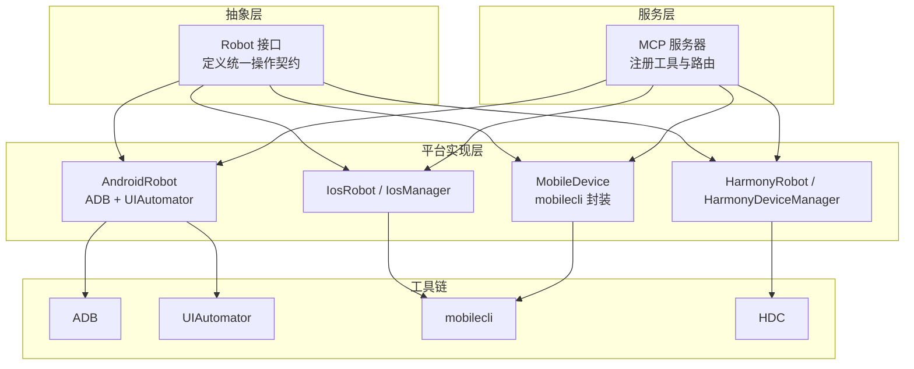
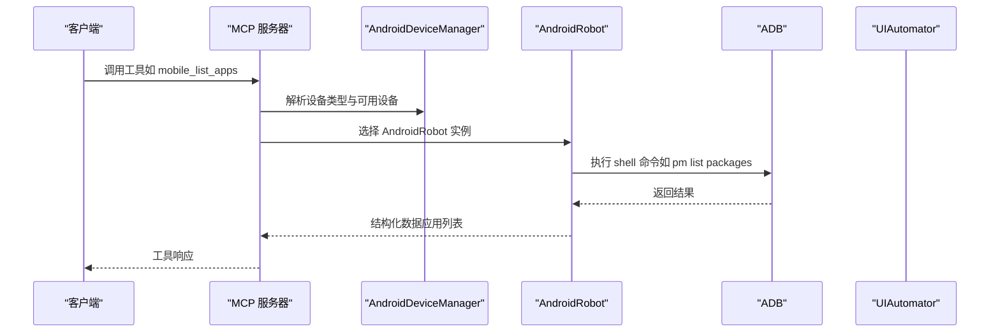
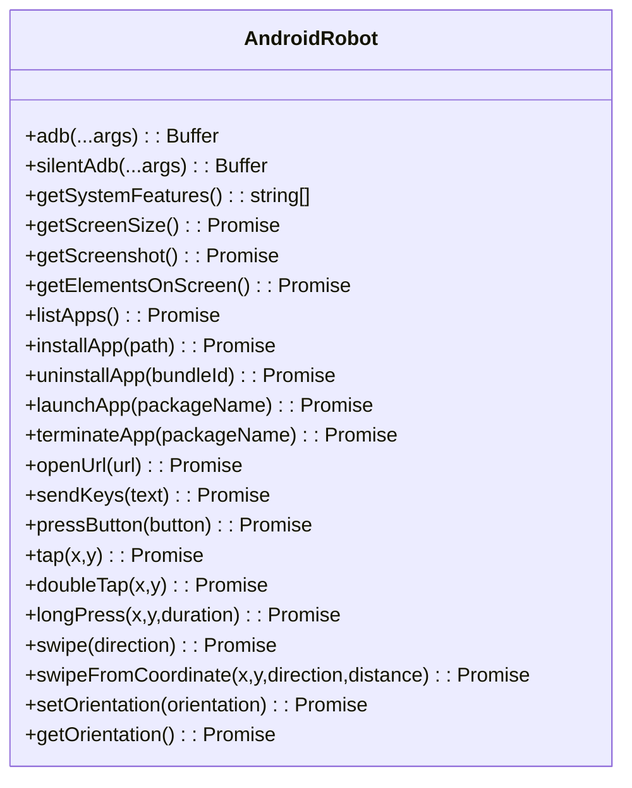
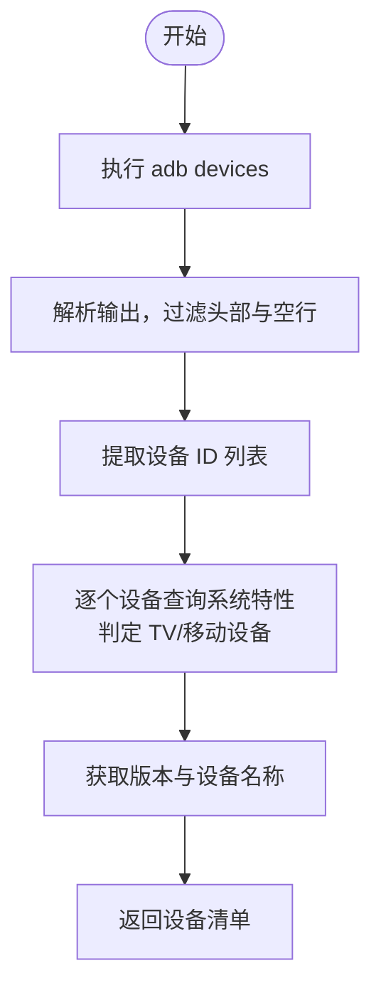
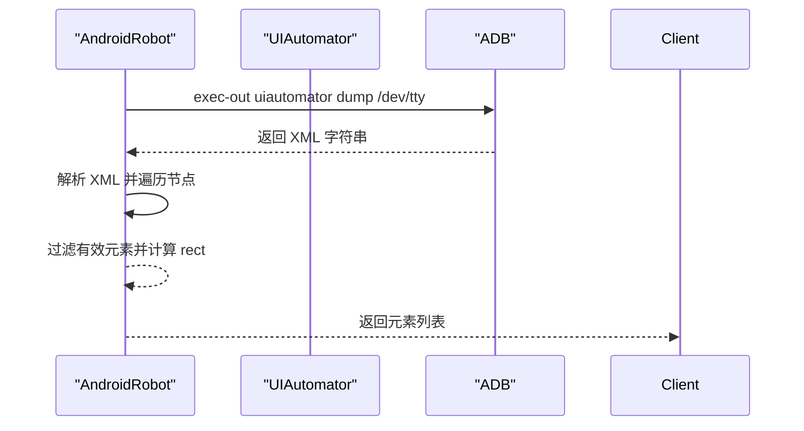
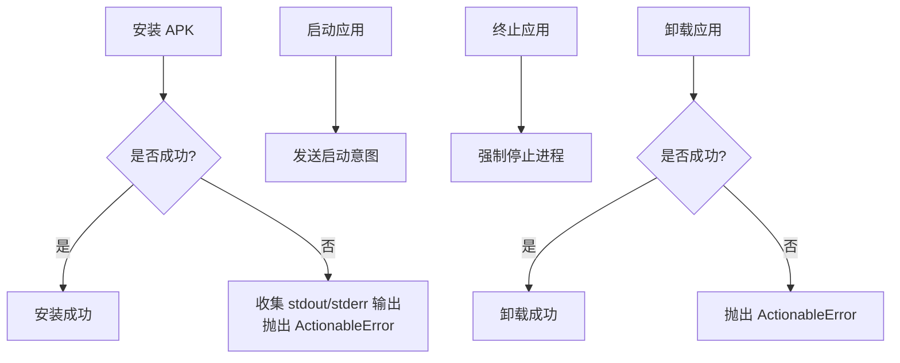
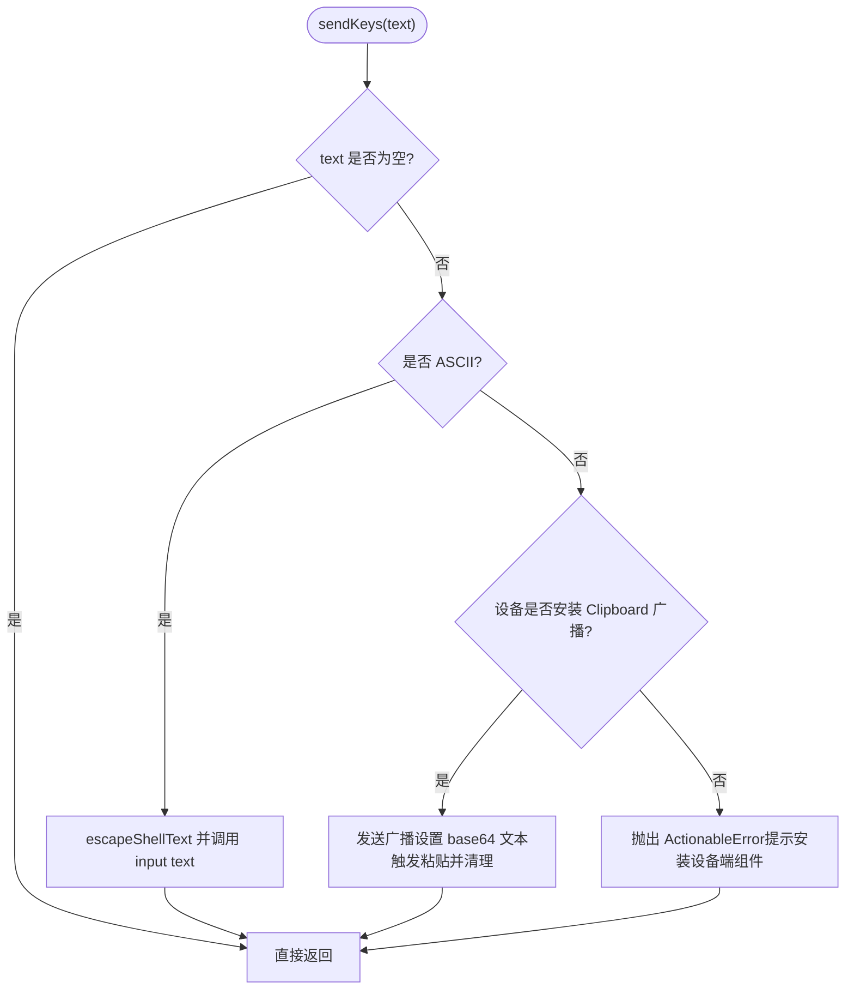
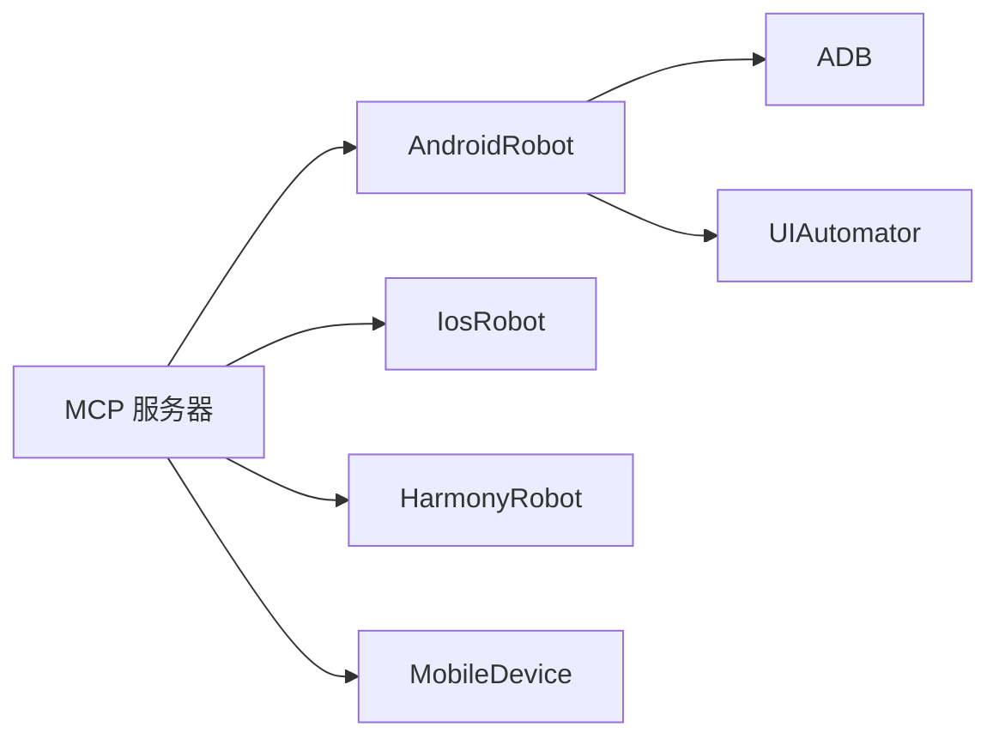

# Android 平台实现

<cite>
**本文引用的文件**
- [android.ts](file://src/android.ts)
- [robot.ts](file://src/robot.ts)
- [server.ts](file://src/server.ts)
- [mobilecli.ts](file://src/mobilecli.ts)
- [mobile-device.ts](file://src/mobile-device.ts)
- [index.ts](file://src/index.ts)
- [android 测试](file://test/android.ts)
- [README.md](file://README.md)
- [package.json](file://package.json)
</cite>

## 目录
1. [简介](#简介)
2. [项目结构](#项目结构)
3. [核心组件](#核心组件)
4. [架构总览](#架构总览)
5. [详细组件分析](#详细组件分析)
6. [依赖关系分析](#依赖关系分析)
7. [性能考量](#性能考量)
8. [故障排查指南](#故障排查指南)
9. [结论](#结论)
10. [附录](#附录)

## 简介
本文件面向 Android 平台实现，系统性解析 AndroidRobot 类的架构设计与实现细节，涵盖 ADB 与 UIAutomator 工具链的集成方式、设备发现与状态监控、屏幕交互（截图、元素识别、触摸与手势）、应用管理（安装/启动/终止/卸载）、文本输入与按键操作、Android 权限与安全注意事项，以及版本兼容与设备适配策略。文档同时结合测试用例与服务端工具注册逻辑，帮助读者快速理解端到端工作流。

## 项目结构
该项目采用“多平台统一抽象 + 平台特定实现”的分层设计：
- 抽象层：定义 Robot 接口，统一跨平台操作契约（屏幕尺寸、截图、元素、应用管理、输入、方向等）。
- 平台实现层：分别针对 Android、iOS、HarmonyOS 提供具体实现类。
- 服务层：MCP 服务器将平台实现封装为工具，供外部 Agent/Llm 调用。
- 工具链集成：Android 侧通过 ADB 与 UIAutomator；iOS 侧通过 mobilecli；HarmonyOS 侧通过 HDC/uitest/hidumper。

图表来源
- [android.ts:74-504](file://src/android.ts#L74-L504)
- [server.ts:149-197](file://src/server.ts#L149-L197)

章节来源
- [android.ts:1-593](file://src/android.ts#L1-L593)
- [robot.ts:48-147](file://src/robot.ts#L48-L147)
- [server.ts:1-200](file://src/server.ts#L1-L200)

## 核心组件
- AndroidRobot：Android 平台的机器人实现，负责设备通信、屏幕交互、应用管理、输入与方向控制。
- AndroidDeviceManager：设备发现与类型判定，支持获取设备列表、版本与名称。
- Robot 接口：统一跨平台操作契约，定义屏幕尺寸、截图、元素、应用管理、输入、方向等方法。
- MCP 服务器：将 AndroidRobot 等实现注册为工具，暴露给外部客户端调用。

章节来源
- [android.ts:74-504](file://src/android.ts#L74-L504)
- [robot.ts:48-147](file://src/robot.ts#L48-L147)
- [server.ts:149-197](file://src/server.ts#L149-L197)

## 架构总览
Android 平台通过 AndroidRobot 集成 ADB 与 UIAutomator，完成设备发现、屏幕交互与应用管理。MCP 服务器根据设备 ID 动态选择对应平台实现，并将操作封装为工具供客户端调用。

图表来源
- [server.ts:149-197](file://src/server.ts#L149-L197)
- [android.ts:118-140](file://src/android.ts#L118-L140)
- [android.ts:133-140](file://src/android.ts#L133-L140)

## 详细组件分析

### AndroidRobot：ADB 与 UIAutomator 集成
- ADB 路径解析：优先从环境变量 ANDROID_HOME 或平台默认路径查找 adb，兼容 Windows 与 macOS。
- 命令执行：提供 adb 与 silentAdb 两种执行方式，silentAdb 以管道模式隐藏输出，便于静默操作。
- 设备特性：通过系统特性检测判断设备类型（移动设备或 TV）。
- 屏幕尺寸：通过窗口管理命令获取分辨率与缩放。
- 截图：支持多显示器场景，优先解析活动显示器 ID，否则回退到默认行为。
- 元素识别：通过 UIAutomator dump 获取 XML，解析节点属性（文本、内容描述、资源 ID、焦点状态、bounds），转换为结构化元素。
- 应用管理：安装、卸载、强制停止、启动（Monkey/Intent）。
- 输入与按键：ASCII 文本直接通过 input text；非 ASCII 文本可借助设备端 Clipboard 广播；按键映射到 KEYCODE。
- 触摸与手势：tap、doubleTap、longPress、swipe 与从坐标出发的滑动。
- 方向控制：通过设置系统参数与用户旋转值切换横竖屏。

图表来源
- [android.ts:74-504](file://src/android.ts#L74-L504)

章节来源
- [android.ts:32-54](file://src/android.ts#L32-L54)
- [android.ts:79-92](file://src/android.ts#L79-L92)
- [android.ts:94-101](file://src/android.ts#L94-L101)
- [android.ts:103-116](file://src/android.ts#L103-L116)
- [android.ts:295-310](file://src/android.ts#L295-L310)
- [android.ts:351-356](file://src/android.ts#L351-L356)
- [android.ts:118-140](file://src/android.ts#L118-L140)
- [android.ts:362-382](file://src/android.ts#L362-L382)
- [android.ts:142-148](file://src/android.ts#L142-L148)
- [android.ts:358-360](file://src/android.ts#L358-L360)
- [android.ts:384-386](file://src/android.ts#L384-L386)
- [android.ts:402-427](file://src/android.ts#L402-L427)
- [android.ts:429-436](file://src/android.ts#L429-L436)
- [android.ts:438-451](file://src/android.ts#L438-L451)
- [android.ts:159-191](file://src/android.ts#L159-L191)
- [android.ts:193-230](file://src/android.ts#L193-L230)
- [android.ts:453-464](file://src/android.ts#L453-L464)
- [android.ts:461-464](file://src/android.ts#L461-L464)

### Android 设备发现机制
- 设备列表：通过 adb devices 获取设备 ID 列表，过滤头部与空行，仅保留设备 ID。
- 设备类型：通过系统特性检测（如 leanback 或 television）判断 TV 或移动设备。
- 设备详情：支持获取版本号与设备名称（优先 AVD 名称，其次产品型号），用于展示与诊断。

图表来源
- [android.ts:551-569](file://src/android.ts#L551-L569)
- [android.ts:506-592](file://src/android.ts#L506-L592)

章节来源
- [android.ts:551-569](file://src/android.ts#L551-L569)
- [android.ts:508-516](file://src/android.ts#L508-L516)
- [android.ts:518-549](file://src/android.ts#L518-L549)
- [android.ts:571-591](file://src/android.ts#L571-L591)

### 屏幕交互：截图、元素识别、触摸与手势
- 截图：多显示器场景下优先解析活动显示器 ID，否则回退到默认 screencap 行为。
- 元素识别：UIAutomator dump XML 解析，提取文本、内容描述、资源 ID、焦点状态与 bounds，转换为 ScreenElement。
- 触摸与手势：tap、doubleTap、longPress、swipe 与从坐标出发的滑动，均通过 input 命令实现。

图表来源
- [android.ts:466-491](file://src/android.ts#L466-L491)
- [android.ts:312-356](file://src/android.ts#L312-L356)
- [android.ts:493-503](file://src/android.ts#L493-L503)

章节来源
- [android.ts:295-310](file://src/android.ts#L295-L310)
- [android.ts:466-491](file://src/android.ts#L466-L491)
- [android.ts:312-356](file://src/android.ts#L312-L356)
- [android.ts:438-451](file://src/android.ts#L438-L451)
- [android.ts:159-191](file://src/android.ts#L159-L191)
- [android.ts:193-230](file://src/android.ts#L193-L230)

### 应用管理：安装、启动、终止、卸载
- 安装：adb install -r，捕获 stdout/stderr 并抛出可定位错误。
- 卸载：adb uninstall。
- 启动：adb shell monkey -p <package> -c android.intent.category.LAUNCHER 1。
- 终止：adb shell am force-stop <package>。

图表来源
- [android.ts:362-382](file://src/android.ts#L362-L382)
- [android.ts:142-148](file://src/android.ts#L142-L148)
- [android.ts:358-360](file://src/android.ts#L358-L360)
- [android.ts:373-382](file://src/android.ts#L373-L382)

章节来源
- [android.ts:362-382](file://src/android.ts#L362-L382)
- [android.ts:142-148](file://src/android.ts#L142-L148)
- [android.ts:358-360](file://src/android.ts#L358-L360)

### 文本输入与按键操作
- ASCII 文本：直接通过 input text 发送。
- 非 ASCII 文本：若设备安装了设备端 Clipboard 广播组件，则通过广播设置 base64 文本并触发粘贴，结束后清理剪贴板。
- 按键映射：将 Button 映射为 KEYCODE 并通过 input keyevent 触发。

图表来源
- [android.ts:402-427](file://src/android.ts#L402-L427)
- [android.ts:388-427](file://src/android.ts#L388-L427)

章节来源
- [android.ts:402-427](file://src/android.ts#L402-L427)
- [android.ts:56-67](file://src/android.ts#L56-L67)
- [android.ts:429-436](file://src/android.ts#L429-L436)

### Android 权限与安全考虑
- Shell 注入防护：对 ASCII 文本进行 shell 特殊字符转义，降低注入风险。
- 静默执行：silentAdb 使用管道模式隐藏输出，避免敏感信息泄露。
- 错误处理：捕获 adb 子进程异常，合并 stdout/stderr 输出，抛出可定位的 ActionableError，便于问题诊断。

章节来源
- [android.ts:392-395](file://src/android.ts#L392-L395)
- [android.ts:86-92](file://src/android.ts#L86-L92)
- [android.ts:362-382](file://src/android.ts#L362-L382)

### Android 版本兼容性与设备适配
- 多显示器截图：优先解析活动显示器 ID，兼容 Android 11+ 的 cmd display 与旧版 dumpsys display。
- 屏幕尺寸：通过窗口管理命令获取分辨率，保持与截图尺寸一致。
- 方向控制：通过系统设置与用户旋转值切换横竖屏，不依赖第三方工具。
- 设备类型：通过系统特性区分 TV 与移动设备，便于后续差异化处理。

章节来源
- [android.ts:295-310](file://src/android.ts#L295-L310)
- [android.ts:240-293](file://src/android.ts#L240-L293)
- [android.ts:103-116](file://src/android.ts#L103-L116)
- [android.ts:453-464](file://src/android.ts#L453-L464)
- [android.ts:508-516](file://src/android.ts#L508-L516)

## 依赖关系分析
- AndroidRobot 依赖 ADB 与 UIAutomator，通过 execFileSync 调用系统命令。
- MCP 服务器根据设备 ID 动态选择实现：HarmonyOS 优先于 Android，随后 iOS 与 mobilecli 模拟器。
- 测试用例覆盖截图、元素识别、应用启动/终止、文本输入、方向切换等关键路径。

图表来源
- [android.ts:74-504](file://src/android.ts#L74-L504)
- [server.ts:149-197](file://src/server.ts#L149-L197)

章节来源
- [server.ts:149-197](file://src/server.ts#L149-L197)
- [android.ts:74-504](file://src/android.ts#L74-L504)

## 性能考量
- 命令超时与缓冲区限制：设置合理超时与最大缓冲区，避免长时间阻塞与内存占用过高。
- UIAutomator XML 解析：对 dump 结果进行重试与 XML 解析，确保稳定性。
- 截图与元素识别：建议在需要时才触发，避免频繁截图导致性能下降。
- 文本输入：ASCII 直传优于广播粘贴，非 ASCII 场景需权衡网络与设备端组件成本。

章节来源
- [android.ts:69-70](file://src/android.ts#L69-L70)
- [android.ts:466-491](file://src/android.ts#L466-L491)
- [android.ts:402-427](file://src/android.ts#L402-L427)

## 故障排查指南
- ADB 路径问题：检查 ANDROID_HOME 或平台默认路径是否存在 adb；Windows/macOS 默认路径不同。
- 设备未列出：确认 ADB 正常运行且设备已授权；查看设备列表输出。
- UIAutomator dump 失败：可能因无障碍桥异常，重试或重启设备后重试。
- 非 ASCII 文本输入失败：确认设备端 Clipboard 广播组件已安装，或改用 ASCII 文本。
- 安装/卸载失败：检查 APK 路径与签名、存储空间与权限；捕获 stdout/stderr 输出定位问题。

章节来源
- [android.ts:32-54](file://src/android.ts#L32-L54)
- [android.ts:466-491](file://src/android.ts#L466-L491)
- [android.ts:402-427](file://src/android.ts#L402-L427)
- [android.ts:362-382](file://src/android.ts#L362-L382)

## 结论
Android 平台实现通过 AndroidRobot 将 ADB 与 UIAutomator 有机整合，提供了稳定可靠的设备发现、屏幕交互与应用管理能力。配合 MCP 服务器的工具化封装，可在统一接口下支持多平台自动化。实践中应关注版本兼容、安全防护与性能优化，以获得更稳健的自动化体验。

## 附录
- 项目入口与运行模式：支持 stdio 与 SSE 两种启动模式，便于不同客户端接入。
- 平台支持与依赖：Android 与 iOS 依赖 mobilecli，HarmonyOS 依赖 HDC；Node.js 版本要求 >= 18。

章节来源
- [index.ts:50-67](file://src/index.ts#L50-L67)
- [README.md:90-100](file://README.md#L90-L100)
- [README.md:175-190](file://README.md#L175-L190)
- [package.json:13-15](file://package.json#L13-L15)