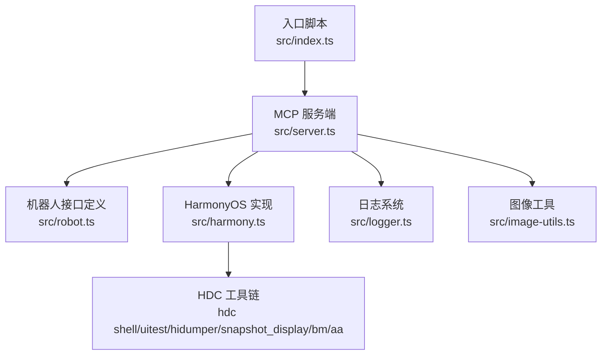
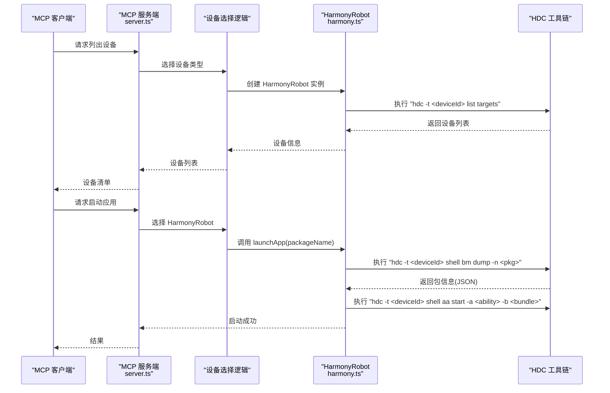
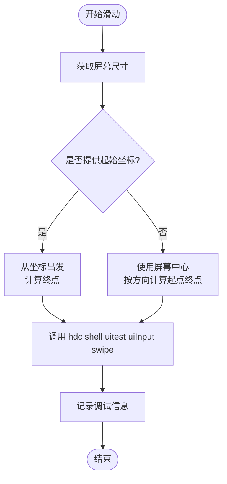
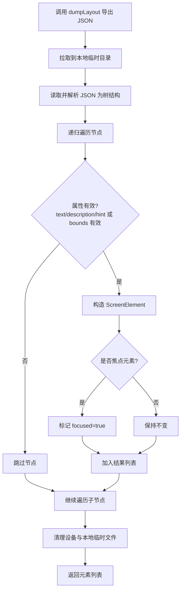
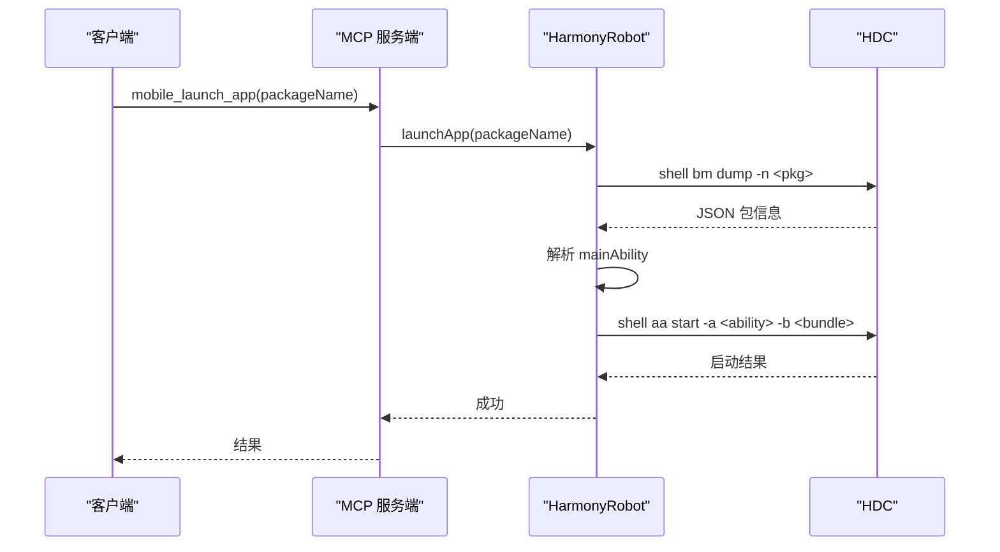
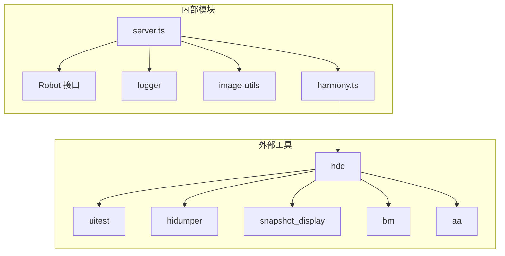

# HarmonyOS 平台实现

<cite>
**本文引用的文件**
- [harmony.ts](file://src/harmony.ts)
- [robot.ts](file://src/robot.ts)
- [server.ts](file://src/server.ts)
- [index.ts](file://src/index.ts)
- [logger.ts](file://src/logger.ts)
- [image-utils.ts](file://src/image-utils.ts)
- [package.json](file://package.json)
- [README.md](file://README.md)
</cite>

## 目录
1. [简介](#简介)
2. [项目结构](#项目结构)
3. [核心组件](#核心组件)
4. [架构总览](#架构总览)
5. [详细组件分析](#详细组件分析)
6. [依赖关系分析](#依赖关系分析)
7. [性能考量](#性能考量)
8. [故障排查指南](#故障排查指南)
9. [结论](#结论)
10. [附录](#附录)

## 简介
本技术文档聚焦于 HarmonyOS 平台在该代码库中的实现，围绕 HarmonyRobot 类的完整实现进行深入解析，涵盖以下主题：
- 使用 HDC 工具链进行设备通信与命令执行
- 屏幕尺寸获取、触摸操作、滑动操作的具体实现机制
- 布局树解析算法：从 HarmonyOS 的 JSON 布局数据中提取 UI 元素的策略
- 应用管理功能：包名解析、主能力识别、应用启动与终止流程
- 截图功能：远程文件传输与本地缓存管理
- 按键映射机制与按钮事件处理
- HarmonyOS 特有功能：方向锁定限制与程序化方向变更的处理方案

该实现通过 Model Context Protocol (MCP) 提供统一的自动化工具集，支持 iOS、Android 与 HarmonyOS 三端原生应用自动化。

章节来源
- [README.md:1-198](file://README.md#L1-L198)

## 项目结构
该项目采用模块化组织，核心文件如下：
- src/harmony.ts：HarmonyOS 平台的机器人实现与设备管理
- src/robot.ts：跨平台机器人接口定义
- src/server.ts：MCP 服务端与工具注册、设备选择逻辑
- src/index.ts：入口脚本，支持 stdio 与 SSE 两种运行模式
- src/logger.ts：日志记录
- src/image-utils.ts：图像缩放与格式转换（用于截图优化）
- package.json：依赖与构建配置
- README.md：平台支持、安装与配置说明



图表来源
- [index.ts:1-67](file://src/index.ts#L1-L67)
- [server.ts:1-708](file://src/server.ts#L1-L708)
- [harmony.ts:1-462](file://src/harmony.ts#L1-L462)
- [robot.ts:1-148](file://src/robot.ts#L1-L148)
- [logger.ts:1-22](file://src/logger.ts#L1-L22)
- [image-utils.ts:1-165](file://src/image-utils.ts#L1-L165)

章节来源
- [package.json:1-74](file://package.json#L1-L74)
- [README.md:175-190](file://README.md#L175-L190)

## 核心组件
- HarmonyRobot：实现 Robot 接口，封装 HDC 工具链调用，完成屏幕尺寸获取、触摸/滑动/按键、布局树解析、应用管理、截图等功能
- HarmonyDeviceManager：通过 hdc list targets 发现 HarmonyOS 设备，获取设备名称与版本
- Robot 接口：统一的跨平台设备控制接口，定义了屏幕尺寸、元素列表、应用管理、截图、输入与导航等方法
- MCP 服务端：根据设备 ID 动态选择对应平台的机器人实现，注册工具并处理错误

章节来源
- [harmony.ts:43-462](file://src/harmony.ts#L43-L462)
- [robot.ts:48-148](file://src/robot.ts#L48-L148)
- [server.ts:149-197](file://src/server.ts#L149-L197)

## 架构总览
HarmonyOS 自动化通过 HarmonyRobot 与 HDC 工具链直接驱动设备，无需 mobilecli 依赖。MCP 服务端负责设备发现与工具分发，HarmonyRobot 将具体命令映射到 hdc 子命令，实现统一的自动化能力。



图表来源
- [server.ts:149-197](file://src/server.ts#L149-L197)
- [harmony.ts:234-262](file://src/harmony.ts#L234-L262)

## 详细组件分析

### HarmonyRobot 类实现详解
HarmonyRobot 是 HarmonyOS 平台的核心实现，负责：
- 设备通信：通过 hdc 工具链执行 shell 命令
- 屏幕尺寸与方向：使用 hidumper 获取显示信息
- 触摸与滑动：通过 uitest uiInput 执行点击、双击、长按、滑动
- 文本输入：通过 uitest uiInput inputText
- 布局树解析：通过 uitest dumpLayout 导出 JSON，递归收集可交互元素
- 应用管理：通过 bm 查询包信息，通过 aa 启动/终止应用
- 截图：通过 snapshot_display 截图，file recv 拉取到本地临时目录
- 按键映射：将通用按钮映射到 HarmonyOS 键值

```mermaid
classDiagram
class HarmonyRobot {
-deviceId : string
+hdc(...args) : Buffer
+getScreenSize() : Promise<ScreenSize>
+tap(x, y) : Promise<void>
+doubleTap(x, y) : Promise<void>
+longPress(x, y, duration) : Promise<void>
+swipe(direction) : Promise<void>
+swipeFromCoordinate(x, y, direction, distance) : Promise<void>
+getScreenshot() : Promise<Buffer>
+sendKeys(text) : Promise<void>
+pressButton(button) : Promise<void>
+listApps() : Promise<InstalledApp[]>
+launchApp(packageName) : Promise<void>
+terminateApp(packageName) : Promise<void>
+installApp(appPath) : Promise<void>
+uninstallApp(bundleId) : Promise<void>
+openUrl(url) : Promise<void>
+getElementsOnScreen() : Promise<ScreenElement[]>
-collectElements(node) : ScreenElement[]
-parseBounds(bounds) : ScreenElementRect | null
+getOrientation() : Promise<Orientation>
+setOrientation(orientation) : Promise<void>
}
class HarmonyDeviceManager {
+getConnectedDevices() : string[]
+getConnectedDevicesWithDetails() : Array<{deviceId, name, version}>
}
class Robot {
<<interface>>
+getScreenSize() : Promise<ScreenSize>
+swipe(direction) : Promise<void>
+swipeFromCoordinate(x, y, direction, distance) : Promise<void>
+getScreenshot() : Promise<Buffer>
+listApps() : Promise<InstalledApp[]>
+launchApp(packageName) : Promise<void>
+terminateApp(packageName) : Promise<void>
+installApp(path) : Promise<void>
+uninstallApp(bundleId) : Promise<void>
+openUrl(url) : Promise<void>
+sendKeys(text) : Promise<void>
+pressButton(button) : Promise<void>
+tap(x, y) : Promise<void>
+doubleTap(x, y) : Promise<void>
+longPress(x, y, duration) : Promise<void>
+getElementsOnScreen() : Promise<ScreenElement[]>
+setOrientation(orientation) : Promise<void>
+getOrientation() : Promise<Orientation>
}
HarmonyRobot ..|> Robot
HarmonyDeviceManager --> HarmonyRobot : "设备发现"
```

图表来源
- [harmony.ts:43-462](file://src/harmony.ts#L43-L462)
- [robot.ts:48-148](file://src/robot.ts#L48-L148)

章节来源
- [harmony.ts:43-462](file://src/harmony.ts#L43-L462)

#### 屏幕尺寸与方向获取
- 屏幕尺寸：通过 hdc shell hidumper -s DisplayManagerService -a -a 获取 VirtualWidth/VirtualHeight
- 方向：解析 ScreenRotation 字段，90/270 为 landscape，否则 portrait
- 程序化方向变更：HarmonyOS 不支持，抛出 ActionableError

章节来源
- [harmony.ts:55-69](file://src/harmony.ts#L55-L69)
- [harmony.ts:401-411](file://src/harmony.ts#L401-L411)
- [harmony.ts:413-415](file://src/harmony.ts#L413-L415)

#### 触摸与滑动操作
- 点击/双击/长按：调用 hdc shell uitest uiInput click/doubleClick/longClick
- 屏中心滑动：根据方向计算起点终点，使用 swipe 命令
- 坐标滑动：从给定坐标出发，按距离与方向计算终点
- 参数安全：对不支持的方向抛出 ActionableError；滑动参数边界在函数内部处理



图表来源
- [harmony.ts:83-117](file://src/harmony.ts#L83-L117)
- [harmony.ts:119-157](file://src/harmony.ts#L119-L157)

章节来源
- [harmony.ts:71-117](file://src/harmony.ts#L71-L117)
- [harmony.ts:119-157](file://src/harmony.ts#L119-L157)

#### 文本输入与按键映射
- 文本输入：优先定位当前焦点元素，若无焦点则使用屏幕中心作为目标，调用 inputText
- 按键映射：BUTTON_MAP 将通用按钮映射到 HarmonyOS 键值（如 Home、Back、Enter、VolumeUp/Down）

章节来源
- [harmony.ts:184-210](file://src/harmony.ts#L184-L210)
- [harmony.ts:20-26](file://src/harmony.ts#L20-L26)

#### 布局树解析算法
- 导出布局：调用 dumpLayout 将 JSON 写入 /data/local/tmp，再通过 file recv 拉取到本地临时目录
- 解析与过滤：递归遍历节点，仅保留具有文本/描述/提示且 bounds 有效（宽高>0）的元素
- 属性映射：type/text/label/hint/id/rect/focused 映射到 ScreenElement
- 清理：删除设备上的临时文件与本地临时目录



图表来源
- [harmony.ts:294-332](file://src/harmony.ts#L294-L332)
- [harmony.ts:334-376](file://src/harmony.ts#L334-L376)
- [harmony.ts:378-399](file://src/harmony.ts#L378-L399)

章节来源
- [harmony.ts:294-332](file://src/harmony.ts#L294-L332)
- [harmony.ts:334-376](file://src/harmony.ts#L334-L376)
- [harmony.ts:378-399](file://src/harmony.ts#L378-L399)

#### 应用管理功能
- 列表：hdc shell bm dump -a 获取包名列表
- 启动：hdc shell bm dump -n <pkg> 解析 hapModuleInfos 中的 mainAbility，然后 hdc shell aa start -a <ability> -b <bundle>
- 终止：hdc shell aa force-stop <bundleId>
- 安装/卸载：hdc install/uninstall
- 打开 URL：hdc shell aa start -U <url>



图表来源
- [harmony.ts:221-262](file://src/harmony.ts#L221-L262)

章节来源
- [harmony.ts:221-262](file://src/harmony.ts#L221-L262)

#### 截图功能
- 截图：hdc shell snapshot_display -f /data/local/tmp/screenshot.jpeg
- 拉取：hdc file recv /data/local/tmp/screenshot.jpeg 本地临时目录
- 缓存：使用临时目录存放，finally 中清理设备与本地文件
- 图像优化：根据文件头判断 JPEG/PNG，必要时缩放并转为 JPEG

章节来源
- [harmony.ts:159-182](file://src/harmony.ts#L159-L182)
- [server.ts:597-673](file://src/server.ts#L597-L673)
- [image-utils.ts:1-165](file://src/image-utils.ts#L1-L165)

#### 方向锁定与程序化变更
- 当前方向：通过 hidumper 获取 ScreenRotation，映射为 portrait/landscape
- 程序化变更：setOrientation 抛出 ActionableError，明确 HarmonyOS 不支持

章节来源
- [harmony.ts:401-415](file://src/harmony.ts#L401-L415)

### 设备发现与工具分发
- 设备发现：HarmonyDeviceManager 通过 hdc list targets 获取设备 ID；同时兼容 iOS/Android 通过 mobilecli
- 工具分发：MCP 服务端根据设备 ID 选择对应机器人实现，注册统一工具集

章节来源
- [server.ts:149-197](file://src/server.ts#L149-L197)
- [harmony.ts:418-461](file://src/harmony.ts#L418-L461)

## 依赖关系分析
- 外部工具链：HDC（hdc）、uitest、hidumper、snapshot_display、bm、aa
- 内部模块：logger、image-utils、robot 接口
- MCP 服务端：统一工具注册与错误处理，设备选择逻辑



图表来源
- [harmony.ts:1-18](file://src/harmony.ts#L1-L18)
- [server.ts:1-16](file://src/server.ts#L1-L16)

章节来源
- [harmony.ts:1-18](file://src/harmony.ts#L1-L18)
- [server.ts:1-16](file://src/server.ts#L1-L16)

## 性能考量
- 截图优化：检测图像格式后进行缩放与压缩，降低传输体积
- 临时文件管理：严格在 finally 中清理设备与本地临时目录，避免资源泄漏
- 命令超时与缓冲：设置超时与最大缓冲，防止长时间阻塞
- 错误处理：ActionableError 用于可修复问题，便于 MCP 客户端重试或提示用户

章节来源
- [harmony.ts:9-10](file://src/harmony.ts#L9-L10)
- [harmony.ts:164-181](file://src/harmony.ts#L164-L181)
- [server.ts:79-94](file://src/server.ts#L79-L94)

## 故障排查指南
- 设备未发现：确认 HDC 可用且在 PATH 中，或设置 HDC_SDK_PATH；检查 hdc list targets 输出
- 命令失败：查看 ActionableError 消息，结合日志定位具体命令与参数
- 截图异常：确认 snapshot_display 权限与路径；检查本地临时目录权限
- 应用启动失败：核对包名与 mainAbility 是否存在；检查 aa 命令参数
- 方向变更报错：HarmonyOS 不支持程序化方向变更，需在设备侧手动切换

章节来源
- [harmony.ts:418-461](file://src/harmony.ts#L418-L461)
- [server.ts:79-94](file://src/server.ts#L79-L94)
- [logger.ts:1-22](file://src/logger.ts#L1-L22)

## 结论
HarmonyRobot 通过 HDC 工具链实现了 HarmonyOS 设备的全栈自动化能力，覆盖屏幕尺寸获取、触摸/滑动/按键、布局树解析、应用管理与截图等核心功能。其设计遵循统一的 Robot 接口，配合 MCP 服务端实现跨平台工具分发。HarmonyOS 的方向锁定限制在实现层面被明确处理，为上层用户提供一致的交互体验。

## 附录
- 安装与配置：详见 README 的前置依赖与 MCP 配置部分
- 平台支持：HarmonyOS 真机支持，无需 mobilecli 依赖

章节来源
- [README.md:90-190](file://README.md#L90-L190)