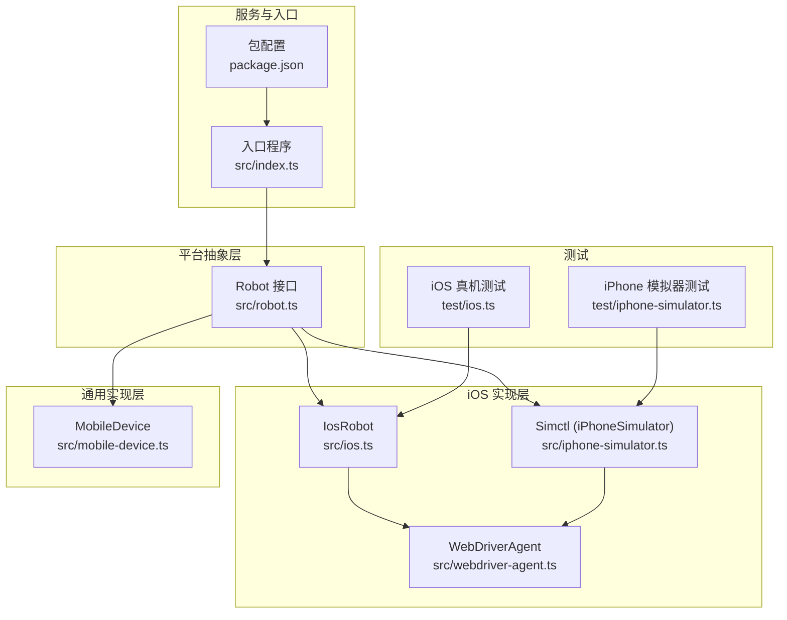
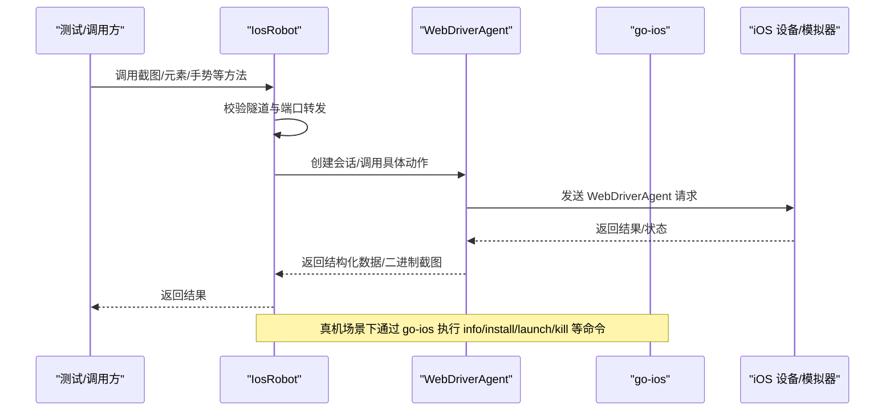
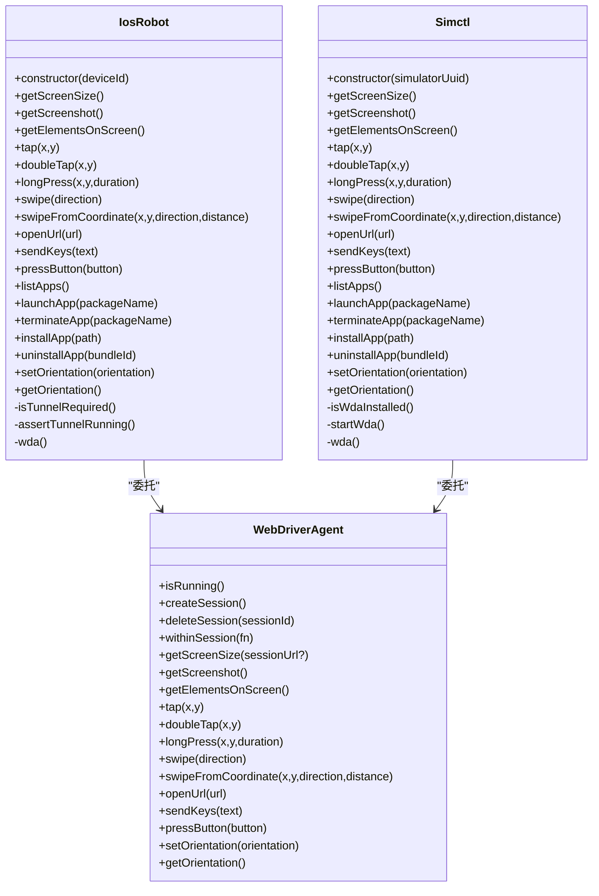
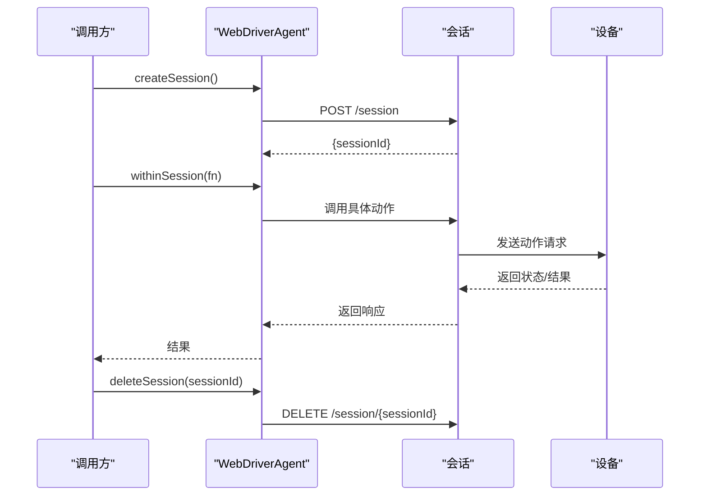
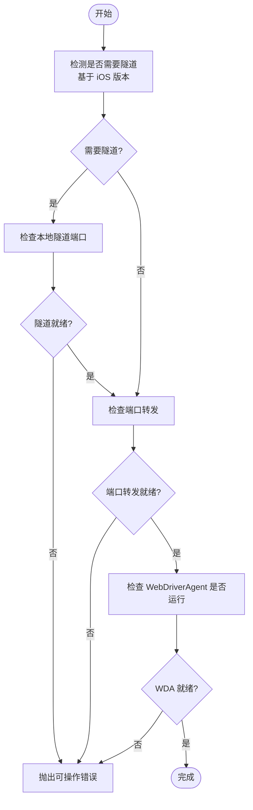
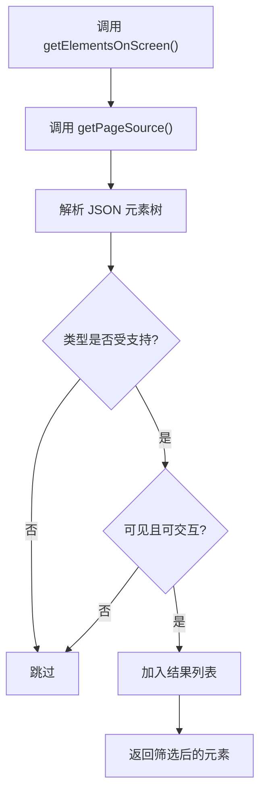
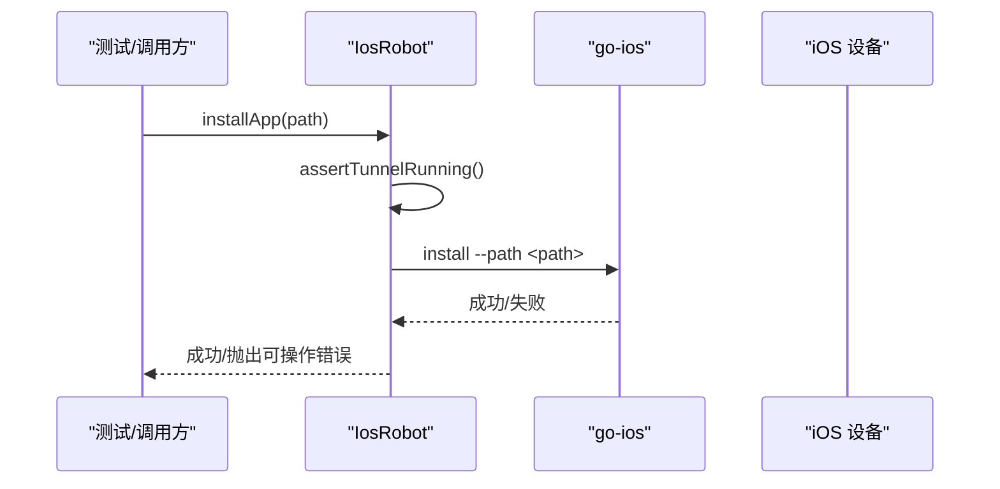
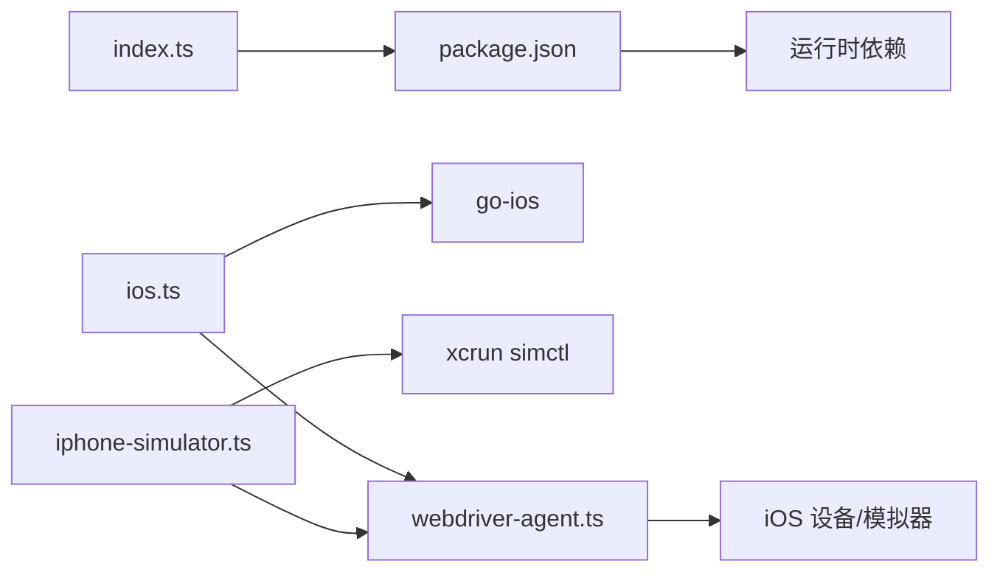

# iOS 平台实现

<cite>
**本文引用的文件**
- [ios.ts](file://src/ios.ts)
- [iphone-simulator.ts](file://src/iphone-simulator.ts)
- [robot.ts](file://src/robot.ts)
- [webdriver-agent.ts](file://src/webdriver-agent.ts)
- [mobile-device.ts](file://src/mobile-device.ts)
- [index.ts](file://src/index.ts)
- [package.json](file://package.json)
- [README.md](file://README.md)
- [test/ios.ts](file://test/ios.ts)
- [test/iphone-simulator.ts](file://test/iphone-simulator.ts)
</cite>

## 目录
1. [简介](#简介)
2. [项目结构](#项目结构)
3. [核心组件](#核心组件)
4. [架构总览](#架构总览)
5. [详细组件分析](#详细组件分析)
6. [依赖关系分析](#依赖关系分析)
7. [性能考量](#性能考量)
8. [故障排查指南](#故障排查指南)
9. [结论](#结论)
10. [附录](#附录)

## 简介
本文件面向 iOS 平台实现，系统性解析 IosRobot 与 iPhoneSimulator 的实现差异、WebDriverAgent 集成机制、设备发现与连接策略、屏幕交互与应用管理的 iOS 特定实现，并给出安全模型、证书要求及版本兼容与设备适配的最佳实践。文档同时兼顾非技术读者的理解需求，通过图示与分层讲解帮助快速掌握关键点。

## 项目结构
该仓库采用“按职责分层”的组织方式：
- 平台抽象层：定义统一的 Robot 接口，屏蔽 iOS/Android/HarmonyOS 的差异
- 平台实现层：分别提供 iOS 真机/模拟器、Android、HarmonyOS 的具体实现
- 服务与入口：MCP 服务器封装与命令行入口
- 测试：针对 iOS 真机与 iPhone 模拟器的功能验证

图表来源
- [robot.ts:48-147](file://src/robot.ts#L48-L147)
- [ios.ts:42-232](file://src/ios.ts#L42-L232)
- [iphone-simulator.ts:32-272](file://src/iphone-simulator.ts#L32-L272)
- [webdriver-agent.ts:25-454](file://src/webdriver-agent.ts#L25-L454)
- [mobile-device.ts:62-216](file://src/mobile-device.ts#L62-L216)
- [index.ts:1-67](file://src/index.ts#L1-L67)
- [package.json:1-74](file://package.json#L1-L74)
- [test/ios.ts:1-29](file://test/ios.ts#L1-L29)
- [test/iphone-simulator.ts:1-196](file://test/iphone-simulator.ts#L1-L196)

章节来源
- [README.md:1-198](file://README.md#L1-L198)
- [package.json:1-74](file://package.json#L1-L74)

## 核心组件
- Robot 接口：定义跨平台一致的设备控制能力，如截图、元素识别、触摸、手势、应用管理、方向控制等
- IosRobot：面向 iOS 真机，通过 go-ios 与本地隧道/端口转发配合 WebDriverAgent 提供完整控制
- Simctl：面向 iPhone 模拟器，直接通过 xcrun simctl 管理应用与状态，必要时启动 WebDriverAgentRunner
- WebDriverAgent：封装 WebDriverAgent 的 HTTP API，负责会话管理、动作下发、元素树获取、截图与方向控制
- MobileDevice：通用实现（用于 HarmonyOS 或其他平台），此处作为对比参考

章节来源
- [robot.ts:48-147](file://src/robot.ts#L48-L147)
- [ios.ts:42-232](file://src/ios.ts#L42-L232)
- [iphone-simulator.ts:32-272](file://src/iphone-simulator.ts#L32-L272)
- [webdriver-agent.ts:25-454](file://src/webdriver-agent.ts#L25-L454)
- [mobile-device.ts:62-216](file://src/mobile-device.ts#L62-L216)

## 架构总览
iOS 平台的自动化由“设备控制层 + WebDriverAgent 层 + 应用生命周期层”构成。真机路径需要本地隧道与端口转发，模拟器路径可直接通过 WebDriverAgentRunner 或 simctl 控制。

图表来源
- [ios.ts:77-92](file://src/ios.ts#L77-L92)
- [webdriver-agent.ts:42-77](file://src/webdriver-agent.ts#L42-L77)
- [test/ios.ts:13-27](file://test/ios.ts#L13-L27)

## 详细组件分析

### IosRobot 与 iPhoneSimulator 的实现差异
- 设备发现与连接
  - IosRobot 依赖 go-ios 列表设备、查询设备信息；通过本地端口监听判断隧道与端口转发是否就绪
  - iPhoneSimulator 通过 xcrun simctl 管理应用与状态，必要时启动 WebDriverAgentRunner
- 应用管理
  - IosRobot 使用 go-ios 的 install/launch/kill/uninstall 命令
  - iPhoneSimulator 使用 simctl install/uninstall/launch/terminate，支持 zip 解压后安装 .app
- 屏幕交互
  - 两者均通过 WebDriverAgent 提供的动作 API（actions）、截图、元素树、方向控制
- 安全与证书
  - IosRobot 未显式处理证书；iPhoneSimulator 未显式处理证书
  - 两者均通过 WebDriverAgent 的 HTTP API 与设备通信，证书由设备侧 WebDriverAgent 管理

图表来源
- [ios.ts:42-232](file://src/ios.ts#L42-L232)
- [iphone-simulator.ts:32-272](file://src/iphone-simulator.ts#L32-L272)
- [webdriver-agent.ts:25-454](file://src/webdriver-agent.ts#L25-L454)

章节来源
- [ios.ts:42-232](file://src/ios.ts#L42-L232)
- [iphone-simulator.ts:32-272](file://src/iphone-simulator.ts#L32-L272)

### WebDriverAgent 集成机制
- 会话管理
  - 创建会话：POST /session，携带 capabilities
  - 删除会话：DELETE /session/{sessionId}
  - withinSession：自动创建/销毁会话，保证动作在会话上下文中执行
- 动作与输入
  - 触摸/双击/长按：通过 /actions 发送 pointer 类型动作序列
  - 文本输入：/wda/keys
  - 按钮按下：/wda/pressButton（映射 HOME/VOLUME_UP/VOLUME_DOWN/ENTER）
- 屏幕与元素
  - 截图：/screenshot，返回 base64 数据
  - 屏幕尺寸：/wda/screen，返回 width/height/scale
  - 元素树：/source/?format=json，过滤可见且可交互的节点
- 方向控制
  - 设置：POST /orientation，body 指定大写方向
  - 查询：GET /orientation，返回小写方向

图表来源
- [webdriver-agent.ts:42-77](file://src/webdriver-agent.ts#L42-L77)
- [webdriver-agent.ts:149-174](file://src/webdriver-agent.ts#L149-L174)
- [webdriver-agent.ts:295-300](file://src/webdriver-agent.ts#L295-L300)
- [webdriver-agent.ts:433-453](file://src/webdriver-agent.ts#L433-L453)

章节来源
- [webdriver-agent.ts:25-454](file://src/webdriver-agent.ts#L25-L454)

### iOS 设备发现与连接机制
- 真机（IosRobot）
  - 通过 go-ios 列表设备、查询设备信息；根据 iOS 版本决定是否需要本地隧道与端口转发
  - 通过本地端口探测判断隧道与端口转发是否就绪；若不满足则抛出可操作错误
- 模拟器（Simctl）
  - 通过 xcrun simctl 管理应用与状态；若 WebDriverAgentRunner 未安装则跳过启动
  - 若 WebDriverAgent 未运行，则尝试启动并在超时时间内轮询直到可用

图表来源
- [ios.ts:69-92](file://src/ios.ts#L69-L92)
- [ios.ts:104-108](file://src/ios.ts#L104-L108)

章节来源
- [ios.ts:69-92](file://src/ios.ts#L69-L92)
- [ios.ts:104-108](file://src/ios.ts#L104-L108)

### 屏幕交互功能实现（截图、元素识别、触摸、手势）
- 截图
  - IosRobot 与 Simctl 均通过 WebDriverAgent 的 /screenshot 获取 base64 图像并转换为 Buffer
- 元素识别
  - 通过 /source/?format=json 获取元素树，过滤可见且可交互的节点（如 TextField/Button/Switch/Image 等）
- 触摸与手势
  - tap/doubleTap/longPress：通过 /actions 发送 pointer 动作序列
  - swipe/swipeFromCoordinate：计算起点/终点坐标，发送 pointerMove/Down/Up 序列，并在完成后清理动作

图表来源
- [webdriver-agent.ts:274-284](file://src/webdriver-agent.ts#L274-L284)
- [webdriver-agent.ts:240-272](file://src/webdriver-agent.ts#L240-L272)

章节来源
- [webdriver-agent.ts:274-284](file://src/webdriver-agent.ts#L274-L284)
- [webdriver-agent.ts:240-272](file://src/webdriver-agent.ts#L240-L272)
- [webdriver-agent.ts:295-300](file://src/webdriver-agent.ts#L295-L300)
- [webdriver-agent.ts:302-370](file://src/webdriver-agent.ts#L302-L370)
- [webdriver-agent.ts:372-431](file://src/webdriver-agent.ts#L372-L431)

### 应用管理功能（安装、启动、终止、卸载）
- IosRobot（真机）
  - 使用 go-ios 的 install/launch/kill/uninstall 命令；异常时拼接 stdout/stderr 输出为可操作错误
- iPhoneSimulator
  - 使用 simctl install/uninstall/launch/terminate；支持 zip 解压后安装 .app，包含 zip 路径安全校验
- 注意
  - 两者均在执行应用管理前进行隧道/端口转发检查（真机）或 WebDriverAgent 可用性检查（模拟器）

图表来源
- [ios.ts:150-160](file://src/ios.ts#L150-L160)
- [ios.ts:77-92](file://src/ios.ts#L77-L92)

章节来源
- [ios.ts:150-160](file://src/ios.ts#L150-L160)
- [iphone-simulator.ts:141-192](file://src/iphone-simulator.ts#L141-L192)

### iOS 安全模型与证书管理
- 证书与信任
  - 代码未显式处理证书安装或信任流程；通常由设备侧 WebDriverAgent 管理
- 权限与限制
  - 真机场景下需确保设备已启用开发者模式与信任，且 WebDriverAgent 已正确安装与签名
  - 模拟器场景下需确保 Xcode 与 WebDriverAgentRunner 已正确安装
- 安全建议
  - 仅在可信网络与受控环境中运行自动化
  - 对应用安装路径进行白名单与完整性校验（模拟器已内置 zip 路径安全校验）

章节来源
- [ios.ts:150-160](file://src/ios.ts#L150-L160)
- [iphone-simulator.ts:124-139](file://src/iphone-simulator.ts#L124-L139)

### iOS 版本兼容性与设备适配最佳实践
- 版本判定与隧道
  - 通过设备 ProductVersion 判断是否需要本地隧道与端口转发；建议在新版本系统上开启隧道以提升稳定性
- 屏幕尺寸与缩放
  - 截图尺寸与 scale 由 WebDriverAgent 返回；测试中验证 PNG 尺寸与 scale 的一致性
- 动作参数
  - 手势距离采用屏幕尺寸比例计算，避免固定像素导致不同设备不一致
- 按钮映射
  - 仅支持 HOME/VOLUME_UP/VOLUME_DOWN/ENTER；其他按钮需通过 sendKeys 或自定义映射

章节来源
- [ios.ts:104-108](file://src/ios.ts#L104-L108)
- [test/ios.ts:13-27](file://test/ios.ts#L13-L27)
- [webdriver-agent.ts:302-370](file://src/webdriver-agent.ts#L302-L370)
- [webdriver-agent.ts:116-147](file://src/webdriver-agent.ts#L116-L147)

## 依赖关系分析
- 运行时依赖
  - Node.js >= 18
  - MCP SDK、Express、Commander 等
  - 可选依赖：@mobilenext/mobilecli（通用平台）
- 平台依赖
  - iOS 真机：go-ios（通过环境变量 GO_IOS_PATH 或 PATH 指定）
  - iOS 模拟器：xcrun simctl（Xcode 工具链）
  - WebDriverAgent：随设备/模拟器安装，通过本地端口访问

图表来源
- [index.ts:1-67](file://src/index.ts#L1-L67)
- [package.json:29-39](file://package.json#L29-L39)
- [ios.ts:33-40](file://src/ios.ts#L33-L40)
- [iphone-simulator.ts:85-90](file://src/iphone-simulator.ts#L85-L90)
- [webdriver-agent.ts:25-40](file://src/webdriver-agent.ts#L25-L40)

章节来源
- [package.json:13-39](file://package.json#L13-L39)
- [ios.ts:33-40](file://src/ios.ts#L33-L40)
- [iphone-simulator.ts:85-90](file://src/iphone-simulator.ts#L85-L90)

## 性能考量
- 端口与隧道
  - 真机场景下隧道与端口转发的延迟会影响动作响应时间；建议在本地网络优化并复用会话
- 动作序列
  - 多次动作应合并或减少不必要的会话创建；WebDriverAgent 的 withinSession 已自动管理会话生命周期
- 截图与元素树
  - 截图与元素树获取为高频操作，建议在批量操作中缓存结果并避免重复请求
- 模拟器安装
  - zip 解压与 .app 定位会带来额外开销，建议预处理或缓存已解压的 .app

## 故障排查指南
- “iOS tunnel is not running”
  - 检查本地隧道端口是否监听；确认 iOS 版本是否需要隧道
- “Port forwarding to WebDriverAgent is not running”
  - 检查本地端口转发是否建立；确认设备与主机网络连通
- “WebDriverAgent is not running on device”
  - 确认设备上 WebDriverAgent 已安装并可访问；查看日志定位问题
- “go-ios is not installed”
  - 安装 go-ios 并确保在 PATH 中或通过 GO_IOS_PATH 指定
- “zip 路径包含非法字符”
  - 模拟器安装 zip 时进行路径安全校验，修正压缩包内容后再试
- “按钮不受支持”
  - 仅支持 HOME/VOLUME_UP/VOLUME_DOWN/ENTER；其他按钮请使用 sendKeys 或 ENTER

章节来源
- [ios.ts:69-92](file://src/ios.ts#L69-L92)
- [ios.ts:150-160](file://src/ios.ts#L150-L160)
- [iphone-simulator.ts:124-139](file://src/iphone-simulator.ts#L124-L139)
- [webdriver-agent.ts:116-147](file://src/webdriver-agent.ts#L116-L147)

## 结论
本实现以 Robot 接口为核心，分别针对 iOS 真机与 iPhone 模拟器提供了稳定可控的自动化能力。通过 WebDriverAgent 的统一 HTTP API，实现了跨平台一致的屏幕交互与应用管理。真机路径强调隧道与端口转发的可靠性，模拟器路径强调应用生命周期与安装流程的安全性。结合版本兼容性与最佳实践，可在多设备、多系统版本下获得稳定的自动化体验。

## 附录
- 测试用例参考
  - iOS 真机测试：验证截图尺寸与 scale 一致性、元素识别与手势效果
  - iPhone 模拟器测试：验证滑动、键盘输入、应用启动/终止、元素识别、URL 打开等

章节来源
- [test/ios.ts:1-29](file://test/ios.ts#L1-L29)
- [test/iphone-simulator.ts:1-196](file://test/iphone-simulator.ts#L1-L196)