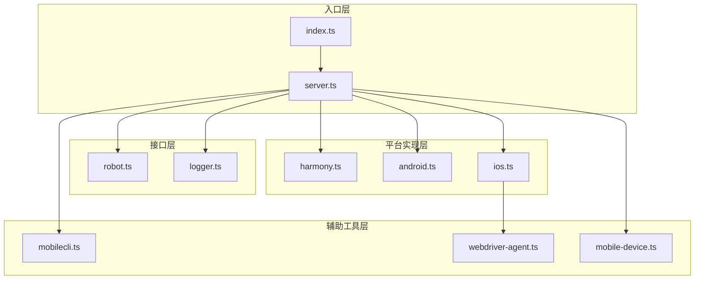
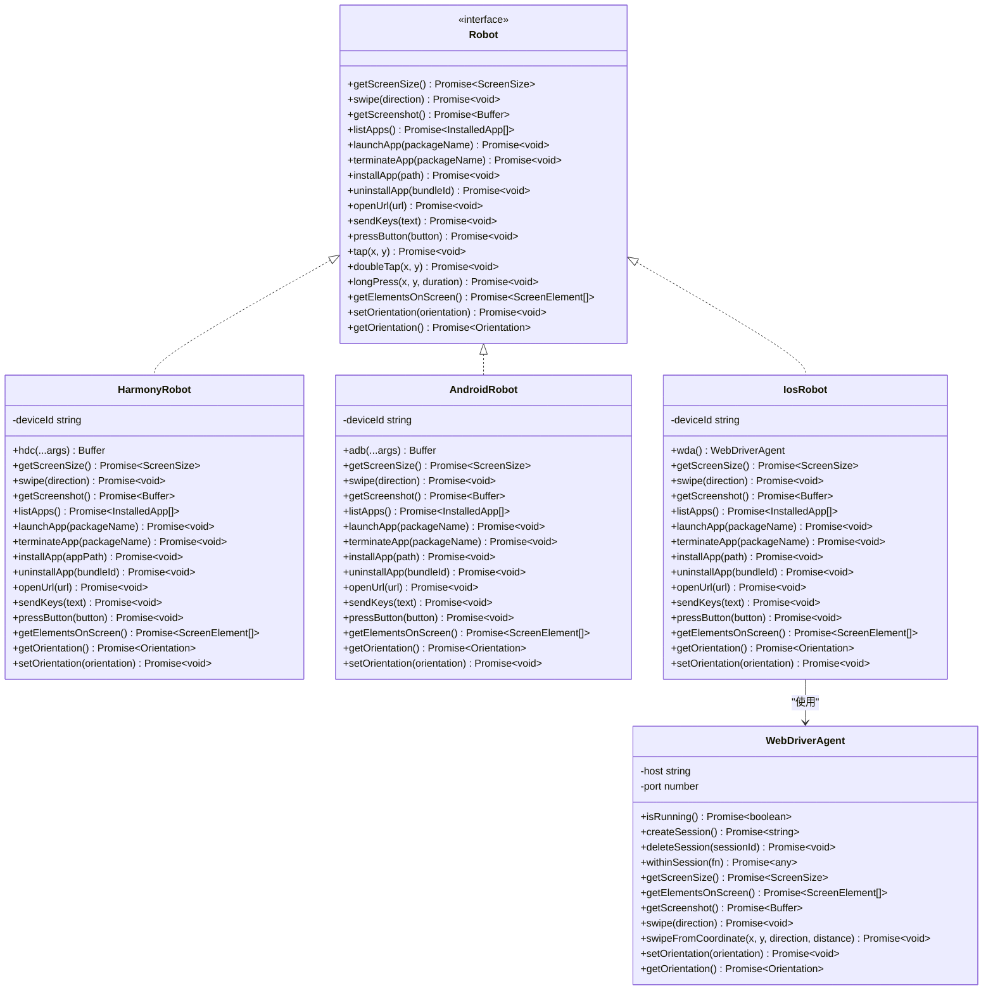
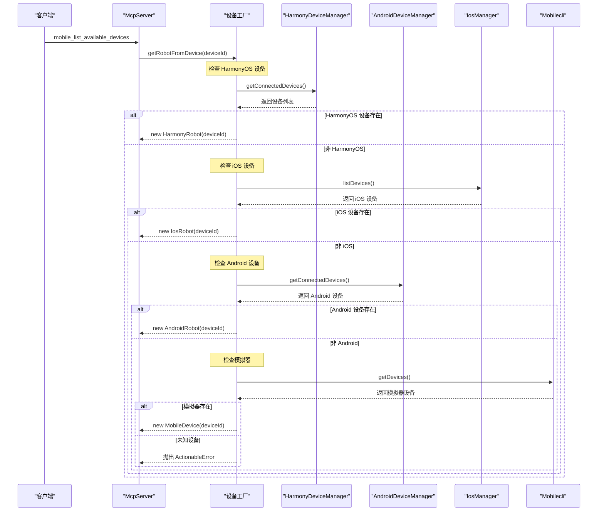
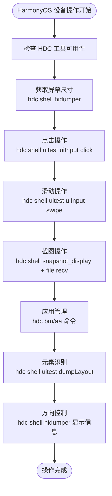
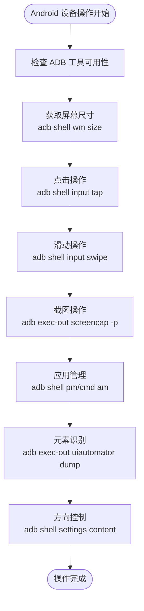
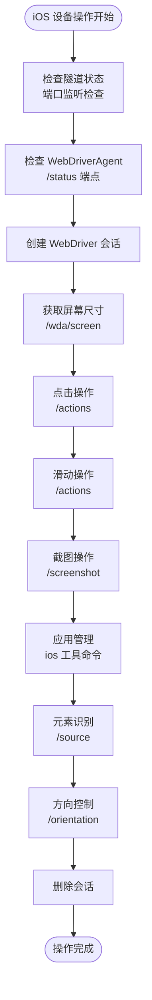
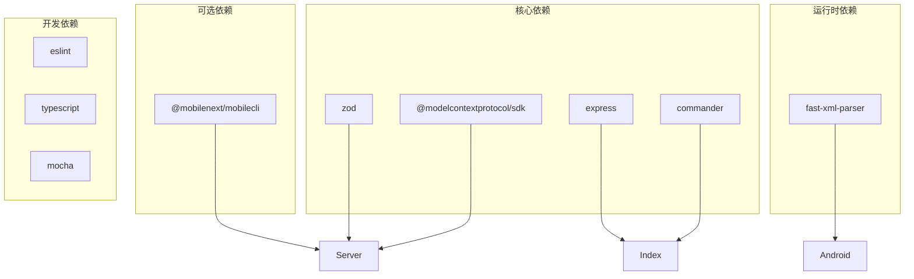

# 平台实现架构

<cite>
**本文档引用的文件**
- [src/index.ts](file://src/index.ts)
- [src/server.ts](file://src/server.ts)
- [src/robot.ts](file://src/robot.ts)
- [src/harmony.ts](file://src/harmony.ts)
- [src/android.ts](file://src/android.ts)
- [src/ios.ts](file://src/ios.ts)
- [src/webdriver-agent.ts](file://src/webdriver-agent.ts)
- [src/mobile-device.ts](file://src/mobile-device.ts)
- [src/mobilecli.ts](file://src/mobilecli.ts)
- [src/logger.ts](file://src/logger.ts)
- [package.json](file://package.json)
- [README.md](file://README.md)
</cite>

## 目录
1. [简介](#简介)
2. [项目结构](#项目结构)
3. [核心组件](#核心组件)
4. [架构总览](#架构总览)
5. [详细组件分析](#详细组件分析)
6. [依赖关系分析](#依赖关系分析)
7. [性能考虑](#性能考虑)
8. [故障排除指南](#故障排除指南)
9. [结论](#结论)
10. [附录](#附录)

## 简介
本项目是基于 Model Context Protocol (MCP) 的移动端自动化服务器，支持 iOS、Android 和 HarmonyOS 三大平台。项目采用策略模式与工厂模式相结合的方式，通过统一的 Robot 抽象接口屏蔽不同平台的差异，实现设备发现、应用管理、屏幕交互等核心功能的跨平台一致性。

项目的核心设计目标是在保持统一 API 的同时，充分利用各平台的原生工具链：
- HarmonyOS：HDC 工具链（无需 mobilecli 依赖）
- Android：ADB + UIAutomator
- iOS：WebDriverAgent

## 项目结构
项目采用模块化设计，主要文件组织如下：
- 核心接口定义：robot.ts
- 平台实现：harmony.ts、android.ts、ios.ts
- 服务器集成：server.ts、index.ts
- 辅助工具：mobilecli.ts、webdriver-agent.ts、mobile-device.ts、logger.ts
- 配置与文档：package.json、README.md



**图表来源**
- [src/index.ts:1-67](file://src/index.ts#L1-L67)
- [src/server.ts:1-708](file://src/server.ts#L1-L708)
- [src/robot.ts:1-148](file://src/robot.ts#L1-L148)

**章节来源**
- [src/index.ts:1-67](file://src/index.ts#L1-L67)
- [src/server.ts:1-708](file://src/server.ts#L1-L708)
- [src/robot.ts:1-148](file://src/robot.ts#L1-L148)

## 核心组件
项目的核心由以下组件构成：

### 抽象接口层
- **Robot 接口**：定义了所有平台统一支持的操作方法，包括屏幕尺寸获取、滑动、截图、应用管理、按键操作、元素识别、方向控制等
- **ActionableError**：自定义错误类型，用于区分可处理的业务错误和系统异常

### 平台实现层
- **HarmonyRobot**：HarmonyOS 平台实现，直接使用 HDC 工具链
- **AndroidRobot**：Android 平台实现，使用 ADB + UIAutomator
- **IosRobot**：iOS 平台实现，通过 WebDriverAgent 提供服务
- **MobileDevice**：通用设备封装，基于 mobilecli 工具

### 服务器集成层
- **McpServer**：MCP 协议服务器，注册所有工具函数
- **设备管理器**：分别管理各平台设备发现与连接

**章节来源**
- [src/robot.ts:48-147](file://src/robot.ts#L48-L147)
- [src/harmony.ts:43-416](file://src/harmony.ts#L43-L416)
- [src/android.ts:74-504](file://src/android.ts#L74-L504)
- [src/ios.ts:42-232](file://src/ios.ts#L42-L232)
- [src/server.ts:149-197](file://src/server.ts#L149-L197)

## 架构总览
项目采用分层架构，通过策略模式选择合适的平台实现，通过工厂模式创建具体的机器人实例。



**图表来源**
- [src/robot.ts:48-147](file://src/robot.ts#L48-L147)
- [src/harmony.ts:43-416](file://src/harmony.ts#L43-L416)
- [src/android.ts:74-504](file://src/android.ts#L74-L504)
- [src/ios.ts:42-232](file://src/ios.ts#L42-L232)
- [src/webdriver-agent.ts:25-454](file://src/webdriver-agent.ts#L25-L454)

## 详细组件分析

### 设备发现与工厂模式
项目实现了智能的设备检测机制，通过工厂模式根据设备类型返回相应的机器人实例。



**图表来源**
- [src/server.ts:149-197](file://src/server.ts#L149-L197)
- [src/harmony.ts:418-461](file://src/harmony.ts#L418-L461)
- [src/android.ts:506-592](file://src/android.ts#L506-L592)
- [src/ios.ts:234-293](file://src/ios.ts#L234-L293)
- [src/mobilecli.ts:107-134](file://src/mobilecli.ts#L107-L134)

### HarmonyOS 实现策略
HarmonyOS 实现采用直接命令行调用的方式，不依赖 mobilecli 工具：



**图表来源**
- [src/harmony.ts:48-416](file://src/harmony.ts#L48-L416)

### Android 实现策略
Android 实现使用 ADB 和 UIAutomator，具备更丰富的功能：



**图表来源**
- [src/android.ts:79-504](file://src/android.ts#L79-L504)

### iOS 实现策略
iOS 实现通过 WebDriverAgent 提供标准化的 Web API：



**图表来源**
- [src/ios.ts:47-232](file://src/ios.ts#L47-L232)
- [src/webdriver-agent.ts:30-454](file://src/webdriver-agent.ts#L30-L454)

**章节来源**
- [src/server.ts:149-197](file://src/server.ts#L149-L197)
- [src/harmony.ts:43-416](file://src/harmony.ts#L43-L416)
- [src/android.ts:74-504](file://src/android.ts#L74-L504)
- [src/ios.ts:42-232](file://src/ios.ts#L42-L232)
- [src/webdriver-agent.ts:25-454](file://src/webdriver-agent.ts#L25-L454)

## 依赖关系分析

### 技术栈差异对比
各平台实现使用不同的原生命令工具：

| 平台 | 工具链 | 关键命令 | 特殊特性 |
|------|--------|----------|----------|
| HarmonyOS | HDC | `hdc shell` | 直接设备控制，无需中间层 |
| Android | ADB + UIAutomator | `adb shell` | 丰富的系统命令，UI 测试框架 |
| iOS | WebDriverAgent | HTTP API | 标准化 Web 服务接口 |

### 外部依赖管理
项目通过 package.json 管理依赖关系：



**图表来源**
- [package.json:29-39](file://package.json#L29-L39)
- [package.json:40-59](file://package.json#L40-L59)

**章节来源**
- [package.json:1-74](file://package.json#L1-L74)
- [src/server.ts:8-15](file://src/server.ts#L8-L15)

## 性能考虑
各平台实现针对性能进行了优化：

### 图像处理优化
- **HarmonyOS**：直接使用 JPEG 格式截图，减少内存占用
- **Android**：根据设备类型选择合适的截图方式（单屏 vs 多屏）
- **iOS**：通过 WebDriverAgent 获取优化的图像数据

### 错误处理与重试机制
- 所有平台实现都包含超时控制和错误恢复逻辑
- Android 实现包含 UIAutomator XML 解析的容错处理
- iOS 实现包含隧道状态检查和会话管理

### 内存管理
- 各平台都实现了临时文件清理机制
- 图像数据在处理后及时释放
- 连接池和会话管理避免资源泄漏

## 故障排除指南

### 常见问题诊断
1. **设备无法发现**
   - 检查对应平台的工具是否正确安装
   - 验证设备连接状态和权限设置
   - 查看日志文件获取详细错误信息

2. **操作失败**
   - 确认设备处于正确的状态（解锁、前台应用）
   - 检查网络连接（特别是 iOS 隧道）
   - 验证参数格式和范围

3. **性能问题**
   - 减少不必要的截图操作
   - 合理使用元素识别功能
   - 优化批量操作的执行顺序

### 日志记录
项目提供了完整的日志记录机制：
- 通过 LOG_FILE 环境变量输出详细日志
- 关键操作包含时间戳和执行结果
- 错误信息包含堆栈跟踪便于调试

**章节来源**
- [src/logger.ts:1-22](file://src/logger.ts#L1-L22)
- [src/server.ts:7-133](file://src/server.ts#L7-L133)

## 结论
本项目成功实现了跨平台移动设备自动化的统一接口，通过策略模式和工厂模式有效屏蔽了各平台的技术差异。HarmonyOS 的直接 HDC 工具链、Android 的 ADB + UIAutomator、iOS 的 WebDriverAgent 各自有其优势和适用场景。

项目的关键优势包括：
- 统一的 API 接口，简化了多平台开发复杂度
- 智能的设备检测和工厂模式，自动选择最优实现
- 完善的错误处理和性能优化
- 清晰的架构设计，便于扩展和维护

## 附录

### 平台扩展指南
要为新平台添加支持，需要：

1. **实现 Robot 接口**
   ```typescript
   class NewPlatformRobot implements Robot {
       // 实现所有 Robot 方法
   }
   ```

2. **创建设备管理器**
   ```typescript
   class NewPlatformDeviceManager {
       getConnectedDevices(): string[]
       getConnectedDevicesWithDetails(): DeviceInfo[]
   }
   ```

3. **更新工厂方法**
   在 getRobotFromDevice 中添加新平台的检测逻辑

4. **测试验证**
   - 设备发现测试
   - 基础操作测试（点击、滑动、截图）
   - 应用管理测试
   - 错误处理测试

### 配置选项
- **LOG_FILE**：设置日志输出文件路径
- **HDC_SDK_PATH**：HarmonyOS SDK 路径
- **ANDROID_HOME**：Android SDK 路径
- **GO_IOS_PATH**：go-ios 工具路径