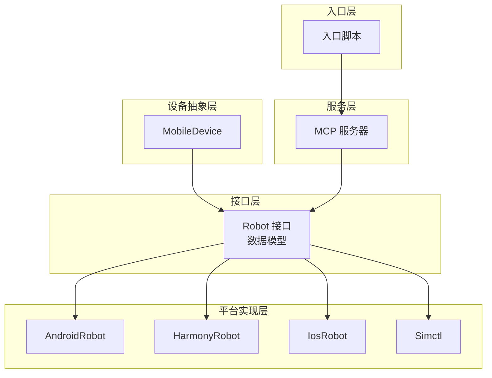
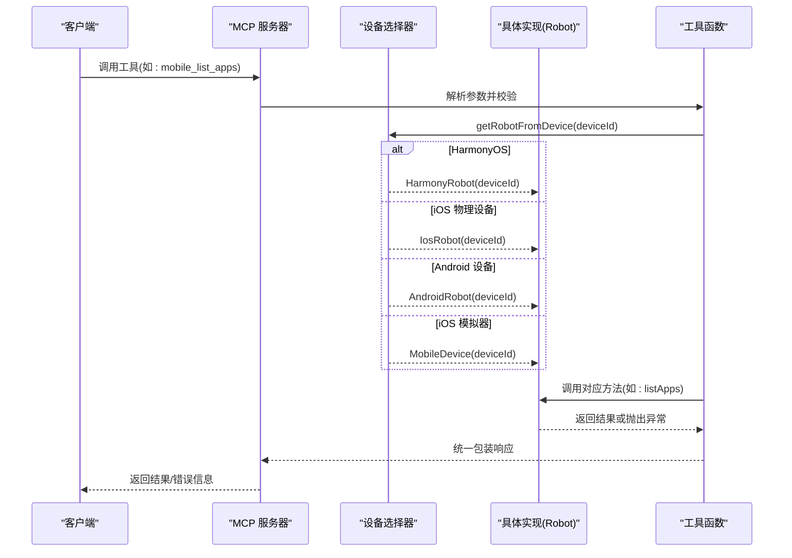
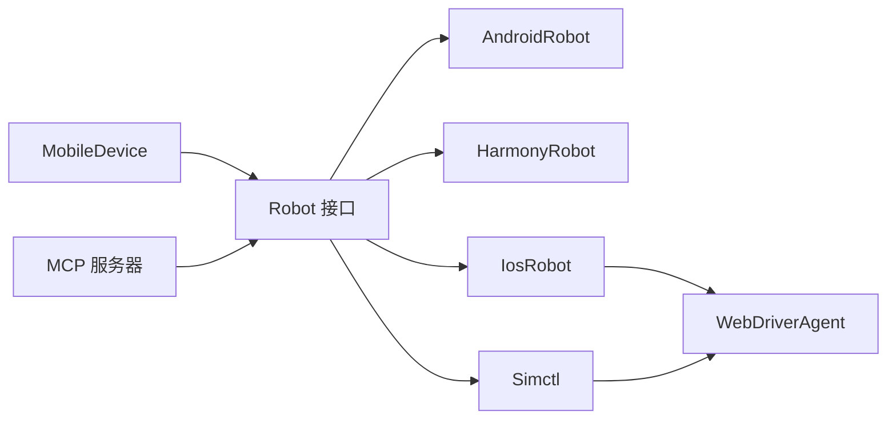

# 抽象接口设计

<cite>
**本文引用的文件列表**
- [robot.ts](file://src/robot.ts)
- [mobile-device.ts](file://src/mobile-device.ts)
- [harmony.ts](file://src/harmony.ts)
- [android.ts](file://src/android.ts)
- [ios.ts](file://src/ios.ts)
- [iphone-simulator.ts](file://src/iphone-simulator.ts)
- [server.ts](file://src/server.ts)
- [index.ts](file://src/index.ts)
- [webdriver-agent.ts](file://src/webdriver-agent.ts)
- [mobilecli.test.ts](file://test/mobilecli.test.ts)
- [package.json](file://package.json)
</cite>

## 目录
1. [引言](#引言)
2. [项目结构](#项目结构)
3. [核心组件](#核心组件)
4. [架构总览](#架构总览)
5. [详细组件分析](#详细组件分析)
6. [依赖关系分析](#依赖关系分析)
7. [性能考量](#性能考量)
8. [故障排查指南](#故障排查指南)
9. [结论](#结论)
10. [附录](#附录)

## 引言
本设计文档围绕 Mobile MCP HarmonyOS 项目中的抽象接口设计展开，重点阐释 Robot 接口的设计理念与实现规范，说明如何通过统一接口实现跨平台（Android、iOS、HarmonyOS）的一致行为；并深入解析接口方法定义、参数规范、返回值约定与异常处理机制。同时，文档阐述 MobileDevice 设备抽象层如何封装不同平台差异，并给出接口实现的最佳实践，包括错误处理策略、资源管理、并发安全等考虑；最后解释接口设计如何支持未来平台扩展，以及如何通过接口隔离实现单元测试。

## 项目结构
该项目采用“接口 + 多实现 + 服务编排”的分层架构：
- 接口层：定义统一的 Robot 接口及数据模型，确保所有平台能力一致对外暴露。
- 平台实现层：针对 Android、iOS、HarmonyOS 分别提供具体实现类，屏蔽底层工具链差异。
- 设备抽象层：MobileDevice 封装通用命令调用，兼容部分 iOS 模拟器场景。
- 服务层：MCP 服务器注册工具函数，动态选择具体 Robot 实现，统一对外能力。
- 入口层：命令行入口启动 MCP 服务，支持 STDIO 或 SSE 两种传输模式。

图表来源
- [robot.ts:48-147](file://src/robot.ts#L48-L147)
- [android.ts:74-504](file://src/android.ts#L74-L504)
- [harmony.ts:43-416](file://src/harmony.ts#L43-L416)
- [ios.ts:42-232](file://src/ios.ts#L42-L232)
- [iphone-simulator.ts:32-272](file://src/iphone-simulator.ts#L32-L272)
- [mobile-device.ts:62-216](file://src/mobile-device.ts#L62-L216)
- [server.ts:149-197](file://src/server.ts#L149-L197)
- [index.ts:1-67](file://src/index.ts#L1-L67)

章节来源
- [index.ts:1-67](file://src/index.ts#L1-L67)
- [server.ts:35-707](file://src/server.ts#L35-L707)

## 核心组件
- Robot 接口：定义设备操作的统一契约，涵盖屏幕尺寸、截图、应用管理、输入事件、手势、元素识别、方向控制等能力。
- 数据模型：ScreenSize、ScreenElement、ScreenElementRect、InstalledApp、Button、SwipeDirection、Orientation 等，确保跨平台一致性。
- 平台实现：
  - AndroidRobot：基于 ADB 工具链，适配多显示设备、UIAutomator、按键映射等。
  - HarmonyRobot：基于 hdc 工具链，适配 UI 测试与布局抓取、按键映射、屏幕截图等。
  - IosRobot：通过 WebDriverAgent 提供统一交互，依赖端口转发与隧道。
  - Simctl：面向 iOS 模拟器，封装安装、启动、卸载、截图、元素识别等。
- 设备抽象层 MobileDevice：封装通用命令执行，兼容部分 iOS 模拟器场景。
- MCP 服务器：注册工具函数，动态选择具体 Robot 实现，统一错误处理与日志追踪。

章节来源
- [robot.ts:1-147](file://src/robot.ts#L1-L147)
- [android.ts:74-504](file://src/android.ts#L74-L504)
- [harmony.ts:43-416](file://src/harmony.ts#L43-L416)
- [ios.ts:42-232](file://src/ios.ts#L42-L232)
- [iphone-simulator.ts:32-272](file://src/iphone-simulator.ts#L32-L272)
- [mobile-device.ts:62-216](file://src/mobile-device.ts#L62-L216)
- [server.ts:149-197](file://src/server.ts#L149-L197)

## 架构总览
下图展示 MCP 服务器如何根据设备类型动态选择具体 Robot 实现，并统一对外暴露工具函数。

图表来源
- [server.ts:149-197](file://src/server.ts#L149-L197)
- [server.ts:298-375](file://src/server.ts#L298-L375)

章节来源
- [server.ts:149-197](file://src/server.ts#L149-L197)
- [server.ts:298-375](file://src/server.ts#L298-L375)

## 详细组件分析

### Robot 接口设计
- 设计理念
  - 平台无关性：通过统一接口屏蔽底层差异，上层仅依赖 Robot 契约。
  - 可扩展性：新增平台只需实现 Robot 即可无缝接入。
  - 易测试性：接口隔离便于注入模拟实现进行单元测试。
- 方法族覆盖
  - 屏幕与截图：getScreenSize、getScreenshot
  - 应用管理：listApps、launchApp、terminateApp、installApp、uninstallApp
  - 输入与按钮：sendKeys、pressButton
  - 手势：tap、doubleTap、longPress、swipe、swipeFromCoordinate
  - 元素识别：getElementsOnScreen
  - 方向控制：setOrientation、getOrientation
- 参数与返回值约定
  - 参数类型严格约束，使用 TypeScript 类型系统保证一致性。
  - 返回值以 Promise 形式异步返回，便于跨平台异步调用。
- 异常处理机制
  - 使用 ActionableError 包装可修复问题，便于 MCP 服务器统一转换为用户可读提示。
  - 非 ActionableError 的异常由服务器捕获并返回通用错误信息。

章节来源
- [robot.ts:48-147](file://src/robot.ts#L48-L147)
- [robot.ts:40-44](file://src/robot.ts#L40-L44)

### AndroidRobot 实现
- 关键点
  - ADB 工具链封装，支持多显示设备与 UIAutomator。
  - 按键映射与非 ASCII 文本处理（通过设备工具包或转义）。
  - 屏幕截图在多显示设备下的差异化处理。
  - 元素收集基于 UIAutomator XML，过滤可见且有标识的控件。
- 错误处理
  - 安装/卸载失败时拼接 stdout/stderr 输出，统一抛出 ActionableError。
  - UIAutomator 获取失败时重试与保护性检查。
- 性能与健壮性
  - 设置超时与缓冲区限制，避免阻塞。
  - 对设备特性探测（如 TV/移动）以选择合适策略。

章节来源
- [android.ts:74-504](file://src/android.ts#L74-L504)
- [android.ts:118-131](file://src/android.ts#L118-L131)
- [android.ts:295-310](file://src/android.ts#L295-L310)
- [android.ts:351-356](file://src/android.ts#L351-L356)
- [android.ts:402-427](file://src/android.ts#L402-L427)
- [android.ts:438-451](file://src/android.ts#L438-L451)
- [android.ts:453-464](file://src/android.ts#L453-L464)

### HarmonyRobot 实现
- 关键点
  - hdc 工具链封装，适配 UI 输入、截图、布局抓取、按键映射。
  - 屏幕截图通过 snapshot_display + 文件收发，本地临时目录清理。
  - 元素识别基于 dumpLayout JSON，递归收集可见文本/描述/提示的节点。
  - 方向设置不支持（抛出 ActionableError），方向查询基于 hidumper。
- 错误处理
  - 安装/卸载失败时拼接输出，统一抛出 ActionableError。
  - 布局抓取失败时尝试解析保存路径，增强可观测性。
- 性能与健壮性
  - 超时与缓冲区限制，finally 中确保清理设备与本地临时目录。

章节来源
- [harmony.ts:43-416](file://src/harmony.ts#L43-L416)
- [harmony.ts:159-182](file://src/harmony.ts#L159-L182)
- [harmony.ts:294-332](file://src/harmony.ts#L294-L332)
- [harmony.ts:413-415](file://src/harmony.ts#L413-L415)

### IosRobot 实现
- 关键点
  - 通过 WebDriverAgent 提供统一交互，依赖端口转发与隧道。
  - 屏幕尺寸、截图、元素识别、手势、按键、方向均委托给 WebDriverAgent。
  - 针对 iOS 17+ 的隧道要求进行前置校验。
- 错误处理
  - 端口转发/隧道状态检查失败时抛出 ActionableError，引导用户按文档配置。
  - 安装/卸载失败时拼接输出，统一抛出 ActionableError。

章节来源
- [ios.ts:42-232](file://src/ios.ts#L42-L232)
- [ios.ts:110-113](file://src/ios.ts#L110-L113)
- [ios.ts:140-148](file://src/ios.ts#L140-L148)
- [ios.ts:150-172](file://src/ios.ts#L150-L172)
- [ios.ts:209-221](file://src/ios.ts#L209-L221)
- [ios.ts:223-231](file://src/ios.ts#L223-L231)

### Simctl 实现（iOS 模拟器）
- 关键点
  - 通过 xcrun simctl 与 WebDriverAgent 协作，提供安装、启动、卸载、截图、元素识别、手势、按键、方向等能力。
  - ZIP 安装前的安全校验与解压流程，确保无路径穿越风险。
- 错误处理
  - 安装/卸载失败时拼接输出，统一抛出 ActionableError。
  - 启动 WebDriverAgent 失败时抛出 ActionableError，引导用户按文档配置。

章节来源
- [iphone-simulator.ts:32-272](file://src/iphone-simulator.ts#L32-L272)
- [iphone-simulator.ts:141-192](file://src/iphone-simulator.ts#L141-L192)
- [iphone-simulator.ts:205-216](file://src/iphone-simulator.ts#L205-L216)
- [iphone-simulator.ts:228-271](file://src/iphone-simulator.ts#L228-L271)

### MobileDevice 设备抽象层
- 关键点
  - 通过 Mobilecli 命令封装，统一执行设备命令（如设备信息、截图、应用管理、IO 操作、方向设置/查询）。
  - 作为 iOS 模拟器的通用实现，屏蔽底层工具差异。
- 错误处理
  - 命令执行失败时返回字符串或抛出异常，由上层统一处理。
- 资源管理
  - 截图与应用安装等涉及临时文件时，遵循 finally 清理策略。

章节来源
- [mobile-device.ts:62-216](file://src/mobile-device.ts#L62-L216)
- [mobile-device.ts:139-142](file://src/mobile-device.ts#L139-L142)
- [mobile-device.ts:144-150](file://src/mobile-device.ts#L144-L150)
- [mobile-device.ts:194-206](file://src/mobile-device.ts#L194-L206)

### MCP 服务器与工具函数
- 关键点
  - 动态设备选择：优先检测 HarmonyOS，再检测 iOS 物理设备，再检测 Android，最后回退到 iOS 模拟器（MobileDevice）。
  - 工具函数注册：将 Robot 能力映射为 MCP 工具，统一参数校验、错误处理与日志追踪。
  - 统一错误处理：ActionableError 转换为用户可读提示，其他异常返回通用错误信息。
- 性能与可观测性
  - 工具调用耗时统计与 PostHog 上报。
  - 截图格式自动检测与按需缩放优化传输体积。

章节来源
- [server.ts:149-197](file://src/server.ts#L149-L197)
- [server.ts:298-375](file://src/server.ts#L298-L375)
- [server.ts:585-704](file://src/server.ts#L585-L704)

### WebDriverAgent 交互层
- 关键点
  - 会话管理：创建/删除会话，确保动作原子性。
  - 屏幕尺寸、截图、元素识别、手势、按键、方向均通过 WebDriverAgent API 完成。
- 错误处理
  - 会话创建失败、动作请求失败时抛出 ActionableError。

章节来源
- [webdriver-agent.ts:25-454](file://src/webdriver-agent.ts#L25-L454)

## 依赖关系分析
- 接口依赖
  - 所有平台实现类均实现 Robot 接口，确保上层调用一致性。
- 运行时依赖
  - Android：ADB 工具链。
  - HarmonyOS：hdc 工具链。
  - iOS：go-ios、WebDriverAgent、端口转发与隧道。
  - iOS 模拟器：xcrun simctl、WebDriverAgent。
- 服务依赖
  - MCP SDK、Zod 参数校验、Express/SSE 传输（可选）。
- 可选依赖
  - @mobilenext/mobilecli：用于 iOS 模拟器设备发现与通用命令执行。

图表来源
- [robot.ts:48-147](file://src/robot.ts#L48-L147)
- [android.ts:74-504](file://src/android.ts#L74-L504)
- [harmony.ts:43-416](file://src/harmony.ts#L43-L416)
- [ios.ts:42-232](file://src/ios.ts#L42-L232)
- [iphone-simulator.ts:32-272](file://src/iphone-simulator.ts#L32-L272)
- [mobile-device.ts:62-216](file://src/mobile-device.ts#L62-L216)
- [server.ts:149-197](file://src/server.ts#L149-L197)
- [webdriver-agent.ts:25-454](file://src/webdriver-agent.ts#L25-L454)

章节来源
- [package.json:29-39](file://package.json#L29-L39)
- [server.ts:8-15](file://src/server.ts#L8-L15)

## 性能考量
- 截图优化
  - 自动检测图像格式并按需缩放，减少传输体积与内存占用。
- 超时与缓冲区
  - 所有外部命令调用设置合理超时与缓冲区上限，避免阻塞。
- 并发与会话
  - WebDriverAgent 通过会话管理确保动作原子性，避免并发冲突。
- 设备选择缓存
  - 在 MCP 服务器中可考虑缓存设备列表与实现选择结果，降低重复探测成本。

## 故障排查指南
- 常见问题与定位
  - ADB/ADB 工具链不可用：检查 ANDROID_HOME、ANDROID_SDK_ROOT 环境变量与 adb 可执行文件路径。
  - hdc 不可用：检查 HDC_SDK_PATH 或系统 PATH 中的 hdc 可执行文件。
  - go-ios/WebDriverAgent 未就绪：确认隧道与端口转发已正确配置，参考项目 Wiki。
  - 安装/卸载失败：查看 ActionableError 中的 stdout/stderr 输出，定位具体错误原因。
- 日志与追踪
  - MCP 服务器记录工具调用耗时与错误事件，便于问题复盘。
- 单元测试
  - 通过模拟 Mobilecli.executeCommand 行为，验证参数传递与错误处理逻辑。

章节来源
- [server.ts:79-94](file://src/server.ts#L79-L94)
- [server.ts:138-147](file://src/server.ts#L138-L147)
- [android.ts:362-382](file://src/android.ts#L362-L382)
- [harmony.ts:268-288](file://src/harmony.ts#L268-L288)
- [ios.ts:150-172](file://src/ios.ts#L150-L172)
- [iphone-simulator.ts:175-202](file://src/iphone-simulator.ts#L175-L202)
- [mobilecli.test.ts:1-120](file://test/mobilecli.test.ts#L1-L120)

## 结论
通过 Robot 接口与多平台实现的解耦设计，Mobile MCP HarmonyOS 成功实现了跨平台的设备控制能力。接口层的统一契约、平台实现层的工具链封装、设备抽象层的通用命令桥接，以及 MCP 服务层的动态选择与统一错误处理，共同构成了高内聚、低耦合、易扩展的体系。该设计不仅满足当前 Android、iOS、HarmonyOS 的需求，也为未来新平台接入提供了清晰的扩展路径；同时，接口隔离与模拟实现使得单元测试具备良好可操作性。

## 附录
- 最佳实践清单
  - 错误处理：优先使用 ActionableError 包装可修复问题，统一转换为用户可读提示。
  - 资源管理：所有外部命令调用设置超时与缓冲区上限；涉及临时文件的操作使用 finally 清理。
  - 并发安全：WebDriverAgent 通过会话管理保证动作原子性；避免全局共享状态。
  - 可观测性：记录工具调用耗时与错误事件，便于问题定位与性能优化。
  - 单元测试：通过模拟外部命令与网络调用，验证参数校验、错误分支与边界条件。
- 未来扩展建议
  - 新增平台时，仅需实现 Robot 接口并更新设备选择器，即可无缝接入 MCP 工具集。
  - 可引入插件化加载机制，按需加载平台实现，降低启动成本。
  - 可增加设备能力探测与降级策略，提升在弱环境下的可用性。