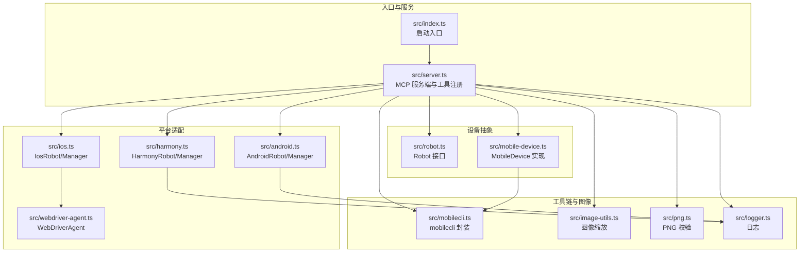
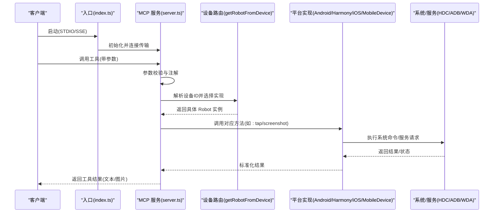
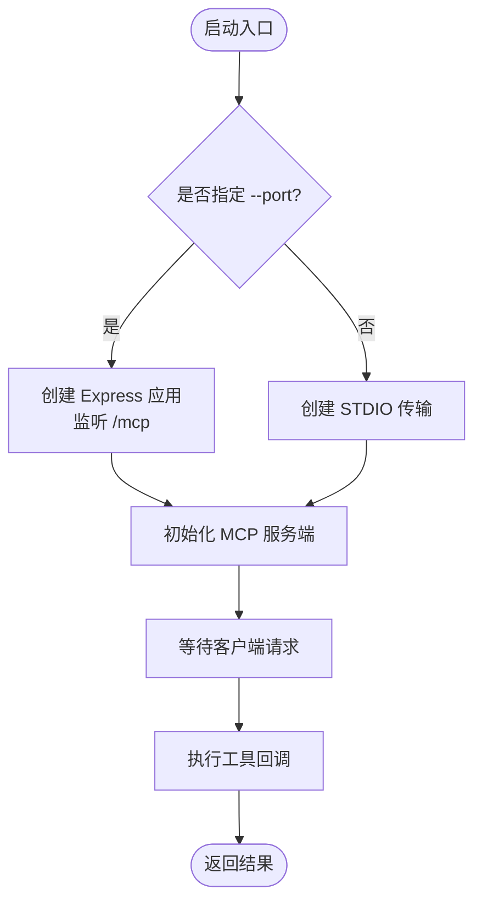
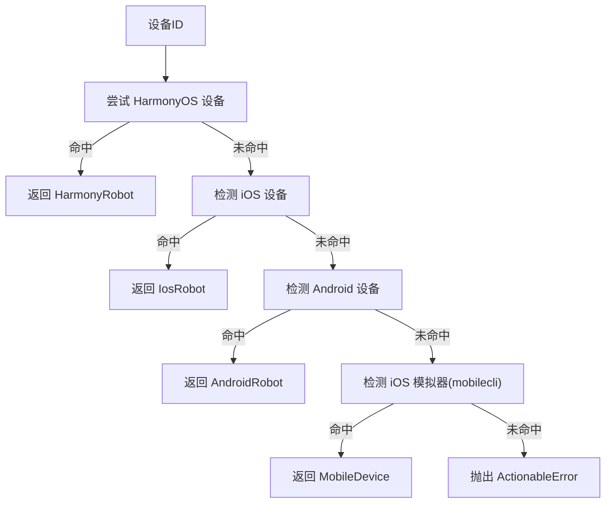
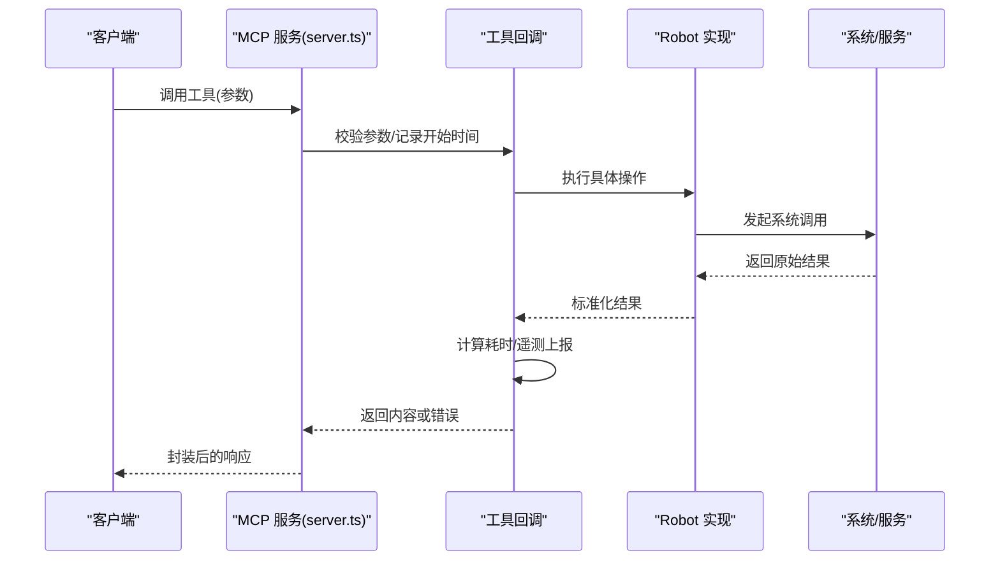
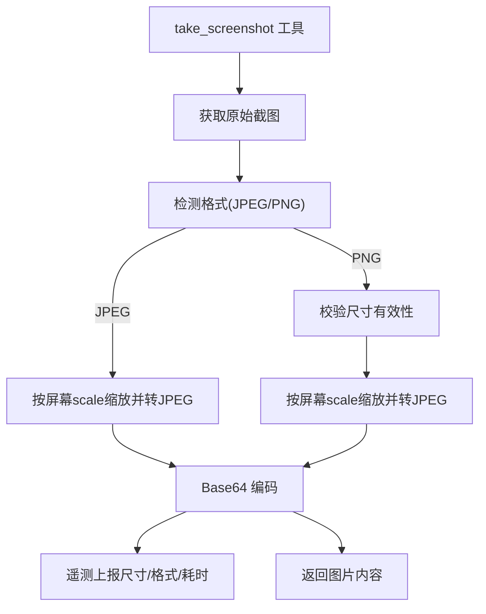
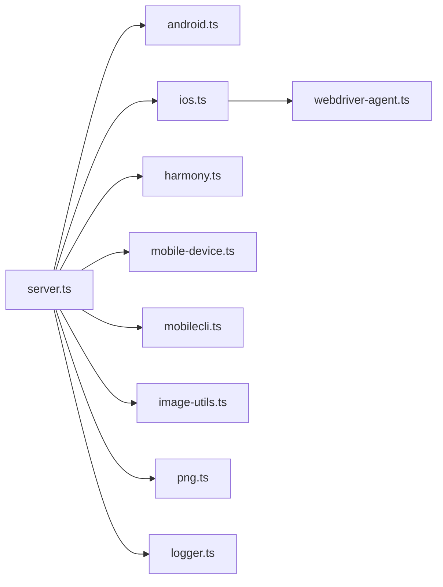

# 数据流与控制流

<cite>
**本文引用的文件**
- [src/index.ts](file://src/index.ts)
- [src/server.ts](file://src/server.ts)
- [src/mobile-device.ts](file://src/mobile-device.ts)
- [src/mobilecli.ts](file://src/mobilecli.ts)
- [src/harmony.ts](file://src/harmony.ts)
- [src/android.ts](file://src/android.ts)
- [src/ios.ts](file://src/ios.ts)
- [src/robot.ts](file://src/robot.ts)
- [src/logger.ts](file://src/logger.ts)
- [src/webdriver-agent.ts](file://src/webdriver-agent.ts)
- [src/image-utils.ts](file://src/image-utils.ts)
- [src/png.ts](file://src/png.ts)
- [package.json](file://package.json)
- [README.md](file://README.md)
</cite>

## 目录
1. [简介](#简介)
2. [项目结构](#项目结构)
3. [核心组件](#核心组件)
4. [架构总览](#架构总览)
5. [详细组件分析](#详细组件分析)
6. [依赖关系分析](#依赖关系分析)
7. [性能考量](#性能考量)
8. [故障排查指南](#故障排查指南)
9. [结论](#结论)

## 简介
本文件面向 Mobile MCP HarmonyOS 项目，聚焦“数据流与控制流”，系统性阐述从客户端请求到设备响应的完整路径，覆盖请求处理流程、设备路由机制、工具执行流程、错误传播路径，并结合事件驱动与异步处理策略，解释如何通过并发与资源隔离提升系统性能与稳定性。文档同时提供多类可视化图示，帮助读者快速把握系统运行时行为。

## 项目结构
该项目采用模块化组织，围绕“MCP 服务端”“设备抽象层”“平台适配层”“工具注册与调度”“日志与监控”等维度构建。核心入口负责启动服务（STDIO 或 SSE），MCP 服务端注册各类工具，工具调用经由设备路由选择具体实现，最终通过平台命令或服务完成设备操作。

图表来源
- [src/index.ts:1-67](file://src/index.ts#L1-L67)
- [src/server.ts:1-708](file://src/server.ts#L1-L708)
- [src/robot.ts:1-148](file://src/robot.ts#L1-L148)
- [src/mobile-device.ts:1-217](file://src/mobile-device.ts#L1-L217)
- [src/android.ts:1-593](file://src/android.ts#L1-L593)
- [src/ios.ts:1-294](file://src/ios.ts#L1-L294)
- [src/harmony.ts:1-462](file://src/harmony.ts#L1-L462)
- [src/webdriver-agent.ts:1-455](file://src/webdriver-agent.ts#L1-L455)
- [src/mobilecli.ts:1-136](file://src/mobilecli.ts#L1-L136)
- [src/image-utils.ts:1-165](file://src/image-utils.ts#L1-L165)
- [src/png.ts:1-21](file://src/png.ts#L1-L21)
- [src/logger.ts:1-22](file://src/logger.ts#L1-L22)

章节来源
- [src/index.ts:1-67](file://src/index.ts#L1-L67)
- [src/server.ts:1-708](file://src/server.ts#L1-L708)
- [README.md:1-198](file://README.md#L1-L198)

## 核心组件
- 入口与服务
  - 入口负责解析参数，启动 STDIO 或 SSE 两种模式的服务；STDIO 模式直接与 MCP 客户端通信，SSE 模式通过 HTTP 提供服务端推送通道。
  - MCP 服务端负责注册工具、参数校验、异常处理、遥测上报与设备路由决策。
- 设备抽象与路由
  - Robot 接口定义统一的设备操作契约；MobileDevice 作为通用实现，委托 mobilecli 执行命令；平台适配分别实现 Android、iOS、HarmonyOS 的具体操作。
  - 设备路由通过 getRobotFromDevice 决策：优先识别 HarmonyOS 设备（无需 mobilecli），再检测 iOS/Android/模拟器，最后抛出可定位的错误。
- 工具注册与执行
  - 通过工具工厂函数注册工具，内置参数 Schema 校验与注解（只读/破坏性），工具回调内捕获异常并标准化返回。
- 图像处理与截图
  - 截图后根据格式与尺寸进行缩放与编码，支持 JPEG/PNG 输出与尺寸统计，便于后续分析与传输。
- 日志与监控
  - 统一日志输出与错误追踪，遥测上报工具调用次数、耗时与截图元信息，辅助性能分析与问题定位。

章节来源
- [src/index.ts:1-67](file://src/index.ts#L1-L67)
- [src/server.ts:135-197](file://src/server.ts#L135-L197)
- [src/robot.ts:48-147](file://src/robot.ts#L48-L147)
- [src/mobile-device.ts:62-216](file://src/mobile-device.ts#L62-L216)
- [src/harmony.ts:43-416](file://src/harmony.ts#L43-L416)
- [src/android.ts:74-504](file://src/android.ts#L74-L504)
- [src/ios.ts:42-232](file://src/ios.ts#L42-L232)
- [src/webdriver-agent.ts:25-454](file://src/webdriver-agent.ts#L25-L454)
- [src/image-utils.ts:9-165](file://src/image-utils.ts#L9-L165)
- [src/png.ts:6-20](file://src/png.ts#L6-L20)
- [src/logger.ts:1-22](file://src/logger.ts#L1-L22)

## 架构总览
系统采用“MCP 服务端 + 多平台适配”的分层设计。MCP 服务端集中处理请求、参数校验、工具分发与结果封装；平台适配层通过系统命令或服务完成设备操作；图像处理模块负责截图质量与体积优化；日志与遥测贯穿全链路，保障可观测性。

图表来源
- [src/index.ts:9-67](file://src/index.ts#L9-L67)
- [src/server.ts:62-95](file://src/server.ts#L62-L95)
- [src/server.ts:149-197](file://src/server.ts#L149-L197)
- [src/mobile-device.ts:70-142](file://src/mobile-device.ts#L70-L142)
- [src/harmony.ts:48-53](file://src/harmony.ts#L48-L53)
- [src/android.ts:79-84](file://src/android.ts#L79-L84)
- [src/ios.ts:94-96](file://src/ios.ts#L94-L96)

## 详细组件分析

### 请求处理流程（STDIO/SSE）
- STDIO 模式
  - 入口创建 STDIO 传输并连接 MCP 服务端，服务端初始化后等待客户端指令。
- SSE 模式
  - 入口创建 Express 应用，监听 GET/POST /mcp，GET 建立 SSE 传输，POST 接收消息；服务端通过传输对象处理请求/响应。
- 控制流要点
  - 两种模式共享同一套工具注册与执行逻辑，仅传输层不同；错误在入口捕获并记录，避免进程崩溃。

图表来源
- [src/index.ts:50-67](file://src/index.ts#L50-L67)
- [src/index.ts:9-33](file://src/index.ts#L9-L33)
- [src/index.ts:35-48](file://src/index.ts#L35-L48)

章节来源
- [src/index.ts:1-67](file://src/index.ts#L1-L67)

### 设备路由机制
- 路由决策
  - 优先匹配 HarmonyOS 设备（无需 mobilecli），再检测 iOS/Android/模拟器；若均不匹配则抛出可定位错误。
- 设备发现
  - HarmonyOS：通过 hdc list targets 获取设备列表；Android：通过 adb devices；iOS：通过 go-ios 列表与详情。
- 错误传播
  - 若 mobilecli 不可用或命令失败，包装为可提示的 ActionableError，引导用户安装依赖或检查环境。

图表来源
- [src/server.ts:149-197](file://src/server.ts#L149-L197)
- [src/harmony.ts:418-461](file://src/harmony.ts#L418-L461)
- [src/android.ts:506-592](file://src/android.ts#L506-L592)
- [src/ios.ts:234-293](file://src/ios.ts#L234-L293)
- [src/mobile-device.ts:66-73](file://src/mobile-device.ts#L66-L73)

章节来源
- [src/server.ts:135-197](file://src/server.ts#L135-L197)
- [src/harmony.ts:418-461](file://src/harmony.ts#L418-L461)
- [src/android.ts:506-592](file://src/android.ts#L506-L592)
- [src/ios.ts:234-293](file://src/ios.ts#L234-L293)

### 工具执行流程与数据转换
- 工具注册
  - 工具工厂函数注册工具名称、标题、描述、输入 Schema 与注解；回调内部进行参数校验、计时、遥测上报与异常包装。
- 数据转换
  - 列表类工具将平台原始结果映射为统一结构；截图工具根据设备分辨率与格式进行缩放与编码；元素列表工具计算中心点坐标并过滤无效元素。
- 结果封装
  - 成功返回文本或图片内容；异常区分 ActionableError 与真实异常，前者返回可读提示，后者标记 isError 并包含错误信息。

图表来源
- [src/server.ts:62-95](file://src/server.ts#L62-L95)
- [src/server.ts:199-704](file://src/server.ts#L199-L704)
- [src/mobile-device.ts:144-206](file://src/mobile-device.ts#L144-L206)
- [src/harmony.ts:221-332](file://src/harmony.ts#L221-L332)
- [src/android.ts:118-504](file://src/android.ts#L118-L504)
- [src/ios.ts:125-231](file://src/ios.ts#L125-L231)

章节来源
- [src/server.ts:62-95](file://src/server.ts#L62-L95)
- [src/server.ts:199-704](file://src/server.ts#L199-L704)

### 截图与图像处理
- 截图来源
  - HarmonyOS：通过 snapshot_display 截图并拉取到本地；Android：通过 screencap；iOS：通过 WebDriverAgent。
- 图像处理
  - 检测格式（JPEG/PNG），对 PNG 进行尺寸校验；若可缩放，则按屏幕 scale 缩放并转为 JPEG，降低体积；记录前后大小与 MIME 类型用于遥测。
- 性能影响
  - 截图与缩放可能占用较多内存与 CPU，建议在需要时才调用，避免频繁截图。

图表来源
- [src/server.ts:585-673](file://src/server.ts#L585-L673)
- [src/image-utils.ts:9-165](file://src/image-utils.ts#L9-L165)
- [src/png.ts:6-20](file://src/png.ts#L6-L20)
- [src/harmony.ts:159-182](file://src/harmony.ts#L159-L182)
- [src/android.ts:295-310](file://src/android.ts#L295-L310)
- [src/webdriver-agent.ts:295-300](file://src/webdriver-agent.ts#L295-L300)

章节来源
- [src/server.ts:585-673](file://src/server.ts#L585-L673)
- [src/image-utils.ts:9-165](file://src/image-utils.ts#L9-L165)
- [src/png.ts:6-20](file://src/png.ts#L6-L20)

### 事件驱动与异步处理
- 异步模型
  - 工具回调、平台适配方法、图像处理均为异步；入口在 STDIO 模式下捕获致命错误并退出，避免进程挂起。
- 并发与资源竞争
  - 平台命令通过子进程执行，彼此隔离；图像处理使用临时目录与外部工具（sips/ImageMagick），注意清理与权限；日志写入受环境变量控制，避免阻塞主流程。
- 性能建议
  - 合理设置超时与缓冲区上限；对高频工具（如截图）进行缓存或节流；在多设备场景下避免同时发起大量系统调用。

章节来源
- [src/index.ts:35-48](file://src/index.ts#L35-L48)
- [src/android.ts:69-71](file://src/android.ts#L69-L71)
- [src/harmony.ts:9-11](file://src/harmony.ts#L9-L11)
- [src/webdriver-agent.ts:30-40](file://src/webdriver-agent.ts#L30-L40)
- [src/logger.ts:1-22](file://src/logger.ts#L1-L22)

## 依赖关系分析
- 运行时依赖
  - MCP SDK、Express、Zod、fast-xml-parser、commander 等；mobilecli 为可选依赖，HarmonyOS 无需该依赖。
- 平台依赖
  - Android：adb；iOS：go-ios、WebDriverAgent；HarmonyOS：hdc。
- 关键耦合点
  - server.ts 对各平台实现存在强耦合（导入与实例化），但通过 Robot 接口与 getRobotFromDevice 路由实现了解耦；图像处理模块与平台无关，仅依赖外部工具。

图表来源
- [src/server.ts:1-16](file://src/server.ts#L1-L16)
- [src/ios.ts:1-5](file://src/ios.ts#L1-L5)
- [package.json:29-39](file://package.json#L29-L39)

章节来源
- [src/server.ts:1-16](file://src/server.ts#L1-L16)
- [package.json:29-39](file://package.json#L29-L39)

## 性能考量
- 截图与图像处理
  - 截图体积大且处理成本高，建议按需调用；启用缩放时注意 CPU 与内存峰值；在 macOS 上优先使用 sips，否则回退 ImageMagick。
- 平台命令与网络
  - ADB/HDC/WebDriverAgent 均为外部进程，注意超时与缓冲区限制；iOS 需要隧道与端口转发，失败时尽早报错。
- 工具调用频率
  - 对高频工具（如列出元素、截图）建议客户端侧做缓存或节流，避免重复调用造成设备负载过高。

章节来源
- [src/image-utils.ts:133-165](file://src/image-utils.ts#L133-L165)
- [src/android.ts:69-71](file://src/android.ts#L69-L71)
- [src/harmony.ts:9-11](file://src/harmony.ts#L9-L11)
- [src/ios.ts:47-92](file://src/ios.ts#L47-L92)

## 故障排查指南
- 设备不可用
  - 检查 mobilecli 是否可用（版本检测）；HarmonyOS 需确认 hdc 可用且设备在线；iOS 需确认 go-ios、隧道与端口转发正常。
- 截图失败
  - 检查图像格式与尺寸有效性；确认缩放工具（sips/ImageMagick）可用；查看日志与遥测上报的 MIME/尺寸信息。
- 工具异常
  - ActionableError 通常由平台命令失败或参数错误引起，查看工具回调中的错误包装与堆栈；非 ActionableError 表示真实异常，需关注堆栈与上下文。
- 日志与遥测
  - 设置 LOG_FILE 环境变量以持久化日志；遥测上报包含工具名、耗时、截图尺寸与格式，可用于性能分析。

章节来源
- [src/server.ts:135-147](file://src/server.ts#L135-L147)
- [src/server.ts:199-704](file://src/server.ts#L199-L704)
- [src/logger.ts:1-22](file://src/logger.ts#L1-L22)
- [src/server.ts:97-133](file://src/server.ts#L97-L133)

## 结论
本项目通过清晰的分层与路由机制，实现了 iOS、Android、HarmonyOS 的统一工具集；借助异步与事件驱动，有效提升了并发处理能力；图像处理与日志遥测增强了可观测性与性能优化空间。建议在生产环境中合理控制工具调用频率、完善依赖检测与错误提示，并持续监控遥测指标以优化整体体验。