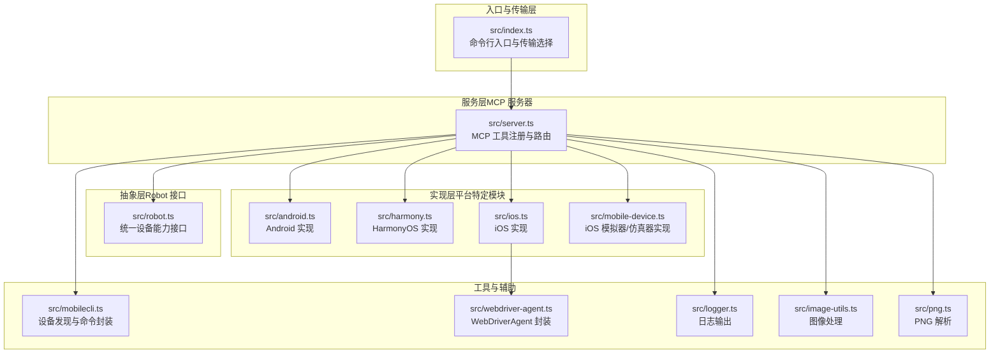
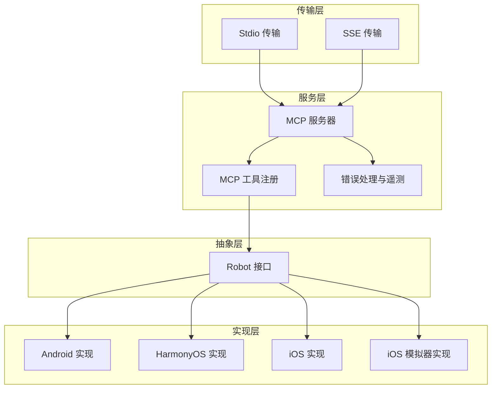
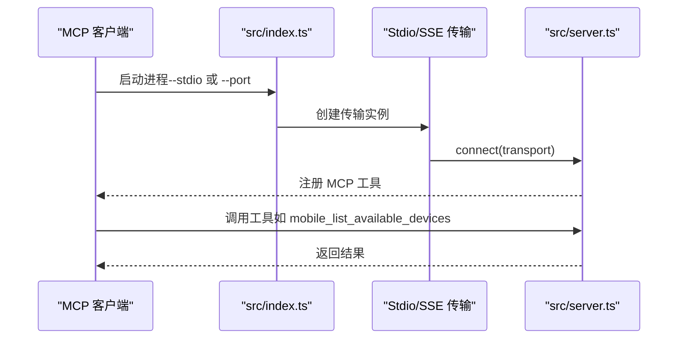
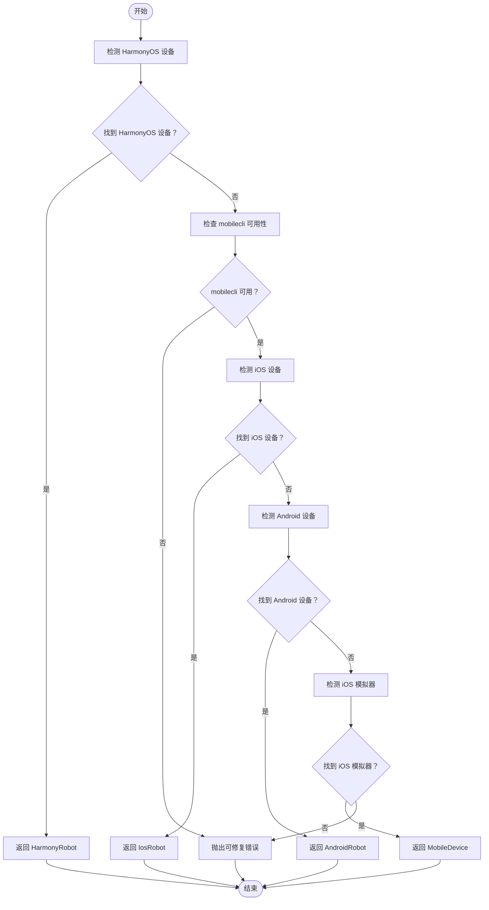
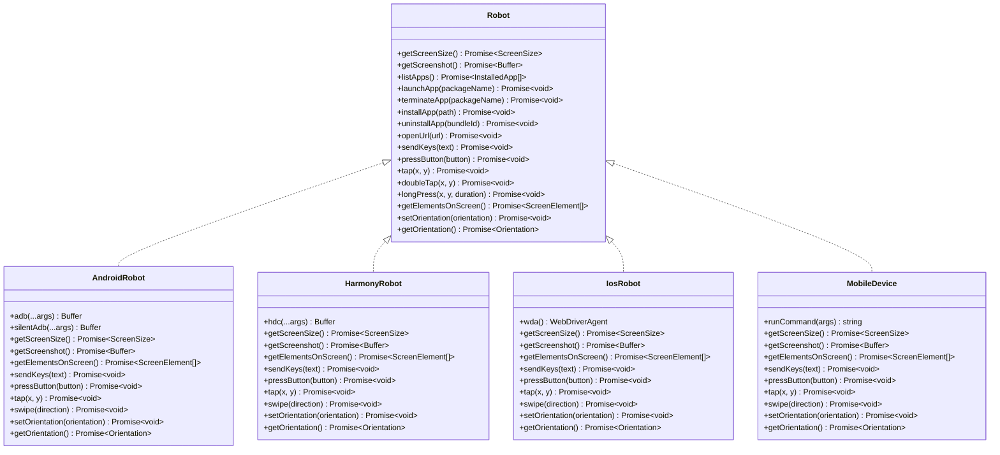
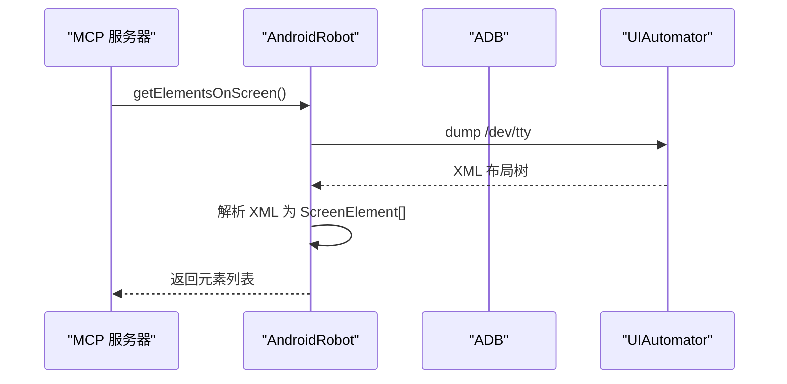
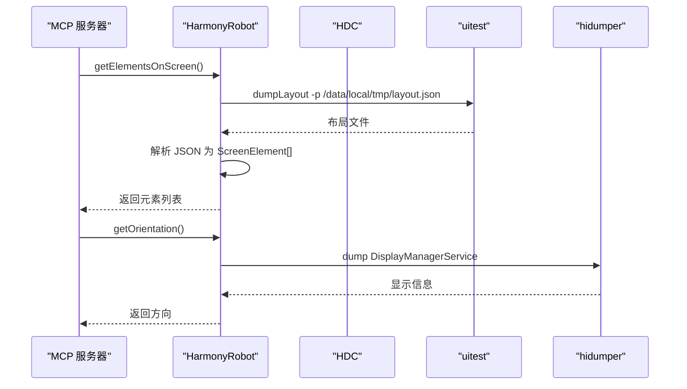
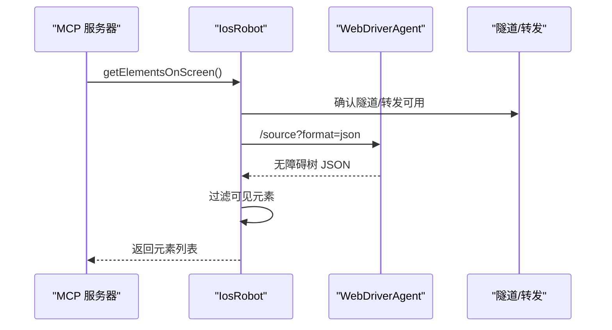
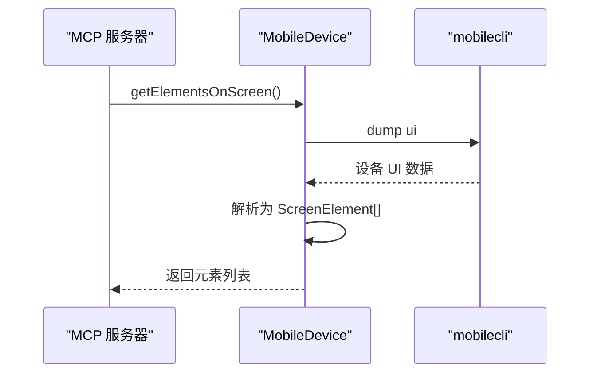
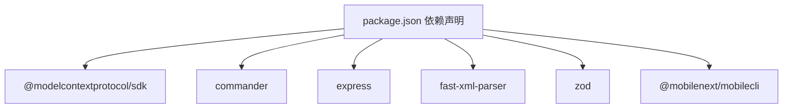

# 整体架构

<cite>
**本文档引用的文件**
- [src/index.ts](file://src/index.ts)
- [src/server.ts](file://src/server.ts)
- [src/robot.ts](file://src/robot.ts)
- [src/android.ts](file://src/android.ts)
- [src/harmony.ts](file://src/harmony.ts)
- [src/ios.ts](file://src/ios.ts)
- [src/mobile-device.ts](file://src/mobile-device.ts)
- [src/mobilecli.ts](file://src/mobilecli.ts)
- [src/webdriver-agent.ts](file://src/webdriver-agent.ts)
- [src/logger.ts](file://src/logger.ts)
- [src/image-utils.ts](file://src/image-utils.ts)
- [src/png.ts](file://src/png.ts)
- [package.json](file://package.json)
- [README.md](file://README.md)
</cite>

## 目录
1. [简介](#简介)
2. [项目结构](#项目结构)
3. [核心组件](#核心组件)
4. [架构总览](#架构总览)
5. [详细组件分析](#详细组件分析)
6. [依赖关系分析](#依赖关系分析)
7. [性能考量](#性能考量)
8. [故障排查指南](#故障排查指南)
9. [结论](#结论)

## 简介
本项目是基于 Model Context Protocol（MCP）的移动自动化服务器，支持 iOS、Android 与 HarmonyOS（鸿蒙）三大平台，通过统一的 MCP 工具集为 Agent/LLM 提供跨平台的移动端自动化能力。系统采用四层架构模式：传输层（Stdio/SSE）、服务层（MCP 服务器）、抽象层（Robot 接口）、实现层（平台特定模块）。该架构通过分层设计实现了关注点分离，既保证了平台无关性与可扩展性，又提供了模块化的实现路径。

## 项目结构
项目采用按功能域划分的模块化组织方式，核心文件分布如下：
- 入口与传输层：src/index.ts
- MCP 服务层：src/server.ts
- 抽象层接口：src/robot.ts
- 平台实现层：src/android.ts、src/harmony.ts、src/ios.ts、src/mobile-device.ts
- 工具与辅助：src/mobilecli.ts、src/webdriver-agent.ts、src/logger.ts、src/image-utils.ts、src/png.ts
- 构建与运行配置：package.json、README.md

图表来源
- [src/index.ts:1-67](file://src/index.ts#L1-L67)
- [src/server.ts:1-708](file://src/server.ts#L1-L708)
- [src/robot.ts:1-148](file://src/robot.ts#L1-L148)
- [src/android.ts:1-593](file://src/android.ts#L1-L593)
- [src/harmony.ts:1-462](file://src/harmony.ts#L1-L462)
- [src/ios.ts:1-294](file://src/ios.ts#L1-L294)
- [src/mobile-device.ts:1-217](file://src/mobile-device.ts#L1-L217)
- [src/mobilecli.ts:1-136](file://src/mobilecli.ts#L1-L136)
- [src/webdriver-agent.ts:1-455](file://src/webdriver-agent.ts#L1-L455)
- [src/logger.ts:1-22](file://src/logger.ts#L1-L22)
- [src/image-utils.ts:1-165](file://src/image-utils.ts#L1-L165)
- [src/png.ts:1-21](file://src/png.ts#L1-L21)

章节来源
- [src/index.ts:1-67](file://src/index.ts#L1-L67)
- [src/server.ts:1-708](file://src/server.ts#L1-L708)
- [package.json:1-74](file://package.json#L1-L74)

## 核心组件
- 传输层（Stdio/SSE）
  - 通过命令行参数选择传输模式：Stdio（默认）或 SSE（HTTP 服务器）
  - Stdio 模式直接与 MCP 客户端通过标准输入输出通信
  - SSE 模式提供 HTTP 接口，支持 GET/POST 访问 /mcp 端点
- 服务层（MCP 服务器）
  - 注册统一的 MCP 工具集，包括设备管理、应用管理、屏幕交互、输入与导航等
  - 统一错误处理与遥测上报（PostHog）
  - 设备选择逻辑：优先识别 HarmonyOS，其次 iOS，再其次 Android，最后 iOS 模拟器
- 抽象层（Robot 接口）
  - 定义跨平台一致的设备操作接口：屏幕尺寸、截图、应用管理、手势、按键、元素列表、方向等
  - 通过接口抽象屏蔽平台差异，便于扩展新平台
- 实现层（平台特定模块）
  - Android：通过 ADB + UIAutomator 实现
  - iOS：通过 WebDriverAgent + 原生无障碍接口实现
  - HarmonyOS：通过 HDC + uitest + hidumper 实现（无需 mobilecli）
  - iOS 模拟器/仿真器：通过 mobilecli 命令封装

章节来源
- [src/index.ts:9-67](file://src/index.ts#L9-L67)
- [src/server.ts:35-708](file://src/server.ts#L35-L708)
- [src/robot.ts:48-148](file://src/robot.ts#L48-L148)
- [src/android.ts:74-504](file://src/android.ts#L74-L504)
- [src/harmony.ts:43-416](file://src/harmony.ts#L43-L416)
- [src/ios.ts:42-232](file://src/ios.ts#L42-L232)
- [src/mobile-device.ts:62-216](file://src/mobile-device.ts#L62-L216)

## 架构总览
系统采用四层架构模式，自下而上分别为传输层、服务层、抽象层与实现层。传输层负责与 MCP 客户端建立连接；服务层负责工具注册与业务编排；抽象层定义统一接口；实现层针对不同平台提供具体实现。该设计实现了平台无关性与可扩展性，便于后续增加新平台或替换实现。

图表来源
- [src/index.ts:9-67](file://src/index.ts#L9-L67)
- [src/server.ts:35-708](file://src/server.ts#L35-L708)
- [src/robot.ts:48-148](file://src/robot.ts#L48-L148)
- [src/android.ts:74-504](file://src/android.ts#L74-L504)
- [src/harmony.ts:43-416](file://src/harmony.ts#L43-L416)
- [src/ios.ts:42-232](file://src/ios.ts#L42-L232)
- [src/mobile-device.ts:62-216](file://src/mobile-device.ts#L62-L216)

## 详细组件分析

### 传输层（Stdio/SSE）
- Stdio 模式
  - 使用 StdioServerTransport 建立与 MCP 客户端的连接
  - 适合大多数 MCP 客户端的标准集成方式
- SSE 模式
  - 使用 Express 提供 HTTP 服务，监听 /mcp 端点
  - 支持 GET（建立连接）与 POST（消息传递）两种方式
  - 适合需要通过 HTTP 代理或浏览器访问的场景

图表来源
- [src/index.ts:9-67](file://src/index.ts#L9-L67)
- [src/server.ts:35-708](file://src/server.ts#L35-L708)

章节来源
- [src/index.ts:9-67](file://src/index.ts#L9-L67)

### 服务层（MCP 服务器）
- 工具注册机制
  - 使用工具包装函数统一处理参数校验、执行计时、错误捕获与遥测上报
  - 对 ActionableError 与真实异常分别处理，前者返回可读错误提示，后者记录堆栈并标记错误
- 设备选择策略
  - 优先检测 HarmonyOS 设备（无需 mobilecli）
  - 其次检测 iOS 设备（需 go-ios）
  - 再次检测 Android 设备（需 ADB）
  - 最后检测 iOS 模拟器（需 mobilecli）
- 截图优化
  - 自动检测图片格式（JPEG/PNG），根据屏幕缩放比例进行压缩与重采样
  - 通过 ImageUtils 与 PNG 解析器保障截图质量与体积平衡

图表来源
- [src/server.ts:149-197](file://src/server.ts#L149-L197)

章节来源
- [src/server.ts:35-708](file://src/server.ts#L35-L708)

### 抽象层（Robot 接口）
- 统一能力定义
  - 屏幕尺寸、截图、应用管理、手势、按键、元素列表、方向控制等
  - 通过接口约束实现类必须提供一致的行为契约
- 错误处理
  - ActionableError 用于可修复的用户错误（如设备未找到、参数不合法）
  - 普通异常用于不可预期的系统错误，并附带堆栈信息

图表来源
- [src/robot.ts:48-148](file://src/robot.ts#L48-L148)
- [src/android.ts:74-504](file://src/android.ts#L74-L504)
- [src/harmony.ts:43-416](file://src/harmony.ts#L43-L416)
- [src/ios.ts:42-232](file://src/ios.ts#L42-L232)
- [src/mobile-device.ts:62-216](file://src/mobile-device.ts#L62-L216)

章节来源
- [src/robot.ts:1-148](file://src/robot.ts#L1-L148)

### 实现层（平台特定模块）

#### Android 实现（ADB + UIAutomator）
- 设备发现与管理
  - 通过 ADB devices 列举设备，解析设备类型（TV/手机）
  - 支持获取设备版本与名称
- 截图与元素解析
  - 通过 screencap 命令截图，支持多显示器场景
  - 通过 uiautomator dump 解析无障碍树，提取可见元素
- 文本输入与按键
  - ASCII 文本直接通过 input text 发送
  - 非 ASCII 文本通过 Clipboard 广播或设备 Kit 支持发送
- 手势与方向
  - 通过 input swipe 实现滑动与长按
  - 通过 settings/content 控制屏幕方向

图表来源
- [src/android.ts:351-356](file://src/android.ts#L351-L356)
- [src/android.ts:466-491](file://src/android.ts#L466-L491)

章节来源
- [src/android.ts:1-593](file://src/android.ts#L1-L593)

#### HarmonyOS 实现（HDC + uitest + hidumper）
- 设备发现与管理
  - 通过 hdc list targets 列举设备，支持获取设备名称与版本
- 截图与元素解析
  - 通过 snapshot_display 截图，uitest dumpLayout 导出布局树
  - 解析布局树中的 bounds、text、description、hint 等属性
- 文本输入与按键
  - 通过 uitest uiInput inputText 在焦点元素处输入
  - 通过 keyEvent 发送按键事件
- 手势与方向
  - 通过 uitest uiInput swipe/tap/doubleClick/longClick 实现
  - 屏幕方向查询通过 hidumper 获取，不支持程序化修改

图表来源
- [src/harmony.ts:294-332](file://src/harmony.ts#L294-L332)
- [src/harmony.ts:401-411](file://src/harmony.ts#L401-L411)

章节来源
- [src/harmony.ts:1-462](file://src/harmony.ts#L1-L462)

#### iOS 实现（WebDriverAgent + 原生无障碍）
- 会话管理
  - 通过 WebDriverAgent 的 /status 检查可用性
  - 动态创建/销毁会话，避免状态污染
- 截图与元素解析
  - 通过 /screenshot 获取 Base64 图像
  - 通过 /source 获取无障碍树，过滤可见元素
- 文本输入与按键
  - 通过 /wda/keys 发送文本
  - 通过 /wda/pressButton 发送按键
- 手势与方向
  - 通过 /actions 发送指针动作实现点击、双击、长按
  - 通过 /orientation 设置/获取方向

图表来源
- [src/ios.ts:77-92](file://src/ios.ts#L77-L92)
- [src/webdriver-agent.ts:274-284](file://src/webdriver-agent.ts#L274-L284)

章节来源
- [src/ios.ts:1-294](file://src/ios.ts#L1-L294)
- [src/webdriver-agent.ts:1-455](file://src/webdriver-agent.ts#L1-L455)

#### iOS 模拟器/仿真器实现（mobilecli）
- 命令封装
  - 通过 mobilecli 命令封装设备信息、应用管理、IO 操作、截图等
  - 自动定位二进制路径，支持环境变量覆盖
- 设备发现
  - 支持按平台与类型筛选设备，包含在线/离线状态
- 截图与元素解析
  - 通过命令行获取截图与 UI 元素信息，转换为统一结构

图表来源
- [src/mobile-device.ts:194-206](file://src/mobile-device.ts#L194-L206)
- [src/mobilecli.ts:107-134](file://src/mobilecli.ts#L107-L134)

章节来源
- [src/mobile-device.ts:1-217](file://src/mobile-device.ts#L1-L217)
- [src/mobilecli.ts:1-136](file://src/mobilecli.ts#L1-L136)

## 依赖关系分析
- 外部依赖
  - @modelcontextprotocol/sdk：MCP 协议实现
  - commander：命令行参数解析
  - express：SSE 传输所需 HTTP 服务
  - fast-xml-parser：XML 解析（Android UIAutomator）
  - zod：参数校验
  - @mobilenext/mobilecli：iOS/Android 设备命令封装（可选）
- 内部依赖
  - 服务层依赖抽象层接口与平台实现
  - 平台实现依赖各自工具链（ADB/HDC/WDA/mobilecli）
  - 工具与辅助模块被服务层调用（日志、图像处理、PNG 解析）

图表来源
- [package.json:29-39](file://package.json#L29-L39)

章节来源
- [package.json:1-74](file://package.json#L1-L74)

## 性能考量
- 截图优化
  - 自动检测图片格式并进行压缩与重采样，降低网络传输与存储成本
  - 仅在可用时启用图像处理（Sips/ImageMagick），否则降级为无处理
- 工具执行计时
  - 记录每个工具的执行时间，便于性能分析与优化
- 错误快速失败
  - 对可修复错误（ActionableError）立即返回，避免无效重试
- 平台差异处理
  - Android 多显示器场景下的截图选择，iOS 会话复用，HarmonyOS 无方向控制等，均在实现层内优化

## 故障排查指南
- 设备未发现
  - HarmonyOS：确认 hdc 在 PATH 中或设置 HDC_SDK_PATH
  - iOS：确认 go-ios 安装且版本满足要求，隧道/端口转发正常
  - Android：确认 ANDROID_HOME/SDK 路径正确，ADB 可用
- 截图异常
  - 检查图像处理依赖（Sips/ImageMagick）是否安装
  - 确认设备截图权限与分辨率支持
- 工具执行失败
  - 查看日志文件（LOG_FILE 环境变量），定位具体错误
  - 对 ActionableError 提示进行针对性修复（如设备 ID、包名等）

章节来源
- [src/logger.ts:1-22](file://src/logger.ts#L1-L22)
- [src/server.ts:79-94](file://src/server.ts#L79-L94)

## 结论
本项目通过四层架构实现了跨平台移动自动化的能力聚合：传输层提供灵活的接入方式，服务层统一编排工具与错误处理，抽象层以 Robot 接口屏蔽平台差异，实现层针对 Android、iOS、HarmonyOS 与 iOS 模拟器提供稳定可靠的平台特定实现。该架构在保持平台无关性的同时，兼顾了可扩展性与模块化，为后续扩展新平台或优化现有实现提供了清晰的路径。