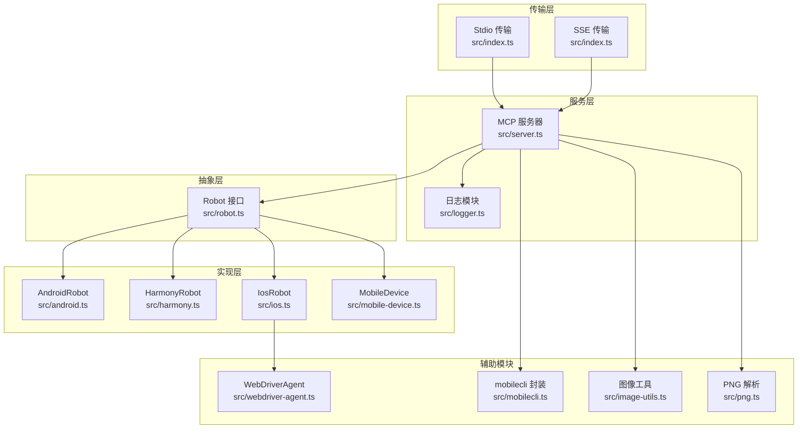
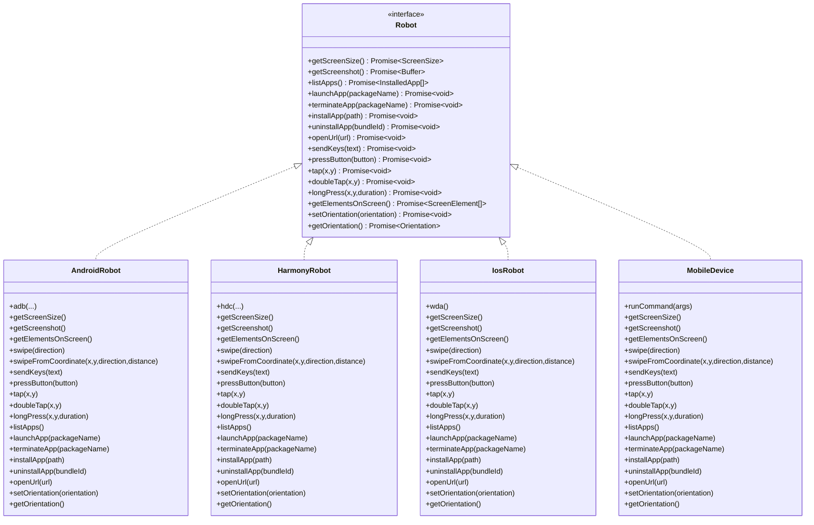
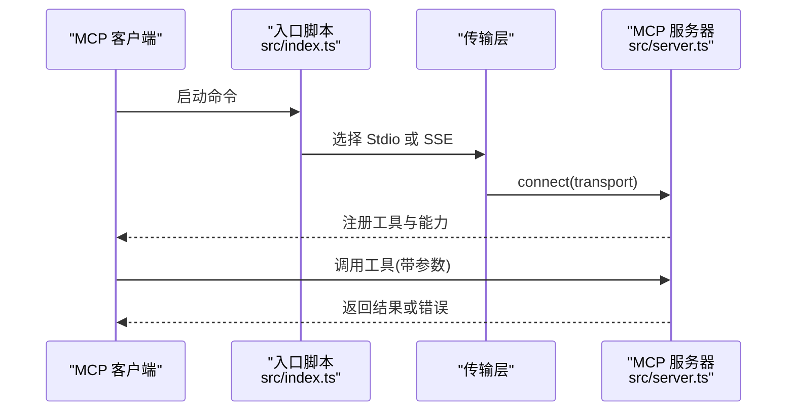
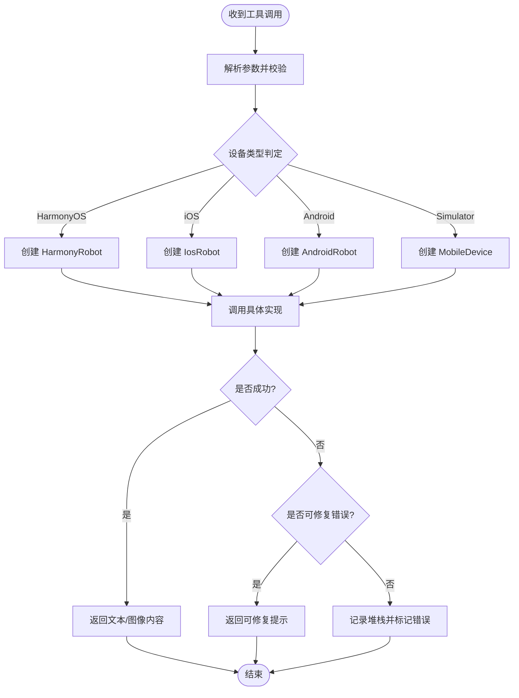
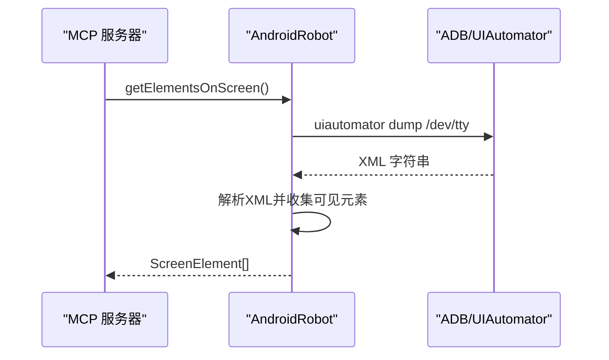
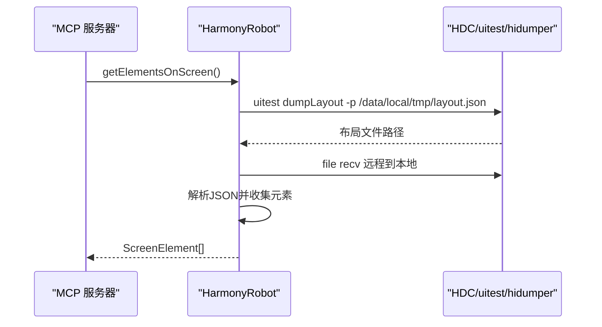
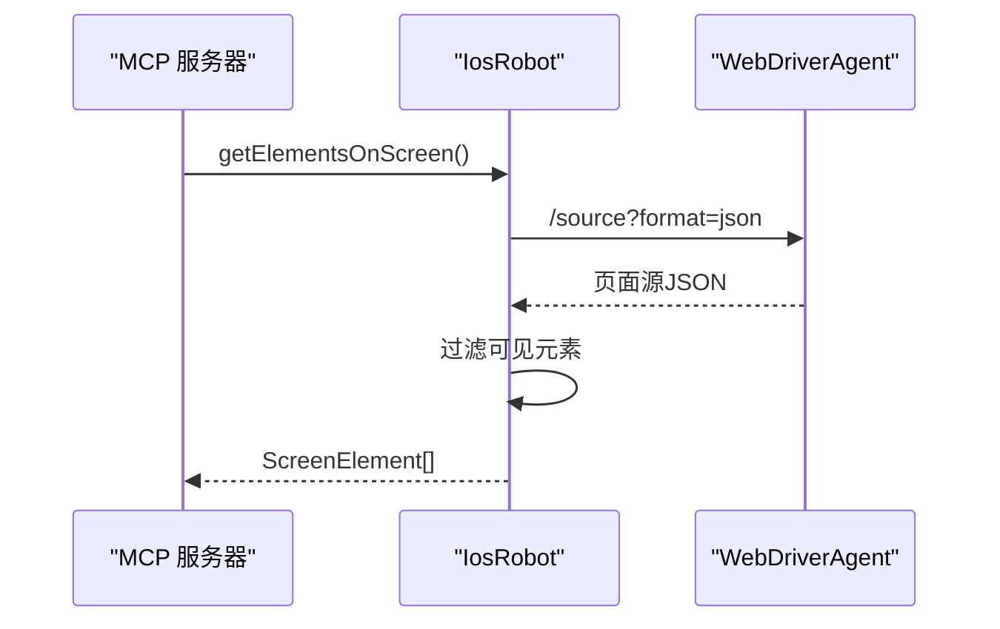
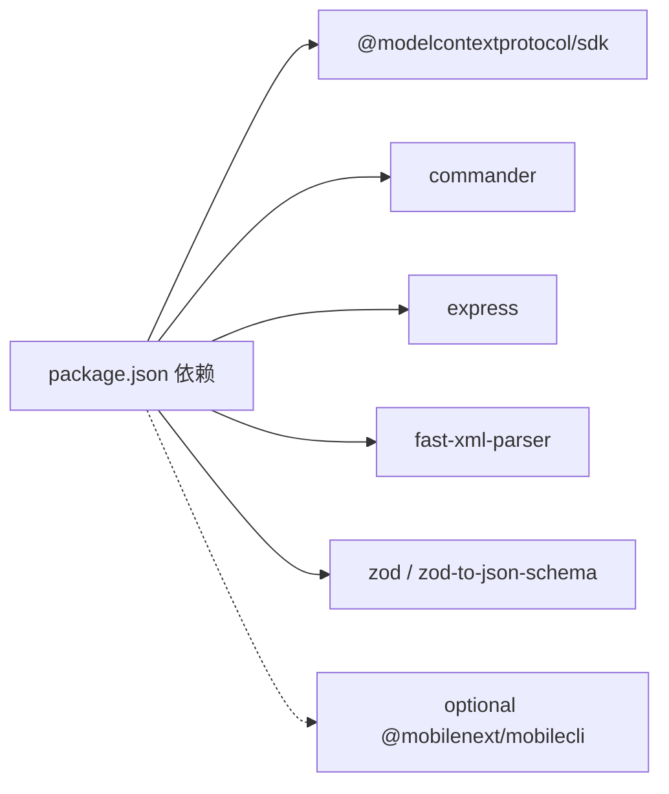

# 架构设计

<cite>
**本文引用的文件**
- [src/index.ts](file://src/index.ts)
- [src/server.ts](file://src/server.ts)
- [src/robot.ts](file://src/robot.ts)
- [src/android.ts](file://src/android.ts)
- [src/harmony.ts](file://src/harmony.ts)
- [src/ios.ts](file://src/ios.ts)
- [src/mobile-device.ts](file://src/mobile-device.ts)
- [src/mobilecli.ts](file://src/mobilecli.ts)
- [src/webdriver-agent.ts](file://src/webdriver-agent.ts)
- [src/logger.ts](file://src/logger.ts)
- [src/png.ts](file://src/png.ts)
- [src/image-utils.ts](file://src/image-utils.ts)
- [package.json](file://package.json)
- [README.md](file://README.md)
</cite>

## 目录
1. [简介](#简介)
2. [项目结构](#项目结构)
3. [核心组件](#核心组件)
4. [架构总览](#架构总览)
5. [详细组件分析](#详细组件分析)
6. [依赖关系分析](#依赖关系分析)
7. [性能考量](#性能考量)
8. [故障排查指南](#故障排查指南)
9. [结论](#结论)
10. [附录](#附录)

## 简介
本项目是面向 iOS、Android 与 HarmonyOS 的 MCP（Model Context Protocol）服务器，提供统一的移动端自动化能力，使 LLM/Agent 能通过标准化工具与多平台设备交互。系统通过策略模式屏蔽平台差异，通过工厂模式动态创建机器人实例，结合 MCP 协议与工具注册机制，实现“传输层-服务层-抽象层-实现层”的清晰分层。

## 项目结构
- 传输层：Stdio/SSE 两种接入方式，分别由入口脚本与 Express 提供。
- 服务层：MCP 服务器封装工具注册、参数校验、错误处理与遥测上报。
- 抽象层：Robot 接口定义跨平台一致的操作契约。
- 实现层：AndroidRobot、HarmonyRobot、IosRobot、MobileDevice 分别对接平台原生命令或代理。
- 辅助模块：日志、图片处理、设备探测、WebDriverAgent、PNG 解析等。

图表来源
- [src/index.ts:1-67](file://src/index.ts#L1-L67)
- [src/server.ts:1-708](file://src/server.ts#L1-L708)
- [src/robot.ts:1-148](file://src/robot.ts#L1-L148)
- [src/android.ts:1-593](file://src/android.ts#L1-L593)
- [src/harmony.ts:1-462](file://src/harmony.ts#L1-L462)
- [src/ios.ts:1-294](file://src/ios.ts#L1-L294)
- [src/mobile-device.ts:1-217](file://src/mobile-device.ts#L1-L217)
- [src/mobilecli.ts:1-136](file://src/mobilecli.ts#L1-L136)
- [src/webdriver-agent.ts:1-455](file://src/webdriver-agent.ts#L1-L455)
- [src/logger.ts:1-22](file://src/logger.ts#L1-L22)
- [src/png.ts:1-21](file://src/png.ts#L1-L21)
- [src/image-utils.ts:1-165](file://src/image-utils.ts#L1-L165)

章节来源
- [src/index.ts:1-67](file://src/index.ts#L1-L67)
- [src/server.ts:1-708](file://src/server.ts#L1-L708)
- [package.json:1-74](file://package.json#L1-L74)

## 核心组件
- 传输层
  - Stdio：默认启动模式，直接与 MCP 客户端通过标准输入输出通信。
  - SSE：通过 Express 提供 HTTP 接口，支持 GET/POST 访问 /mcp，适配部分 MCP 客户端。
- 服务层
  - MCP 服务器：注册工具、参数校验、异常处理、遥测上报、设备路由与工厂方法。
  - 工具注册：以工具函数包装器统一处理入参、调用、计时与结果返回。
- 抽象层
  - Robot 接口：定义屏幕尺寸、截图、应用管理、按键、点击、滑动、元素枚举、方向等统一方法。
- 实现层
  - AndroidRobot：基于 ADB/UIAutomator。
  - HarmonyRobot：基于 HDC/uitest/hidumper/snapshot_display/bm/aa。
  - IosRobot：基于 WebDriverAgent（WDA）。
  - MobileDevice：基于 mobilecli 的通用模拟器/仿真器封装。
- 辅助模块
  - 日志：统一输出与可选落盘。
  - 图像：Sips/ImageMagick 缩放与格式转换；PNG 解析。
  - 设备探测：mobilecli、adb、hdc、go-ios。

章节来源
- [src/index.ts:9-67](file://src/index.ts#L9-L67)
- [src/server.ts:35-708](file://src/server.ts#L35-L708)
- [src/robot.ts:48-148](file://src/robot.ts#L48-L148)
- [src/android.ts:74-504](file://src/android.ts#L74-L504)
- [src/harmony.ts:43-416](file://src/harmony.ts#L43-L416)
- [src/ios.ts:42-232](file://src/ios.ts#L42-L232)
- [src/mobile-device.ts:62-216](file://src/mobile-device.ts#L62-L216)
- [src/logger.ts:1-22](file://src/logger.ts#L1-L22)
- [src/image-utils.ts:9-165](file://src/image-utils.ts#L9-L165)
- [src/png.ts:1-21](file://src/png.ts#L1-L21)
- [src/mobilecli.ts:27-135](file://src/mobilecli.ts#L27-L135)

## 架构总览
系统采用“策略 + 工厂”模式实现平台无关性：
- 策略模式：Robot 接口作为策略契约，各平台实现类提供具体策略。
- 工厂模式：根据设备 ID 与环境探测，动态选择对应实现类实例。
- MCP 协议：通过工具注册与参数校验，统一对外暴露能力。

图表来源
- [src/robot.ts:48-148](file://src/robot.ts#L48-L148)
- [src/android.ts:74-504](file://src/android.ts#L74-L504)
- [src/harmony.ts:43-416](file://src/harmony.ts#L43-L416)
- [src/ios.ts:42-232](file://src/ios.ts#L42-L232)
- [src/mobile-device.ts:62-216](file://src/mobile-device.ts#L62-L216)

## 详细组件分析

### 传输层（Stdio/SSE）
- Stdio：通过 StdioServerTransport 直连 MCP 客户端，适合大多数本地/远程终端场景。
- SSE：Express 提供 /mcp 端点，GET 建立 SSE 连接，POST 处理消息，便于某些 GUI 客户端接入。

图表来源
- [src/index.ts:9-67](file://src/index.ts#L9-L67)
- [src/server.ts:35-708](file://src/server.ts#L35-L708)

章节来源
- [src/index.ts:9-67](file://src/index.ts#L9-L67)

### 服务层（MCP 服务器与工具注册）
- 工具注册：统一使用工具包装器，内置参数 Schema 校验、超时与耗时统计、错误分类与遥测上报。
- 设备路由：优先识别 HarmonyOS（无需 mobilecli），再探测 iOS（go-ios），再探测 Android（adb），最后回退到 mobilecli 模拟器。
- 错误处理：区分可修复的 ActionableError 与真实异常，前者返回可读提示，后者记录堆栈并标记错误。

图表来源
- [src/server.ts:149-197](file://src/server.ts#L149-L197)
- [src/server.ts:62-95](file://src/server.ts#L62-L95)

章节来源
- [src/server.ts:35-708](file://src/server.ts#L35-L708)

### 抽象层（Robot 接口）
- 统一契约：所有平台必须实现的屏幕尺寸、截图、应用管理、输入、点击、滑动、元素枚举、方向等方法。
- 异常：ActionableError 用于可修复的用户/环境问题，便于客户端重试或引导修复。

章节来源
- [src/robot.ts:48-148](file://src/robot.ts#L48-L148)

### 实现层（平台特定模块）

#### Android 实现（ADB/UIAutomator）
- 设备发现：通过 adb devices 列表，特征检测区分 TV 与移动设备。
- 截图：exec-out screencap -p，兼容多显示设备。
- 元素树：uiautomator dump + fast-xml-parser 解析，过滤可见节点。
- 文本输入：ASCII 直接 input text，非 ASCII 通过 Clipboard 方案或报错。
- 方向：关闭自动旋转后设置 user_rotation。

图表来源
- [src/android.ts:466-491](file://src/android.ts#L466-L491)
- [src/android.ts:312-356](file://src/android.ts#L312-L356)

章节来源
- [src/android.ts:74-504](file://src/android.ts#L74-L504)

#### HarmonyOS 实现（HDC/uitest/hidumper）
- 设备发现：hdc list targets，支持名称与版本探测。
- 截图：snapshot_display -> file recv，临时路径管理。
- 元素树：uitest dumpLayout -> 本地 JSON，递归收集可见元素。
- 文本输入：定位焦点元素或中心点输入。
- 方向：不支持程序化修改。

图表来源
- [src/harmony.ts:294-332](file://src/harmony.ts#L294-L332)
- [src/harmony.ts:159-182](file://src/harmony.ts#L159-L182)

章节来源
- [src/harmony.ts:43-416](file://src/harmony.ts#L43-L416)

#### iOS 实现（WebDriverAgent）
- 设备发现：go-ios list/info，支持隧道与端口转发检查。
- 截图：WDA /screenshot 返回 base64。
- 元素树：/source 获取 JSON，过滤可见节点。
- 输入/点击/长按/滑动：通过 /actions 执行指针动作序列。
- 方向：/orientation 设置与获取。

图表来源
- [src/ios.ts:204-207](file://src/ios.ts#L204-L207)
- [src/webdriver-agent.ts:274-284](file://src/webdriver-agent.ts#L274-L284)

章节来源
- [src/ios.ts:42-232](file://src/ios.ts#L42-L232)
- [src/webdriver-agent.ts:25-455](file://src/webdriver-agent.ts#L25-L455)

#### 模拟器/仿真器（MobileDevice + mobilecli）
- 通过 mobilecli 的子命令与参数组合，统一调用底层工具链。
- 适用于 iOS Simulator 与 Android Emulator/AVD。

章节来源
- [src/mobile-device.ts:62-216](file://src/mobile-device.ts#L62-L216)
- [src/mobilecli.ts:27-135](file://src/mobilecli.ts#L27-L135)

### 关键设计决策
- 为什么选择 MCP 协议
  - 统一工具契约与参数校验，便于客户端与 LLM 以自然语言驱动自动化。
  - 通过工具包装器集中处理错误、遥测与耗时统计，提升可观测性。
- 如何处理不同平台差异
  - 通过 Robot 接口与平台实现分离，策略模式屏蔽 ADB/HDC/WDA 差异。
  - 设备路由优先 HarmonyOS（无依赖），再 iOS（go-ios），再 Android（adb），最后 mobilecli。
- 如何保证可扩展性
  - 新增平台只需实现 Robot 接口并加入 getRobotFromDevice 路由逻辑。
  - 工具注册采用统一包装器，新增工具仅需定义参数 Schema 与回调。

章节来源
- [src/server.ts:149-197](file://src/server.ts#L149-L197)
- [src/robot.ts:48-148](file://src/robot.ts#L48-L148)

## 依赖关系分析
- 运行时依赖
  - @modelcontextprotocol/sdk：MCP 协议实现与传输抽象。
  - commander/express：命令行与 HTTP 服务。
  - fast-xml-parser：解析 Android UIAutomator 输出。
  - zod/zod-to-json-schema：工具参数 Schema 校验与导出。
- 可选依赖
  - @mobilenext/mobilecli：统一设备与应用管理（iOS/Android 模拟器/仿真器）。
- 平台工具
  - ADB（Android SDK）、HDC（HarmonyOS SDK）、go-ios（iOS）。

图表来源
- [package.json:29-39](file://package.json#L29-L39)

章节来源
- [package.json:1-74](file://package.json#L1-L74)

## 性能考量
- 截图与图像处理
  - 优先使用 ImageMagick 或 macOS Sips 进行缩放与压缩，降低网络传输与存储成本。
  - 对 JPEG 自适应质量与 PNG 校验，避免无效图像导致后续失败。
- 平台差异
  - Android 多显示器场景下的 screencap -d 选择，避免截屏失败。
  - iOS 通过 WDA 动作序列一次性完成，减少往返次数。
- 错误与重试
  - UIAutomator dump 失败时的重试与降级提示，提升鲁棒性。

章节来源
- [src/server.ts:615-650](file://src/server.ts#L615-L650)
- [src/image-utils.ts:9-165](file://src/image-utils.ts#L9-L165)
- [src/android.ts:295-310](file://src/android.ts#L295-L310)
- [src/webdriver-agent.ts:302-370](file://src/webdriver-agent.ts#L302-L370)

## 故障排查指南
- 设备未发现
  - HarmonyOS：确认 hdc 在 PATH 或设置 HDC_SDK_PATH。
  - iOS：确认 go-ios 安装与版本，隧道与端口转发状态。
  - Android：确认 ANDROID_HOME/adb 可用。
- 截图为空或无效
  - 检查图像格式与尺寸校验，必要时启用图像缩放。
- 工具调用失败
  - 查看 ActionableError 提示，按指引修复环境或参数。
  - 开启 LOG_FILE 观察详细日志。

章节来源
- [src/harmony.ts:12-18](file://src/harmony.ts#L12-L18)
- [src/ios.ts:33-40](file://src/ios.ts#L33-L40)
- [src/android.ts:32-54](file://src/android.ts#L32-L54)
- [src/logger.ts:1-22](file://src/logger.ts#L1-L22)
- [src/server.ts:81-94](file://src/server.ts#L81-L94)

## 结论
该系统通过清晰的分层与策略/工厂模式，实现了对 iOS、Android 与 HarmonyOS 的统一自动化接入。MCP 协议与工具注册机制提供了良好的可扩展性与可观测性，平台差异通过抽象接口与路由策略被有效屏蔽。未来可进一步扩展平台支持、优化图像处理链路、增强工具生态与可视化调试能力。

## 附录
- 架构演进与未来方向
  - 现状：新增 HarmonyOS 支持，移除对 mobilecli 的强制依赖。
  - 未来：完善工具生态（如 OCR、手势识别）、引入更丰富的遥测指标、增强可视化调试面板。
- 使用参考
  - MCP 客户端配置与启动方式详见 README。

章节来源
- [README.md:1-198](file://README.md#L1-L198)