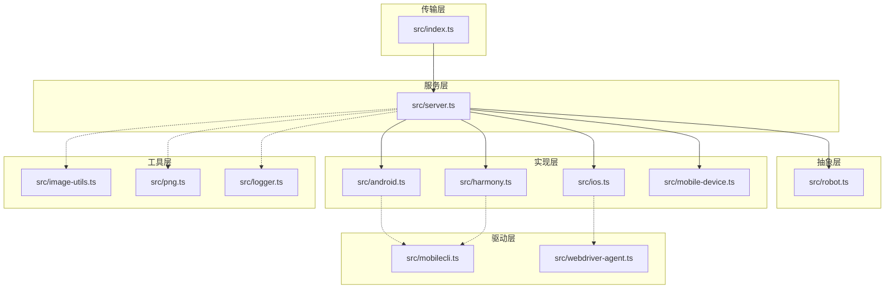
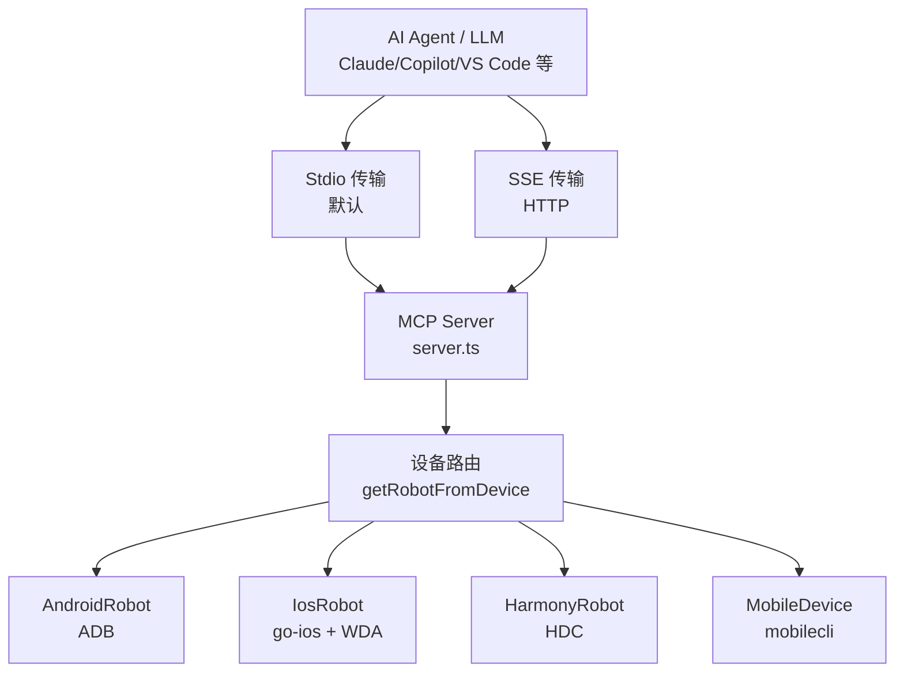
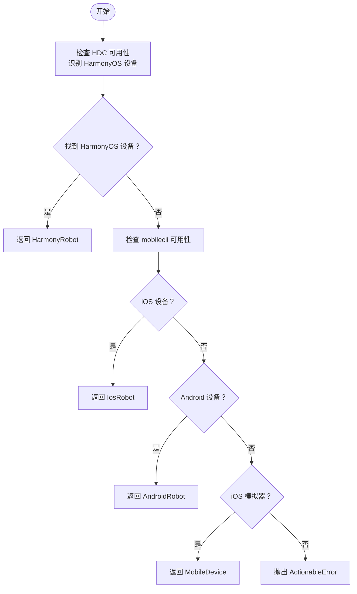
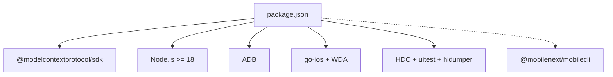

# 项目概述

<cite>
**本文引用的文件**
- [README.md](file://README.md)
- [DEEPWIKI.md](file://DEEPWIKI.md)
- [package.json](file://package.json)
- [src/index.ts](file://src/index.ts)
- [src/server.ts](file://src/server.ts)
- [src/robot.ts](file://src/robot.ts)
- [src/android.ts](file://src/android.ts)
- [src/ios.ts](file://src/ios.ts)
- [src/harmony.ts](file://src/harmony.ts)
- [src/mobile-device.ts](file://src/mobile-device.ts)
- [src/mobilecli.ts](file://src/mobilecli.ts)
- [src/webdriver-agent.ts](file://src/webdriver-agent.ts)
- [src/image-utils.ts](file://src/image-utils.ts)
- [src/png.ts](file://src/png.ts)
- [src/logger.ts](file://src/logger.ts)
</cite>

## 目录
1. [引言](#引言)
2. [项目结构](#项目结构)
3. [核心组件](#核心组件)
4. [架构总览](#架构总览)
5. [详细组件分析](#详细组件分析)
6. [依赖关系分析](#依赖关系分析)
7. [性能考量](#性能考量)
8. [故障排查指南](#故障排查指南)
9. [结论](#结论)
10. [附录](#附录)

## 引言
本项目是基于 Model Context Protocol（MCP）的移动端自动化服务器，面向 AI Agent 与 LLM，提供统一的跨平台移动设备自动化接口。它在上游项目基础上进行了增强，新增了对 HarmonyOS（鸿蒙）真机的自动化支持，并保持与 iOS、Android 的一致能力边界。

项目核心目标：
- 为 AI Agent/LLM 提供统一的移动端自动化入口，覆盖 iOS、Android、HarmonyOS 真机与模拟器。
- 以“结构化数据优先”的方式提升自动化确定性，同时保留“视觉兜底”能力，降低误判风险。
- 通过三层架构清晰分离传输、服务与实现层，便于扩展与维护。

与上游项目的差异（HarmonyOS 新增）：
- HarmonyOS 真机自动化不再依赖 mobilecli，而是通过 HDC（HarmonyOS Device Connector）直连设备，开箱即用。
- 通过 HarmonyRobot/HarmonyDeviceManager 实现统一的 Robot 接口，无缝融入现有设备路由与工具体系。

平台支持与能力矩阵：
- iOS 真机/模拟器、Android 真机/模拟器、HarmonyOS 真机均受支持。
- 工具集覆盖设备管理、应用管理、屏幕交互、输入与导航等全链路能力。

应用场景与价值主张：
- LLM 驱动的用户旅程自动化、跨应用数据采集与表单填写。
- Agent 框架中的通用移动交互能力，支撑多步骤任务编排。
- 与 Claude、Copilot、VS Code 等 MCP 客户端无缝集成。

章节来源
- [README.md:1-198](file://README.md#L1-L198)
- [DEEPWIKI.md:1-716](file://DEEPWIKI.md#L1-L716)

## 项目结构
项目采用“分层 + 平台实现”的组织方式，核心目录与职责如下：

- 传输层：src/index.ts，负责 MCP 协议传输（Stdio/SSE）。
- 服务层：src/server.ts，注册 MCP 工具、设备路由、参数校验与遥测上报。
- 抽象层：src/robot.ts，定义统一的 Robot 接口。
- 实现层：src/android.ts、src/ios.ts、src/harmony.ts、src/mobile-device.ts。
- 驱动层：src/mobilecli.ts、src/webdriver-agent.ts。
- 工具层：src/image-utils.ts、src/png.ts、src/logger.ts。

图表来源
- [src/index.ts:1-67](file://src/index.ts#L1-L67)
- [src/server.ts:1-708](file://src/server.ts#L1-L708)
- [src/robot.ts:1-148](file://src/robot.ts#L1-L148)
- [src/android.ts:1-593](file://src/android.ts#L1-L593)
- [src/ios.ts:1-294](file://src/ios.ts#L1-L294)
- [src/harmony.ts:1-462](file://src/harmony.ts#L1-L462)
- [src/mobile-device.ts:1-217](file://src/mobile-device.ts#L1-L217)
- [src/mobilecli.ts:1-136](file://src/mobilecli.ts#L1-L136)
- [src/webdriver-agent.ts:1-455](file://src/webdriver-agent.ts#L1-L455)
- [src/image-utils.ts:1-165](file://src/image-utils.ts#L1-L165)
- [src/png.ts:1-21](file://src/png.ts#L1-L21)
- [src/logger.ts:1-22](file://src/logger.ts#L1-L22)

章节来源
- [DEEPWIKI.md:32-54](file://DEEPWIKI.md#L32-L54)
- [package.json:17-68](file://package.json#L17-L68)

## 核心组件
- Robot 接口：统一抽象设备能力，包括屏幕尺寸、截图、元素列表、点击/滑动/长按、输入、按键、应用管理、URL 打开、方向设置与获取等。
- 设备路由：根据设备 ID 与平台类型，动态选择 AndroidRobot、IosRobot、HarmonyRobot 或 MobileDevice 实现。
- MCP 工具注册：在 server.ts 中集中注册 20 个工具，涵盖设备管理、应用管理、屏幕交互、输入导航等。
- 传输层：支持 Stdio（默认）与 SSE（HTTP）两种 MCP 传输模式，便于不同客户端集成。

章节来源
- [src/robot.ts:48-147](file://src/robot.ts#L48-L147)
- [src/server.ts:149-197](file://src/server.ts#L149-L197)
- [src/server.ts:199-704](file://src/server.ts#L199-L704)
- [src/index.ts:9-67](file://src/index.ts#L9-L67)

## 架构总览
整体架构遵循三层设计：传输层负责与 MCP 客户端通信；服务层负责工具注册与设备路由；实现层对接各平台自动化能力。HarmonyOS 通过 HDC 直连设备，无需 mobilecli，与 iOS/Android 的实现形成互补。

图表来源
- [src/index.ts:9-67](file://src/index.ts#L9-L67)
- [src/server.ts:149-197](file://src/server.ts#L149-L197)
- [src/android.ts:74-504](file://src/android.ts#L74-L504)
- [src/ios.ts:42-232](file://src/ios.ts#L42-L232)
- [src/harmony.ts:43-416](file://src/harmony.ts#L43-L416)
- [src/mobile-device.ts:62-216](file://src/mobile-device.ts#L62-L216)

## 详细组件分析

### 设备路由与工具注册（server.ts）
- 设备路由：优先判断 HarmonyOS 设备（无需 mobilecli），再检查 iOS/Android，最后回退到 mobilecli 模拟器。找不到设备则抛出可操作错误。
- 工具注册：集中注册 20 个工具，每个工具包含参数校验、只读/写入注解、异常处理与遥测上报。
- 设备发现：mobile_list_available_devices 同时收集 HarmonyOS、Android、iOS 真机与 iOS 模拟器设备。

图表来源
- [src/server.ts:149-197](file://src/server.ts#L149-L197)
- [src/server.ts:207-294](file://src/server.ts#L207-L294)

章节来源
- [src/server.ts:149-197](file://src/server.ts#L149-L197)
- [src/server.ts:207-294](file://src/server.ts#L207-L294)

### Android 实现（AndroidRobot）
- 底层驱动：ADB（Android Debug Bridge），支持多屏设备通过 display ID 指定。
- 能力覆盖：截图、点击、滑动、长按、输入文本（ASCII 直接输入，非 ASCII 通过剪贴板）、按键、UI 元素解析（UIAutomator XML）、应用管理（am/install/uninstall）、屏幕尺寸与方向。
- 设备发现：通过 ADB devices 列表与系统特性判断设备类型（TV/Mobile）。

章节来源
- [src/android.ts:74-504](file://src/android.ts#L74-L504)
- [src/android.ts:506-592](file://src/android.ts#L506-L592)

### iOS 实现（IosRobot）
- 底层驱动：go-ios（设备发现、应用管理、隧道）+ WebDriverAgent（WDA，设备上运行）。
- 能力覆盖：截图（WDA）、点击/滑动/长按（W3C Actions）、输入文本、按键、UI 元素（SourceTree）、应用管理（go-ios）、屏幕尺寸与方向。
- 连接前置条件：iOS 17+ 需要隧道与端口转发，WDA 必须在设备上运行。

章节来源
- [src/ios.ts:42-232](file://src/ios.ts#L42-L232)
- [src/webdriver-agent.ts:25-454](file://src/webdriver-agent.ts#L25-L454)

### HarmonyOS 实现（HarmonyRobot/HarmonyDeviceManager）
- 底层驱动：HDC（HarmonyOS Device Connector）、uitest（UI 操作）、hidumper（显示信息）、snapshot_display（截图）、bm/aa（应用包管理与 Ability 启停）。
- 能力覆盖：截图、点击/双击/长按、滑动、输入文本、按键、UI 元素解析（uitest dump）、应用管理、屏幕尺寸与方向。
- 设备发现：通过 hdc list targets 识别设备，支持名称与版本查询。

章节来源
- [src/harmony.ts:43-416](file://src/harmony.ts#L43-L416)
- [src/harmony.ts:418-461](file://src/harmony.ts#L418-L461)

### 通用设备实现（MobileDevice）
- 底层驱动：mobilecli（可选依赖的原生二进制工具），用于 iOS 模拟器与部分场景。
- 能力覆盖：与 Robot 接口一致，命令映射到 mobilecli 子命令。

章节来源
- [src/mobile-device.ts:62-216](file://src/mobile-device.ts#L62-L216)
- [src/mobilecli.ts:27-135](file://src/mobilecli.ts#L27-L135)

### 传输层（Stdio/SSE）
- Stdio 模式：默认传输，适合本地集成（Claude Desktop、VS Code）。
- SSE 模式：启动 HTTP 服务器，支持 GET/POST 建立 SSE 连接，适合远程/Web 场景。

章节来源
- [src/index.ts:9-67](file://src/index.ts#L9-L67)

### 图像处理与截图优化
- 截图流程：原始 PNG → 尺寸校验 → 可用时缩放并转 JPEG → base64 返回。
- 工具链优先级：macOS 使用 Sips，跨平台回退 ImageMagick。

章节来源
- [src/image-utils.ts:9-165](file://src/image-utils.ts#L9-L165)
- [src/png.ts:6-21](file://src/png.ts#L6-L21)
- [src/server.ts:597-672](file://src/server.ts#L597-L672)

## 依赖关系分析
- 运行时与 SDK：Node.js >= 18，MCP SDK（@modelcontextprotocol/sdk）。
- 平台依赖：Android（ADB）、iOS（go-ios + WDA）、HarmonyOS（HDC/uitest/hidumper）。
- 可选依赖：mobilecli（上游兼容与 iOS 模拟器支持）。

图表来源
- [package.json:13-39](file://package.json#L13-L39)
- [README.md:92-99](file://README.md#L92-L99)

章节来源
- [package.json:13-39](file://package.json#L13-L39)
- [README.md:92-99](file://README.md#L92-L99)

## 性能考量
- 截图优化：优先使用系统工具（Sips/ImageMagick）进行缩放与压缩，显著降低传输体积与 Agent 处理成本。
- 设备路由：先识别 HarmonyOS（无需额外工具链），再回退到 mobilecli，减少无效探测。
- 会话管理：WDA 采用 withinSession 模式，按需创建与销毁会话，降低资源占用。
- 错误早返回：ActionableError 提示用户修复，避免无意义重试。

章节来源
- [src/image-utils.ts:137-165](file://src/image-utils.ts#L137-L165)
- [src/server.ts:149-197](file://src/server.ts#L149-L197)
- [src/webdriver-agent.ts:71-77](file://src/webdriver-agent.ts#L71-L77)

## 故障排查指南
常见问题与定位建议：
- mobilecli 不可用：检查 mobilecli 版本与 PATH，或安装上游依赖以支持 iOS/Android 设备与模拟器。
- iOS 连接失败：确认 go-ios 安装、隧道与端口转发正常，WDA 在设备上运行。
- HarmonyOS 设备未识别：确认 HDC 可用且设备在线，必要时设置 HDC_SDK_PATH。
- 截图异常：检查截图格式与尺寸校验，确保图像处理工具可用或降级处理。
- 遥测与日志：查看日志文件（LOG_FILE 环境变量）与遥测事件（PostHog）以辅助诊断。

章节来源
- [src/server.ts:135-147](file://src/server.ts#L135-L147)
- [src/ios.ts:69-92](file://src/ios.ts#L69-L92)
- [src/harmony.ts:12-18](file://src/harmony.ts#L12-L18)
- [src/logger.ts:3-22](file://src/logger.ts#L3-L22)

## 结论
本项目以 MCP 为核心，通过三层架构实现了对 iOS、Android、HarmonyOS 的统一自动化能力。HarmonyOS 的引入填补了国内主流生态的空白，配合结构化数据优先与视觉兜底策略，既保证了确定性，又兼顾了灵活性。对于希望在 AI Agent/LLM 场景中快速接入移动自动化能力的团队，该项目提供了高一致性、低门槛、可扩展的解决方案。

## 附录
- MCP 工具列表与说明详见 README 的“MCP 工具列表”章节。
- 安装与配置指南（含 MCP 客户端配置示例）详见 README 的“安装与配置”。

章节来源
- [README.md:47-171](file://README.md#L47-L171)